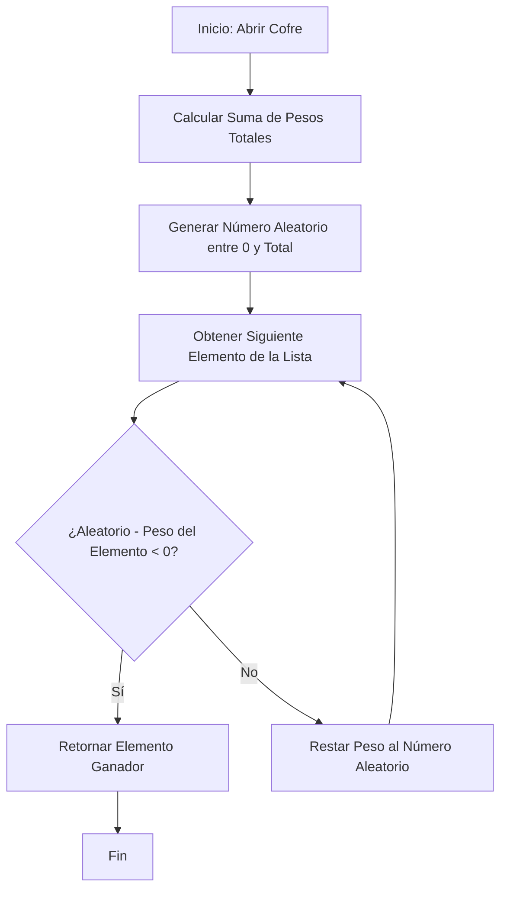

# Algoritmia de Recompensas, Probabilidades y Sistemas Gacha/Cofres

Este documento recopila la teoría matemática, el diseño de sistemas de juego y las mejores prácticas de desarrollo profesional aplicadas al diseño de sistemas de recompensa probabilísticos (como cofres de botín, *loot boxes*, ruletas o mecánicas *gacha*). Se analiza a fondo el caso de estudio de **Clash Royale**, los mecanismos anti-frustración modernos y se propone una guía de implementación arquitectónica.

---

## 1. Diseño Probabilístico de Recompensas: El Azar Controlado

En el diseño de software interactivo y videojuegos, el azar puro (RNG - *Random Number Generation*) es caótico y perjudicial. La aleatoriedad pura sin control genera dos escenarios negativos:
1. **La Paradoja de la Mala Suerte Infinita:** Un usuario con un comportamiento probabilístico desafortunado puede abrir cientos de cofres sin obtener nunca un objeto valioso. Esto destruye la retención del usuario (*user retention*) y causa abandono de la app.
2. **Superinflación Económica:** Un usuario con suerte extrema puede desbloquear el contenido más valioso y avanzado de forma prematura. Esto rompe la curva de progresión, el valor de los artículos raros y arruina la monetización.

Para solucionar esto, los ingenieros de software implementan **azar controlado**, usando distribuciones de probabilidad ponderadas, ciclos deterministas y contadores de piedad.

---

## 2. El Algoritmo Core: Selección Aleatoria Ponderada (*Weighted Random Selection*)

El algoritmo fundamental detrás de cualquier cofre es la **selección ponderada**. En lugar de asignar porcentajes rígidos (que dificultan la adición de nuevos elementos), se asigna a cada elemento un **peso relativo** (*weight*).

### Mecánica del Algoritmo
1. **Registro:** Cada objeto se registra con un valor numérico entero que representa su peso.
2. **Suma:** Se calcula la suma acumulativa de todos los pesos en la tabla de botín (peso total).
3. **Generación:** Se genera un número aleatorio entre `0` y `peso total - 1`.
4. **Barrido (Scan):** Se recorre la lista restando el peso de cada objeto al número aleatorio. En el momento en que el número cae por debajo de cero, ese objeto es seleccionado.

### Diagrama de Flujo del Algoritmo



### Implementación en Código Dart (Limpio y Optimizado)

El siguiente ejemplo simula de manera exacta este comportamiento utilizando la librería integrada `dart:math`:

```dart
import 'dart:math';

/// Representa una recompensa potencial dentro de un cofre.
class Reward {
  final String id;
  final String name;
  final int weight; // Frecuencia relativa de aparición
  final String rarity;

  const Reward({
    required this.id,
    required this.name,
    required this.weight,
    required this.rarity,
  });
}

/// Tabla de botín interactiva para realizar rolls matemáticos.
class LootTable {
  final List<Reward> rewards;
  final Random _random = Random();

  LootTable(this.rewards);

  /// Selecciona una recompensa aplicando el algoritmo de selección ponderada.
  Reward roll() {
    if (rewards.isEmpty) {
      throw Exception("La tabla de botín no contiene recompensas configuradas.");
    }

    // 1. Obtener el peso acumulativo total
    final int totalWeight = rewards.fold(0, (sum, item) => sum + item.weight);

    // 2. Generar un número pseudo-aleatorio acotado
    int rollValue = _random.nextInt(totalWeight);

    // 3. Evaluar el intervalo correspondiente
    for (final reward in rewards) {
      rollValue -= reward.weight;
      if (rollValue < 0) {
        return reward;
      }
    }

    return rewards.last; // Fallback ante precisiones decimales
  }
}
```

---

## 3. Caso de Estudio: El Sistema de Cofres de Clash Royale

Clash Royale (Supercell) es uno de los mejores ejemplos de control y equilibrio matemático en sistemas de recompensas. Combina dos metodologías complementarias:

### A) El Ciclo de Cofres (Sistema Determinista)
Cuando un jugador gana una batalla multijugador, la obtención del cofre **no es aleatoria**. El juego consulta un array estático circular de **240 posiciones** (el *Chest Cycle*).
* **Flujo del ciclo:** Cada vez que el jugador gana con un espacio libre de cofres, se le otorga el cofre de la posición actual de su ciclo personal y avanza una posición.
* **Composición del ciclo estándar:** Contiene 180 cofres de Plata, 52 de Oro, 4 cofres Gigantes y 4 Mágicos.
* **Ciclos Secundarios:** Los cofres especiales (Megarrelámpago, Legendario y Épico) funcionan en un ciclo más largo de 500 posiciones. Cuando el jugador alcanza la posición asignada en el ciclo largo, este cofre reemplaza al cofre del ciclo corto correspondiente a esa victoria.
* **Propósito de Negocio:** Permite a la economía del juego predecir con precisión de céntimos cuántos recursos máximos y mínimos puede adquirir un jugador gratuito (*F2P*) en un intervalo de tiempo determinado, eliminando la varianza extrema y previniendo la frustración por rachas largas de mala suerte.

### B) Algoritmo de Rareza y Factor de Desborde
Al abrir un cofre, el juego calcula el número de cartas y su rareza según la Arena actual.

1. **Garantía Básica:** Cada cofre tiene un número estático de cartas comunes, raras y épicas garantizadas.
2. **Cálculo de Fracciones (Desborde):** Si una Arena dictamina que un cofre debe dar $7.4$ cartas raras en promedio, el juego otorga de forma fija $7$ cartas raras y realiza un sorteo del $40\%$ (0.4) para decidir si otorga la octava.
3. **Fórmula de Aparición Legendaria:**
   La probabilidad de obtener una carta legendaria en un cofre que no la tiene garantizada se calcula dinámicamente en el momento de la apertura mediante la siguiente relación:

   $$\text{Probabilidad} = \frac{\text{Cartas Totales del Cofre} \times \text{Legendarias Disponibles en el Juego}}{\text{Factor de Rareza de la Arena} \times \text{Especiales Garantizadas}}$$

   Esto significa que a medida que Supercell introduce nuevas cartas legendarias al juego, la probabilidad de encontrarlas en cualquier cofre aumenta automáticamente de manera proporcional, auto-regulando el progreso.

---

## 4. Mecanismos Anti-Frustración Modernos

### A) El Sistema de Piedad (*Pity System*)
Utilizado en los videojuegos tipo *Gacha* (como *Genshin Impact* o *Honkai: Star Rail*). Funciona incrementando la probabilidad de éxito a medida que el jugador falla.

* **Soft Pity (Piedad Suave):** Se define un umbral de intentos (por ejemplo, a partir de la apertura número 70 sin obtener un objeto de 5 estrellas). A partir de este intento, la probabilidad base (ej. 0.6%) aumenta un 6% con cada apertura subsecuente (71 = 6.6%, 72 = 12.6%, etc.).
* **Hard Pity (Piedad Dura):** Es el límite garantizado (generalmente en la apertura número 90). Si el contador llega a este punto sin éxitos, la probabilidad se fuerza al 100%.
* **Reset:** Al obtener el objeto deseado, el contador vuelve a cero.

### B) Distribución Pseudo-Aleatoria (*PRD - Pseudo-Random Distribution*)
Es el estándar para eventos probabilísticos en juegos competitivos como *Dota 2* o *Warcraft III* (críticos, evasiones, aturdimientos).
* En lugar de mantener una probabilidad de crítico fija del $25\%$ por golpe, el motor del juego utiliza una probabilidad inicial real muy inferior (aproximadamente $8.5\%$).
* Si el golpe no es crítico, la probabilidad del siguiente golpe se incrementa en ese mismo valor inicial ($8.5\% + 8.5\% = 17\%$).
* Si continúa fallando, el porcentaje sigue subiendo ($25.5\%$, $34\%$, etc.). En el momento en que se activa el golpe crítico, la probabilidad se restablece al inicial de $8.5\%$.
* **Efecto de Juego:** Reduce drásticamente las rachas de "suerte loca" (dar 4 críticos seguidos) o las de "desgracia absoluta" (dar 15 golpes sin ningún crítico), concentrando la frecuencia real exactamente alrededor del $25\%$ esperado de forma muy homogénea.

---

## 5. Diseño Arquitectónico para una Integración Futura en Lingiux

En caso de implementar un sistema de cofres o recompensas para Lingiux (por ejemplo, para desbloquear paletas de colores, marcos de tarjetas o temas visuales de perfil), se recomienda la siguiente arquitectura en la base de datos de **Supabase**:

### Esquema de Base de Datos Recomendado (PostgreSQL)

```sql
-- Tabla de items desbloqueables
CREATE TABLE reward_items (
    id UUID PRIMARY KEY DEFAULT gen_random_uuid(),
    name VARCHAR(255) NOT NULL,
    rarity VARCHAR(50) NOT NULL, -- 'common', 'rare', 'epic', 'legendary'
    weight INT NOT NULL DEFAULT 100, -- Peso para el algoritmo ponderado
    image_url VARCHAR(500)
);

-- Estado del usuario y contadores de piedad (Pity Counter)
CREATE TABLE user_pity_counters (
    user_id UUID REFERENCES auth.users(id) ON DELETE CASCADE PRIMARY KEY,
    pity_count INT NOT NULL DEFAULT 0, -- Intentos desde el último legendario
    chests_opened INT NOT NULL DEFAULT 0
);
```

### Librerías Utilizadas
* **`dart:math`:** Librería estándar del SDK de Flutter para invocar el generador pseudo-aleatorio `Random()`. No requiere la adición de paquetes externos en `pubspec.yaml`, lo que mantiene el bundle de la app optimizado y libre de sobrecargas de dependencias innecesarias.

---

## 6. Archivos Modificados

* **[algoritmia_cofres_probabilidades_gacha.md](file:///c:/Users/sebas/OneDrive/Escritorio/Lingiux/lingiux_app/resources/mds_relevantes/algoritmia_cofres_probabilidades_gacha.md) [NEW]:**
  * Creación de este archivo de análisis arquitectónico e instructivo de desarrollo para futuras integraciones dentro del proyecto.
