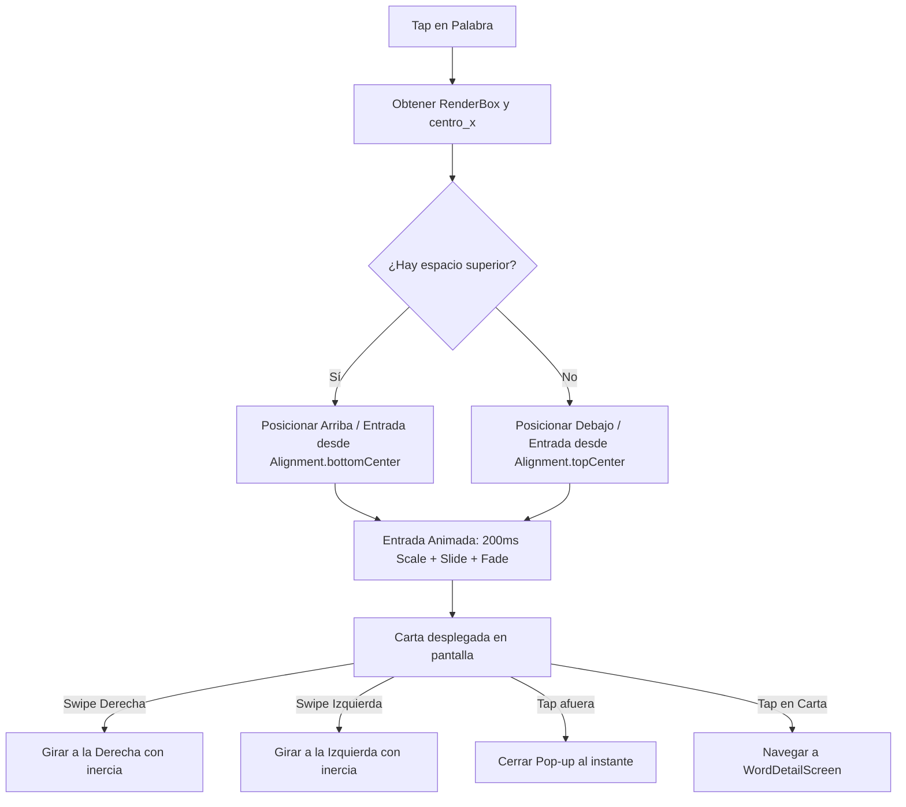

# Animación y Posicionamiento de Flashcard Interactiva (Word Popup)

Este documento describe la arquitectura técnica, las fórmulas matemáticas y los detalles de implementación utilizados para lograr la previsualización interactiva de palabras en el chat de **Lingiux**. La funcionalidad permite que, al hacer tap en una palabra, emerja una flashcard 3D interactiva de forma orgánica y pueda ser volteada con gestos en cualquier sentido.

---

## 1. Centrado Preciso y Posicionamiento Inteligente (Arriba/Debajo)

El posicionamiento se calcula dinámicamente en tiempo de ejecución combinando la posición global de la palabra con las dimensiones físicas del widget cliqueado.

### 1.1 Centrado Horizontal
Anteriormente, la carta se posicionaba usando la esquina superior izquierda de la palabra presionada como origen, desplazando la carta de forma descentrada. Para corregirlo:
1. Obtenemos el `RenderBox` de la palabra en `_TappableWordState`.
2. Calculamos el punto central horizontal sumando la mitad del ancho de la palabra a su coordenada inicial:
   $$\text{centro\_x} = \text{globalPosition.dx} + \frac{\text{box.size.width}}{2}$$
3. Este punto central se envía al callback `onWordTap` para centrar simétricamente la carta usando:
   $$\text{carta\_left} = \text{centro\_x} - \frac{\text{cardWidth}}{2}$$

### 1.2 Ubicación Vertical Dinámica con Safe Area
Si la palabra cliqueada se encuentra en la parte superior de la pantalla, la carta taparía la palabra o se saldría de los límites del dispositivo. Para evitarlo:
- Definimos el límite superior de pantalla segura (`safeAreaTop`) sumando la altura del notch/barra de estado y del AppBar:
  $$\text{safeAreaTop} = \text{MediaQuery.padding.top} + \text{kToolbarHeight}$$
- Calculamos la posición óptima de la carta encima de la palabra con un espaciado de `8.0` píxeles:
  $$\text{top} = \text{globalPosition.dy} - \text{cardHeight} - 8.0$$
- Si $\text{top} < \text{safeAreaTop} + 8.0$, el sistema coloca automáticamente la carta **debajo** de la palabra:
  $$\text{top} = \text{globalPosition.dy} + \text{wordSize.height} + 8.0$$
- Finalmente, se aplica un `clamp` horizontal y vertical para asegurar que la carta nunca quede truncada en los bordes de la pantalla.

---

## 2. Animación de Nacimiento Orgánico (`_OverlayEntrance`)

Para evitar que la carta aparezca de forma abrupta, se creó un contenedor de entrada (`_OverlayEntrance`) que combina tres transformaciones animadas coordinadas en un periodo de **`200ms`**:

```dart
// Configuración de las curvas y valores iniciales en initState
_scaleAnimation = Tween<double>(begin: 0.0, end: 1.0).animate(
  CurvedAnimation(parent: _controller, curve: Curves.easeOutBack),
);
_slideAnimation = Tween<double>(
  begin: widget.isBelow ? -8.0 : 8.0,
  end: 0.0,
).animate(CurvedAnimation(parent: _controller, curve: Curves.easeOutBack));
```

### 2.1 Anclaje del Punto de Nacimiento (Pivote de Escala)
Para lograr que la carta parezca brotar desde el centro de la palabra seleccionada, el anclaje (`alignment`) de `ScaleTransition` se configura dinámicamente en base a su ubicación:
* **Carta encima de la palabra**: `alignment: Alignment.bottomCenter` (escala hacia arriba desde la base).
* **Carta debajo de la palabra**: `alignment: Alignment.topCenter` (escala hacia abajo desde el tope).

### 2.2 Desplazamiento de Elevación (Slide)
La carta realiza una traslación sutil de `8` píxeles:
- Si se muestra arriba, sube de `8.0` a `0.0`.
- Si se muestra abajo, baja de `-8.0` a `0.0`.

### 2.3 Interpolación de Opacidad (Fade In)
Se realiza un fade in clásico (`opacity: 0.0 -> 1.0`) usando `FadeTransition` para suavizar los primeros milisegundos de la escala.

---

## 3. Animación de Volteo 3D Sensible al Desplazamiento (`FlippableCard`)

La carta funciona como una flashcard física gracias a una manipulación matemática del renderizado y gestos de barrido (swipe).

### 3.1 Proyección Perspectiva
Para romper la planicidad en 2D, se inyecta un factor de perspectiva en la matriz de transformación `Matrix4` en la coordenada `[3][2]` (representando la profundidad del eje Z):

```dart
final Matrix4 transform = Matrix4.identity()
  ..setEntry(3, 2, 0.002) // Inyecta profundidad 3D
  ..rotateY(anguloEnRadianes);
```

### 3.2 Rotación Dinámica según Sentido del Gesto (Swipe)
El sistema captura la velocidad horizontal del arrastre global (`primaryVelocity`). Un valor positivo significa que el usuario barrió hacia la derecha, y uno negativo hacia la izquierda.

Para que la carta acompañe la inercia del dedo del usuario (en lugar de girar siempre en el mismo sentido), se calcula dinámicamente el sentido del giro a través del estado de la carta (`_isFront`) y el gesto de swipe:

```dart
void toggleCard({required bool swipeRight}) {
  setState(() {
    if (_isFront) {
      // De Frente a Reverso (Animación Forward)
      // Deslizar derecha -> giro antihorario (-1.0). Deslizar izquierda -> horario (1.0)
      _directionMultiplier = swipeRight ? -1.0 : 1.0;
    } else {
      // De Reverso a Frente (Animación Reverse)
      // Deslizar derecha -> giro horario (1.0). Deslizar izquierda -> antihorario (-1.0)
      _directionMultiplier = swipeRight ? 1.0 : -1.0;
    }
  });

  _isFront ? _animationController.forward() : _animationController.reverse();
  setState(() => _isFront = !_isFront);
}
```

### 3.3 Corrección de Efecto Espejo (Contra-rotación)
Al rotar un widget $180^\circ$ ($\pi$ radianes) en 3D, el contenido trasero se vería al revés. Cuando la animación cruza los $90^\circ$ ($\pi / 2$ radianes), el widget conmuta y contra-rota el reverso de manera independiente para reordenar los píxeles a su sentido de lectura normal:

```dart
final double angle = _animation.value * math.pi * _directionMultiplier;
final bool showFront = angle.abs() < math.pi / 2;

return Transform(
  transform: transform,
  alignment: Alignment.center,
  child: showFront
      ? widget.front
      : Transform(
          transform: Matrix4.identity()..rotateY(math.pi), // Contra-rotación de 180°
          alignment: Alignment.center,
          child: widget.back,
        ),
);
```

---

## 4. Resumen de Flujo de Interacción


