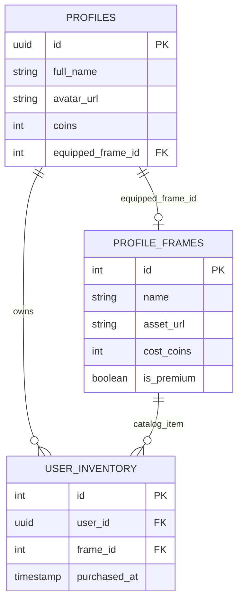

# Arquitectura de Catálogos, Personalización y Tienda en Flutter

Este documento sirve como guía de ingeniería de software para el diseño, almacenamiento, gestión de base de datos y renderizado de catálogos de personalización (avatares predefinidos, marcos de perfil y fondos de cartas de vocabulario) en Lingiux. Asimismo, detalla cómo las librerías implementadas recientemente sientan las bases para este ecosistema.

---

## 1. Catálogos de Avatares Predefinidos

Cuando un usuario no sube una foto de perfil personalizada, es una buena práctica ofrecer una selección de ilustraciones o dibujos predefinidos por la aplicación. Esto previene que la interfaz se vea vacía o genérica.

### A. Enfoque Local (Assets Empaquetados)
Los archivos se guardan físicamente en el directorio del proyecto (ej: `assets/images/avatars/`).
*   **Implementación:** Se registran en `pubspec.yaml` y se cargan usando `Image.asset('path')`.
*   **Cuándo usar:** Si los diseños son definitivos, pocos (menos de 5-10) y no hay intenciones de cambiarlos dinámicamente.
*   **Limitaciones:** Cualquier adición o corrección de diseño obliga a reconstruir la aplicación y pasar por el proceso de aprobación de App Store y Google Play Store, forzando al usuario a realizar una actualización de la app.

### B. Enfoque Dinámico (Almacenamiento en la Nube y CDN) ➔ *Estándar Profesional*
Los archivos se alojan en un almacenamiento en la nube, como un **Bucket Público de Supabase Storage** llamado `predefined_avatars`.
*   **Esquema de Base de Datos:**
    Creamos una tabla dedicada en Supabase para registrar el índice y metadatos de las imágenes:
    ```sql
    CREATE TABLE predefined_avatars (
      id SERIAL PRIMARY KEY,
      name VARCHAR(100) NOT NULL,
      image_url VARCHAR(255) NOT NULL,
      category VARCHAR(50) DEFAULT 'general',
      created_at TIMESTAMP WITH TIME ZONE DEFAULT NOW()
    );
    ```
*   **Flujo en la Aplicación:**
    1. La aplicación realiza una petición a través de un `FutureProvider` de Riverpod para consultar los registros de la tabla `predefined_avatars`.
    2. La interfaz de selección de perfil pinta un grid de imágenes leyendo los campos `image_url`.
    3. Cuando el usuario selecciona una imagen, se actualiza el campo `avatar_url` en su registro correspondiente dentro de la tabla `profiles`.
    4. **Optimización con Caché:** Para evitar consumir los datos móviles del usuario en cada recarga, se utiliza la librería `cached_network_image`. Esta librería descarga la imagen la primera vez y la guarda localmente en el directorio de almacenamiento temporal del dispositivo (usando `path_provider`), cargándola de forma instantánea y offline en subsecuentes ejecuciones.

---

## 2. Marcos de Fotos de Perfil (Profile Frames) y Sistema de Tienda

Los marcos para fotos de perfil son superposiciones visuales (overlays) que envuelven la foto del usuario. Sirven como recompensas por logros de aprendizaje o productos adquiribles en una tienda virtual de Lingiux.

### Formato de Archivo Adecuado
*   **PNG Transparentes (Rasterizados):** Obligatorio si el marco tiene texturas fotorealistas, brillos complejos o efectos de renderizado 3D. El centro del archivo PNG debe ser 100% transparente para permitir que la foto circular del usuario sea visible detrás.
*   **SVG (Vectores):** Recomendado para marcos geométricos, planos o de estilo minimalista. Un archivo SVG pesa típicamente menos de 10 KB, se escala infinitamente sin pixelación en pantallas de cualquier densidad de píxeles (desde teléfonos económicos hasta pantallas Retina), y se renderiza muy rápido.
*   **Lottie JSON (Animados):** Si se desea implementar marcos premium animados (por ejemplo, un marco de fuego con partículas o luces de neón giratorias), Lottie es el estándar del mercado. Consiste en animaciones exportadas desde Adobe After Effects en formato JSON que Flutter interpreta de forma nativa a 60fps con un impacto mínimo en el rendimiento de la CPU.

### Gestión en Base de Datos y Lógica de Adquisición
Para soportar una economía interna en la aplicación, se requiere una relación de tablas en Supabase:



1.  **Compra de un Marco:**
    *   La app envía una transacción a la base de datos (o una función remota RPC en Supabase) que descuenta la cantidad de `cost_coins` del saldo del usuario en `profiles`.
    *   Inserta un nuevo registro en `user_inventory` vinculando el `user_id` con el `frame_id`.
2.  **Equipar un Marco:**
    *   La app realiza una actualización directa del campo `equipped_frame_id` en el registro del usuario dentro de la tabla `profiles`.

### Renderizado en Flutter (Widget Stack)
El marco se superpone en la interfaz usando el widget `Stack` con alineación central y controlando el desbordamiento de clics mediante `IgnorePointer`:

```dart
Widget buildProfileAvatar(BuildContext context, String avatarUrl, String? frameUrl) {
  return SizedBox(
    width: 100,
    height: 100,
    child: Stack(
      alignment: Alignment.center,
      children: [
        // 1. Imagen base del usuario (Foto de Perfil)
        CircleAvatar(
          radius: 40, // Radio interno
          backgroundImage: CachedNetworkImageProvider(avatarUrl),
        ),
        // 2. Marco Superpuesto
        if (frameUrl != null)
          Positioned.fill(
            child: IgnorePointer(
              // IgnorePointer asegura que los clics pasen al botón base y no sean bloqueados por la imagen del marco
              child: CachedNetworkImage(
                imageUrl: frameUrl,
                fit: BoxFit.contain,
                placeholder: (context, url) => const SizedBox(),
                errorWidget: (context, url, error) => const SizedBox(),
              ),
            ),
          ),
      ],
    ),
  );
}
```

---

## 3. Fondos de las Cartas de Vocabulario (Card Backgrounds)

Las tarjetas de vocabulario se benefician visualmente al tener fondos personalizados (por nivel, categoría o comprados en la tienda). Aquí los profesionales optimizan drásticamente los datos.

### Enfoque de Datos (Gradientes vía Código)
En lugar de descargar imágenes de fondo pesadas, el fondo se define como una estructura de datos serializada. Esto ahorra ancho de banda e incrementa la velocidad de dibujado.
*   **Estructura JSON del Degradado:**
    ```json
    {
      "id": "galaxy_purple",
      "colors": ["#815BF5", "#5A45FF", "#A258F5"],
      "begin": "topLeft",
      "end": "bottomRight"
    }
    ```
*   **Traducción en Flutter:**
    Leemos las strings hexadecimales, las convertimos en instancias de `Color` y las pasamos a un `LinearGradient` o `RadialGradient` dentro de un `BoxDecoration`.
    ```dart
    final colors = gradientData.colors.map((hex) => Color(int.parse(hex.replaceFirst('#', '0xFF')))).toList();
    ```

### Enfoque de Texturas Complejas (Ilustraciones WebP)
Si el fondo requiere ilustraciones elaboradas (por ejemplo, patrones de estrellas, texturas de acuarela o bordes dibujados):
*   **Formato WebP:** Se utiliza obligatoriamente el formato **WebP con compresión con pérdida del 75-80%**. Esto reduce el peso de una ilustración de fondo típica de 500 KB (en PNG) a menos de 45 KB, sin diferencias visuales perceptibles en pantallas móviles.
*   **Almacenamiento y Precarga:** Las imágenes se guardan en el bucket `card_backgrounds` de Supabase. Para evitar un destello blanco mientras la imagen se descarga al deslizar cartas en un `PageView`, se utiliza la función de **precarga** (`precacheImage`) en el inicializador de la pantalla de detalle de cartas.

---

## 4. Detalles de las Librerías Utilizadas en la Reciente Implementación

Para soportar las configuraciones locales y preparar la arquitectura para los catálogos y la tienda, integramos y utilizamos las siguientes librerías:

### A. `shared_preferences`
*   **Propósito:** Almacenar de forma persistente la configuración de reproducción automática de audio (`auto_play_audio`).
*   **Por qué es clave:** Actúa como la memoria física del celular para los ajustes del usuario.
*   **Uso en código:**
    ```dart
    final sharedPrefs = await SharedPreferences.getInstance();
    await sharedPrefs.setBool('auto_play_audio', value);
    ```

### B. `flutter_riverpod`
*   **Propósito:** Proveer inyección de dependencias síncrona y reactiva para los ajustes de la app.
*   **Implementación:**
    1.  Declaramos un `sharedPreferencesProvider` que expone la instancia inicializada en `main()`.
    2.  Creamos el `settingsProvider` (un `StateNotifierProvider`) que expone el objeto inmutable `AppSettings` y el controlador `SettingsNotifier`.
    3.  Cualquier pantalla (`WordDetailScreen` o `SettingsScreen`) puede hacer un `ref.watch(settingsProvider)` para redibujarse o consultar valores inmediatamente sin lidiar con promesas de tipo `Future`.

### C. `audioplayers`
*   **Propósito:** Reproducir los audios remotos de pronunciación asociados a cada palabra de las cartas.
*   **Implementación:**
    *   Utilizamos la clase `AudioPlayer` para controlar el hardware de sonido.
    *   Detiene cualquier audio previo con `stop()` antes de arrancar uno nuevo al deslizar las cartas, evitando la superposición molesta de pronunciaciones al pasar de página rápidamente.

### D. `flutter/services.dart`
*   **Propósito:** Proporcionar interacciones hápticas (físicas) al usuario.
*   **Implementación:**
    *   Llamamos a `HapticFeedback.lightImpact()` al presionar botones de navegación o cambiar interruptores, mejorando la percepción de calidad y pulido ("feel") de la aplicación.

---

## 5. Resumen de Archivos Modificados y Creados

Para sentar las bases de la configuración y dar soporte a la auto-reproducción condicional, intervenimos la estructura del código en los siguientes archivos:

### 1. `pubspec.yaml` [MODIFICADO]
*   **Cambio:** Añadimos `shared_preferences: ^2.3.2` al árbol de dependencias directas para habilitar el acceso al SDK de almacenamiento del dispositivo.

### 2. `lib/main.dart` [MODIFICADO]
*   **Cambio:** Modificamos el arranque para inicializar `SharedPreferences` de forma asíncrona en el hilo principal antes de ejecutar `runApp()`. Sobreescribimos el valor de `sharedPreferencesProvider` dentro del `ProviderScope` raíz de la app para que el resto de componentes accedan de forma síncrona y segura a la base de datos local.

### 3. `lib/features/profile/presentation/providers/settings_provider.dart` [NUEVO]
*   **Cambio:** Creamos este proveedor central para encapsular los ajustes de la aplicación. Define el modelo `AppSettings` y el `SettingsNotifier` que se encarga de guardar y leer los valores de configuración (comenzando por `autoPlayAudio`).

### 4. `lib/features/profile/presentation/screens/settings_screen.dart` [NUEVO]
*   **Cambio:** Implementamos la pantalla de Ajustes a pantalla completa, reemplazando el diseño temporal del bottom sheet por un flujo estático. Sigue el diseño Soft UI con tarjetas contenedoras de bordes redondeados (`24px`), sombras suaves y un interruptor adaptativo.

### 5. `lib/features/profile/presentation/screens/profile_screen.dart` [MODIFICADO]
*   **Cambio:** Eliminamos el método obsoleto de hoja inferior (`_showSettingsBottomSheet`) y actualizamos las acciones de los botones de configuración para que empujen la nueva pantalla completa mediante `Navigator.push`.

### 6. `lib/features/vocabulary/presentation/screens/word_detail_screen.dart` [MODIFICADO]
*   **Cambio:** Integramos el soporte de auto-reproducción de sonido. Al iniciar la pantalla y al deslizar horizontal o verticalmente entre cartas en el `PageView`, se lee `settings.autoPlayAudio` desde Riverpod; de estar activado, se invoca la reproducción de la pronunciación de forma automatizada mediante el reproductor de red.
