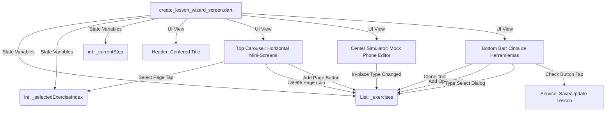

# Arquitectura del Editor Interactivo de Lecciones

Este documento detalla la especificación técnica, el diseño de la interfaz de usuario, el flujo de datos y la arquitectura del **Creador y Editor Interactivo de Lecciones** de Lingiux.

---

## 1. Resumen Ejecutivo y Objetivos del Rediseño

El creador de lecciones anterior consistía en un formulario de metadatos estático y una lista de tarjetas reordenable para organizar los ejercicios. Con el fin de elevar la experiencia de usuario a estándares profesionales (estilo "Canva" o "PowerPoint" adaptado a móviles), se sustituyó el flujo tradicional por un **Editor Visual Basado en Miniaturas, un Simulador Físico de Smartphone y una Cinta de Herramientas Premium**.

### Objetivos Clave:
* **Fidelidad Visual Directa:** El usuario debe ver exactamente cómo se mostrará la pantalla del ejercicio en el dispositivo del estudiante.
* **Autoría In-Place:** Reducción drástica de popups y diálogos secundarios; la edición de preguntas, distractores, respuestas correctas y bloques de oraciones ocurre de forma reactiva escribiendo directo sobre el simulador.
* **Estructura Simplificada (Mago de 2 Pasos):** Se eliminó el paso intermedio de selección de "cartas semilla" para agilizar la publicación. El flujo ahora va de la metadata directo a la construcción manual/visual.
* **Control Preciso del Orden:** Un carrusel de vistas previas en la parte superior actúa como organizador de páginas del libro/lección.

---

## 2. Ubicación en la Estructura del Proyecto

El código implementado reside en la capa de presentación de lecciones dentro del módulo de características del dominio:

```text
lingiux_app/
├── lib/
│   ├── features/
│   │   ├── lessons/
│   │   │   ├── domain/
│   │   │   │   └── models/
│   │   │   │       ├── lesson_model.dart          # Modelo de entidad de la lección
│   │   │   │       └── lesson_exercise_model.dart # Modelo mutable de los ejercicios
│   │   │   └── presentation/
│   │   │       ├── providers/
│   │   │       │   └── lessons_provider.dart      # Proveedores de estado Riverpod (guardado, lista)
│   │   │       └── screens/
│   │   │           └── create_lesson_wizard_screen.dart # PANTALLA PRINCIPAL DEL EDITOR (Modificado)
│   │   └── create_card/
│   │       └── presentation/
│   │           └── screens/
│   │               └── create_card_screen.dart    # Punto de entrada desde el editor de tarjetas
└── resources/
    └── mds_relevantes/
        ├── arquitectura_lecciones_estetica_y_opiniones_eco.md
        └── arquitectura_editor_interactivo_lecciones.md  # ESTE DOCUMENTO
```

---

## 3. Arquitectura del Flujo de Datos y Estado

El editor interactivo utiliza un estado local mutable gestionado con `StatefulWidget` combinado con proveedores globales de `flutter_riverpod` para el ciclo de persistencia de datos (lectura y escritura en base de datos/servicios).

### Diagrama de Relaciones y Estado



### Variables de Estado Locales Clave:
1. `_currentStep` (`int`): Define la pantalla activa.
   * `0`: Configuración de metadatos (Título, descripción, idioma, dificultad).
   * `1`: Editor interactivo general.
2. `_exercises` (`List<LessonExerciseModel>`): Colección reactiva de los ejercicios de la lección.
3. `_selectedExerciseIndex` (`int`): Índice del ejercicio seleccionado que se está mostrando y editando activamente en el smartphone central.

### Flujo de Inicialización (Templates):
Si el usuario crea una nueva lección, al pasar del Paso 0 al Paso 1, el sistema detecta que `_exercises.isEmpty` e inicializa automáticamente **3 pantallas plantilla** de ejercicios básicos para evitar un lienzo vacío y proporcionar una base autoguiada:

```dart
_exercises = [
  const LessonExerciseModel(
    id: '1',
    type: ExerciseType.multipleChoice,
    question: 'Select the correct translation',
    correctAnswer: 'Coffee',
    options: ['Tea', 'Water', 'Coffee', 'Juice'],
  ),
  const LessonExerciseModel(
    id: '2',
    type: ExerciseType.translateSentence,
    question: 'Translate: "I want a coffee"',
    correctAnswer: 'I want a coffee',
    correctSequence: ['I', 'want', 'a', 'coffee'],
    options: ['I', 'want', 'a', 'coffee'],
  ),
  const LessonExerciseModel(
    id: '3',
    type: ExerciseType.listeningQuiz,
    question: 'Listen and select the word',
    correctAnswer: 'Coffee',
    options: ['Tea', 'Water', 'Coffee', 'Juice'],
  ),
];
```

---

## 4. Desglose Detallado de los Componentes de la Interfaz

### A. Encabezado Dinámico Simplificado
Renderizado en `_buildHeader()`. Cambia radicalmente entre pasos:
* **Paso 0 (Metadatos):** Muestra el botón de regreso hacia la vista anterior y el título estático "CREADOR LECCIÓN" o "EDITAR LECCIÓN".
* **Paso 1 (Editor Interactivo):**
  * Desaparecen textos del paso e indicadores de progreso.
  * Muestra el botón de regreso (`Icons.arrow_back_ios_rounded`) hacia el Paso 0.
  * Muestra el **título de la lección en mayúsculas**, centrado horizontalmente en la pantalla usando un widget `Expanded` con alineación central (`TextAlign.center`), con un espaciador compensatorio a la derecha de igual tamaño para un centrado perfecto a nivel de píxel.

---

### B. Carrusel Horizontal de Mini-Pantallas (Thumbnails)
Ubicado en `_buildHorizontalThumbnails()`. Es un contenedor horizontal de `104` píxeles de alto compuesto por un `ListView.builder`.
* **Miniaturas de Pantalla:** Representan físicamente la distribución de páginas. Cada tarjeta tiene un tamaño fijo de `72x96` píxeles con bordes redondeados (`BorderRadius.circular(14)`).
* **Estados Activo/Inactivo:**
  * **Activo:** Borde de `2.5` píxeles en color primario violeta, badge superior destacado en violeta e ícono violeta con una sombra suave de fondo.
  * **Inactivo:** Borde sutil gris, badge en gris e ícono con el color temático de la tipología del ejercicio con baja opacidad.
* **Insignia "PÁG X":** Etiqueta superior que indica la secuencia ordinal de la pantalla del ejercicio.
* **Íconos Temáticos de Plantilla:**
  * Comprensión Auditiva: `Icons.volume_up_rounded` (Azul).
  * Opción Múltiple: `Icons.quiz_rounded` (Violeta).
  * Reconstrucción de Oraciones: `Icons.sort_rounded` (Rosa).
  * Pronunciación: `Icons.mic_rounded` (Verde).
* **Acción de Eliminación:** Un círculo rojo flotante en la esquina superior derecha (`Positioned`) con una cruz blanca `x`. Elimina el ejercicio de la lista mediante `_exercises.removeAt(index)` y ajusta el índice activo mediante `.clamp()` para evitar apuntar fuera de rango.
* **Botón de Añadir:** Tarjeta discontinua final con el icono `add_circle_outline_rounded`. Despliega una hoja de opciones inferior (`_showAddExerciseOptionsBottomSheet()`) con micro-descripciones para seleccionar el tipo de ejercicio a anexar.

---

### C. Simulador Físico de Teléfono (Editor Central)
Se incrementó el tamaño visual a **`300x440` píxeles** en `_buildMockPhoneEditor()` para mejorar la legibilidad y la interacción táctil.
* **Bisel y Cámara:** Diseñado con un borde oscuro sólido (`Color(0xFF0F172A)`) de `6.0` de grosor que simula la carcasa física y una muesca negra de cámara (notch) en la parte superior central.
* **Área de Trabajo Reactiva:**
  * **Título de Ejercicio (in-place):** Un `TextFormField` sin bordes y centrado que edita la instrucción del ejercicio. Se vincula al evento `onChanged` actualizando el estado de forma síncrona mediante el helper `_updateExercise(exercise.copyWith(question: val.trim()))`.
  * **Edición de Opciones (Múltiple/Auditiva):** Renderiza la lista de respuestas editables inline. El usuario puede tocar un interruptor circular (radio button) para marcar el elemento como respuesta correcta (coloreando la celda de verde). También puede borrar distractores o cambiar sus textos.
  * **Edición de Oraciones:** Muestra la traducción y renderiza de manera inmediata la vista previa de las burbujas de palabras sueltas abajo utilizando un layout envolvente (`Wrap`).
  * **Edición de Pronunciación:** Renderiza un micrófono de grabación ilustrativo grande y un campo de texto editable para la palabra o frase objetivo.

---

### D. Cinta de Herramientas Al Bottom (Toolbar)
Un contenedor blanco horizontal con borde divisorio superior de `1.0` de grosor que se ancla a la base del dispositivo móvil:
* **Botones de Acción de Estilo Stacked (Gris):**
  * **Tipo:** Muestra un diálogo flotante (`_showChangeTypeMenu`) que permite alternar la plantilla del ejercicio actual preservando el contenido compatible.
  * **Clonar:** Duplica el ejercicio activo en memoria con un nuevo ID único e inserta la copia inmediatamente después.
  * **Opción (dinámico):** Añade un distractor en blanco a la lista de opciones (disponible solo si el tipo es Quiz o Audio).
* **Botón de Publicar / Guardar (`✓`):**
  * Botón circular negro (`Color(0xFF0F172A)`) de `48x48` píxeles posicionado en la esquina derecha del `Row`.
  * Al hacer clic, valida que la lección contenga al menos 3 ejercicios y llama a la base de datos mediante `_publishLesson()` para persistir los cambios.

---

## 5. Instrucciones Paso a Paso para Revertir la Funcionalidad

Si por necesidades del proyecto decides volver a la versión clásica de Organizador de Ejercicios basado en listas reordenables clásicas y el Mago original de 3 Pasos, debes realizar las siguientes modificaciones de código en [create_lesson_wizard_screen.dart](file:///c:/Users/sebas/OneDrive/Escritorio/Lingiux/lingiux_app/lib/features/lessons/presentation/screens/create_lesson_wizard_screen.dart):

### Paso A: Restaurar los pasos de `_currentStep`
Modificar la variable `_currentStep` y sus comentarios explicativos arriba del archivo:
```diff
-  int _currentStep = 0; // 0: Metadatos, 1: Organizador de Ejercicios (Editor)
+  int _currentStep = 0; // 0: Metadatos, 1: Selección de Cartas, 2: Organizador de Ejercicios
```

### Paso B: Reintroducir la importación del compilador
Volver a añadir el compilador inteligente de lecciones en la parte superior:
```dart
import '../../domain/compiler/lesson_compiler.dart';
```

### Paso C: Restaurar `_nextStep` y `_prevStep` originales
Cambiar los métodos de navegación secuencial por los siguientes que procesan la auto-generación por cartas semilla:
```dart
  void _nextStep(List<WordCardModel> userCards) {
    if (_currentStep == 0) {
      if (_titleController.text.trim().isEmpty) {
        ScaffoldMessenger.of(context).showSnackBar(
          const SnackBar(
            content: Text('Por favor, ingresa un título para la lección.'),
            backgroundColor: AppColors.error,
          ),
        );
        return;
      }
      setState(() => _currentStep = 1);
    } else if (_currentStep == 1) {
      if (_selectedCardIds.length < 2) {
        ScaffoldMessenger.of(context).showSnackBar(
          const SnackBar(
            content: Text('Por favor, selecciona al menos 2 cartas para auto-generar ejercicios.'),
            backgroundColor: AppColors.error,
          ),
        );
        return;
      }

      final selectedCards = userCards.where((c) => _selectedCardIds.contains(c.id)).toList();
      final generated = LessonCompiler.compile(cards: selectedCards);

      setState(() {
        _exercises = generated;
        _currentStep = 2;
        _selectedExerciseIndex = 0;
      });
    }
  }
```

### Paso D: Re-implementar el Diálogo de Edición e Importar Layout de Paso 1
1. Añadir el widget de renderizado de selección de cartas semilla (`_buildCardSelectionStep`) y la barra inferior clásica (`_buildBottomNavigation`). Puedes copiar este código directamente desde el historial de commits Git.
2. Actualizar `_buildStepBody` para incluir nuevamente los 3 pasos originales:
```dart
  Widget _buildStepBody(List<WordCardModel> userCards) {
    switch (_currentStep) {
      case 0:
        return _buildMetadataStep(userCards);
      case 1:
        return _buildCardSelectionStep(userCards);
      case 2:
        return _buildOrganizerStep();
      default:
        return const SizedBox();
    }
  }
```

3. Restaurar la barra de navegación del wizard (`_buildBottomNavigation`) dentro del método `build` de la vista del árbol de widgets:
```dart
                // Barra Inferior de Navegación
                if (_currentStep > 0)
                  _buildBottomNavigation(userCards),
```

### Paso E: Modificar el Encabezado (`_buildHeader`)
Retornar al encabezado lineal clásico con barra de progreso violeta en lugar del centrado del título:
```dart
  Widget _buildHeader() {
    if (_currentStep == 0) {
      // Header original de metadatos...
    }

    String stepTitle = '';
    double progress = 0.0;

    switch (_currentStep) {
      case 1:
        stepTitle = 'SELECCIÓN DE CARTAS';
        progress = 0.66;
        break;
      case 2:
        stepTitle = 'ORGANIZADOR DE EJERCICIOS';
        progress = 1.0;
        break;
    }

    return Padding(
      padding: const EdgeInsets.symmetric(horizontal: 24.0, vertical: 16.0),
      child: Column(
        children: [
          Row(
            children: [
              GestureDetector(
                onTap: _prevStep,
                child: const Icon(
                  Icons.arrow_back_ios_rounded,
                  color: AppColors.onSurfaceMuted,
                  size: 18,
                ),
              ),
              const SizedBox(width: 8),
              Text(
                stepTitle,
                style: const TextStyle(
                  color: AppColors.primary,
                  fontWeight: FontWeight.bold,
                  fontSize: 12,
                  fontFamily: 'Inter',
                  letterSpacing: 1.0,
                ),
              ),
              const Spacer(),
              Text(
                'Paso ${_currentStep + 1} de 3',
                style: const TextStyle(
                  color: AppColors.onSurfaceMuted,
                  fontSize: 11,
                  fontFamily: 'Inter',
                ),
              ),
            ],
          ),
          const SizedBox(height: 12),
          ClipRRect(
            borderRadius: BorderRadius.circular(4),
            child: LinearProgressIndicator(
              value: progress,
              minHeight: 5,
              backgroundColor: AppColors.border.withValues(alpha: 0.5),
              valueColor: const AlwaysStoppedAnimation<Color>(AppColors.primary),
            ),
          ),
        ],
      ),
    );
  }
```

### Paso F: Reemplazar el Editor por el ReorderableListView clásico
Restaurar `_buildOrganizerStep()` original para mostrar la lista reordenable simple con el botón de borrar lateral y el disparador del diálogo `_showEditExerciseDialog()`.

---

## 6. Librerías y Dependencias Utilizadas

* **`flutter/material.dart`:** Provee la base de componentes visuales (ListView, Column, Row, Container, TextFormField, InkWell).
* **`flutter/services.dart`:** Utilizada para llamadas hápticas (`HapticFeedback.lightImpact()`, `HapticFeedback.mediumImpact()`) en clics e interacciones de arrastre o creación, mejorando el feedback táctil del editor interactivo.
* **`flutter_riverpod/flutter_riverpod.dart`:** Utilizado para acceder a los proveedores de autenticación (`authProvider`) y servicios de base de datos (`lessonServiceProvider`) para guardar lecciones de manera asíncrona.
