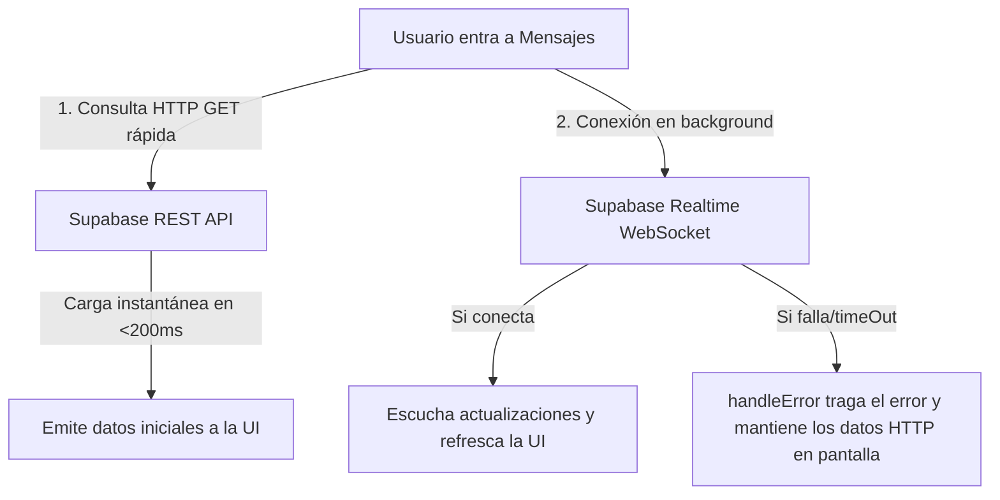

# Cargas Resilientes en Tiempo Real y Pre-cacheado Síncrono de Imágenes

Este documento detalla la especificación técnica de la arquitectura de datos híbrida de Lingiux y el sistema de sincronización de imágenes en el cliente para resolver los tiempos de espera lentos, los errores de timeout en WebSockets (`RealtimeSubscribeException`), y el "flasheo" o pop visual de los avatares de perfil en las listas de chat.

---

## ⚖️ 1. Concepto de Resiliencia en Software

En ingeniería de software, la **resiliencia** es la capacidad que tiene una aplicación para **soportar fallos, recuperarse de ellos y seguir operando con normalidad** en lugar de colapsar, trabarse o pintar pantallas de error (pantalla roja de muerte) en la cara del usuario.

Para ilustrar este concepto en Lingiux, contrastamos los dos modelos de carga:

*   **Fragilidad (App NO Resiliente)**: La app abre un canal WebSocket en tiempo real. Si la señal del celular parpadea por un segundo (ej. en un ascensor) o la base de datos de Supabase está dormida, la conexión falla. La app entra en pánico, arroja una excepción no controlada en la UI y rompe la pantalla del usuario mostrando el error técnico.
*   **Resiliencia (App Resiliente - Modelo Profesional)**: La app asume desde el diseño que **las conexiones van a fallar**. Por tanto, realiza una consulta rápida por HTTP de respaldo en paralelo. Si el WebSocket en tiempo real se cae o da timeout, la app captura el error en silencio en segundo plano, lo traga y sigue mostrando los mensajes cargados previamente por HTTP. Mientras tanto, sigue intentando reconectarse en background de forma automática sin interrumpir al usuario.

---

## 🏗️ 2. Arquitectura Híbrida: HTTP + WebSocket Resiliente

### El Problema de Origen:
Anteriormente, la lista de conversaciones y el chat de mensajes se suscribían directamente al flujo de Supabase (`supabase.from().stream()`). Esta conexión requiere abrir un WebSocket persistente, lo cual es propenso a fallar debido a inestabilidad de red, firewalls, o porque la base de datos de Supabase entra en modo reposo (free tier sleep) tras inactividad. Cuando esto ocurría, la app arrojaba la excepción `RealtimeSubscribeException(status: RealtimeSubscribeStatus.timedOut)`, mostrando una pantalla roja de error al usuario.

### El Enfoque Profesional Híbrido:
Rediseñamos la capa de sincronización en tiempo real para usar un flujo híbrido:



1.  **Carga Inicial por HTTP REST**: Al iniciar la suscripción, ejecutamos de inmediato un método asíncrono para hacer un fetch directo por HTTP REST (`select()`). Esto tarda menos de 200 ms, haciendo que el esqueleto del chat se pueble de inmediato de forma estable.
2.  **Suscripción Tolerante a Fallos (`handleError`)**: Iniciamos la escucha del stream de WebSockets en segundo plano. Mediante el operador de streams `.handleError(...)`, capturamos en silencio cualquier desconexión o timeout. La UI nunca se enterará si el WebSocket falló o se reconectó; simplemente continuará mostrando los datos ya cargados estáticamente sin mostrar ninguna pantalla roja de error.

---

## 🖼️ 3. Pre-cacheado Síncrono de Imágenes (Cero Flasheos)

### El Problema de Origen:
Aunque la base de datos responda de inmediato en 200 ms, si los cargadores de esqueleto desaparecen en ese instante, el widget de la celda de chat se pinta de golpe. Sin embargo, las imágenes de perfil (`NetworkImage` cargadas desde URLs de internet) apenas comienzan su descarga por red. Esto produce un parpadeo visual molesto donde el usuario ve primero la celda con un avatar vacío y, fracciones de segundo después, la foto de perfil "hace pop" en su cara.

### La Solución Profesional:
El Skeleton Screen (pantalla esqueleto) debe permanecer activo hasta que **tanto los datos estructurados como las imágenes pesadas de internet estén 100% listos en la memoria caché del teléfono**.

```
[SKELETON ACTIVO] ──► (1. Datos cargados de Supabase) ──► (2. precacheImage asíncrono de Avatares) ──► [TODAS LAS IMÁGENES EN CACHÉ] ──► [CAMBIO A UI REAL CON IMÁGENES AL INSTANTE]
```

1.  **Registro de Caché (`_cachedAvatarUrls`)**: En el estado del widget `ChatsListScreen`, creamos un conjunto `_cachedAvatarUrls` para registrar qué imágenes ya tenemos decodificadas en la caché gráfica de Flutter.
2.  **Pre-cacheado Asíncrono de Red**: Al recibir los chats desde Supabase, recorremos los avatares que aún no estén registrados en `_cachedAvatarUrls` y lanzamos la descarga en caché con la función nativa de Flutter:
    ```dart
    await precacheImage(NetworkImage(chat.avatarUrl), context);
    ```
3.  **Tolerancia a Enlaces Rotos**: La descarga se realiza dentro de un bloque `try-catch`. Si una imagen da error (por ejemplo, error 404 o conexión cortada), se agrega igualmente al set y se fuerza un `setState()`. Esto evita que la pantalla se quede congelada para siempre en modo esqueleto si el servidor del avatar está caído.
4.  **Espera Coordinada (`hasUncachedImages`)**: Evaluamos si hay imágenes pendientes de descarga. Mientras existan, la pantalla del listado de chats continuará mostrando la maqueta esqueleto animada. Solo cuando todas las descargas finalizan con éxito o fallo, la interfaz da paso a las celdas reales del chat de forma unificada.

---

## 💻 4. Código Fuente de los Archivos Modificados

### A. Capa de Datos y Proveedores: [chat_provider.dart](file:///c:/Users/sebas/OneDrive/Escritorio/Lingiux/lingiux_app/lib/features/chat/presentation/providers/chat_provider.dart)

Refactorizamos ambos proveedores usando generadores asíncronos (`async*`) para implementar el doble flujo:

```dart
// StreamProvider para escuchar las conversaciones con fallback HTTP instantáneo
final chatsProvider = StreamProvider.autoDispose<List<ChatEntity>>((ref) async* {
  final authState = ref.watch(authProvider);
  final user = authState.user;
  if (user == null) { yield []; return; }

  final supabase = ref.read(supabaseClientProvider);

  // 1. Fetch HTTP REST rápido
  Future<List<ChatEntity>> fetchChatsHttp() async {
    final data = await supabase
        .from('conversations')
        .select('''
          id, last_message, last_message_time, active_nationality, last_message_sender_id,
          conversation_participants!inner(profile_id),
          all_participants:conversation_participants(
            profile:profiles(id, full_name, avatar_url, nationality)
          )
        ''')
        .eq('conversation_participants.profile_id', user.id)
        .order('last_message_time', ascending: false);

    return (data as List<dynamic>).map((json) => ChatModel.fromJson(json, user.id)).toList();
  }

  // Emitir inmediatamente para poblar el skeleton
  List<ChatEntity> currentChats = [];
  try {
    currentChats = await fetchChatsHttp();
    yield currentChats;
  } catch (e) {
    yield [];
  }

  // 2. Escucha en segundo plano tolerante a caídas de WebSocket
  final realtimeStream = supabase
      .from('conversations')
      .stream(primaryKey: ['id'])
      .asyncMap((_) => fetchChatsHttp());

  await for (final updatedChats in realtimeStream.handleError((error) {
    // Tragar errores de WebSocket en background y mantener el estado HTTP actual
  })) {
    currentChats = updatedChats;
    yield currentChats;
  }
});
```

### B. Capa de Presentación: [chats_list_screen.dart](file:///c:/Users/sebas/OneDrive/Escritorio/Lingiux/lingiux_app/lib/features/chat/presentation/screens/chats_list_screen.dart)

Agregamos el estado de caché de imágenes, la lógica de pre-cargado asíncrono y los widgets del esqueleto:

```dart
class _ChatsListScreenState extends ConsumerState<ChatsListScreen> {
  int _activeSegment = 0;
  final Set<String> _cachedAvatarUrls = {}; // Rastrear avatares cacheados

  @override
  Widget build(BuildContext context) {
    final chatsAsync = ref.watch(chatsProvider);

    // Lógica para pre-cachear imágenes de avatar antes de apagar el skeleton
    final chatsList = chatsAsync.value;
    bool hasUncachedImages = false;

    if (chatsList != null) {
      final uncachedUrls = chatsList
          .where((c) => c.avatarUrl != null && c.avatarUrl!.isNotEmpty && !_cachedAvatarUrls.contains(c.avatarUrl))
          .map((c) => c.avatarUrl!)
          .toList();

      hasUncachedImages = uncachedUrls.isNotEmpty;

      if (hasUncachedImages) {
        WidgetsBinding.instance.addPostFrameCallback((_) async {
          for (final url in uncachedUrls) {
            try {
              await precacheImage(NetworkImage(url), context);
            } catch (_) {
              // Evitar atoramientos
            }
            if (mounted) {
              setState(() {
                _cachedAvatarUrls.add(url);
              });
            }
          }
        });
      }
    }

    // ... estructura del scaffold ...
    // Dentro de chatsAsync.when(data: (chats) { ... })
    if (hasUncachedImages) {
      return ListView.builder(
        itemCount: 6,
        shrinkWrap: true,
        physics: const NeverScrollableScrollPhysics(),
        itemBuilder: (context, index) => const _ChatListTileSkeleton(),
      );
    }
```

---

## 📂 5. Archivos Creados y Modificados

### [NUEVO] [cargas_resilientes_y_precacheado_de_imagenes.md](file:///c:/Users/sebas/OneDrive/Escritorio/Lingiux/lingiux_app/resources/mds_relevantes/cargas_resilientes_y_precacheado_de_imagenes.md)
*   Documento actual explicativo largo de especificación de arquitectura y precacheado.

### [MODIFY] [chat_provider.dart](file:///c:/Users/sebas/OneDrive/Escritorio/Lingiux/lingiux_app/lib/features/chat/presentation/providers/chat_provider.dart)
*   Rediseño de los Streams reactivos de Riverpod a streams híbridos con fallback HTTP REST.

### [MODIFY] [chats_list_screen.dart](file:///c:/Users/sebas/OneDrive/Escritorio/Lingiux/lingiux_app/lib/features/chat/presentation/screens/chats_list_screen.dart)
*   Soporte para esperas de descarga de avatares a nivel de estado mediante `precacheImage` y retención del skeleton Shimmer.
