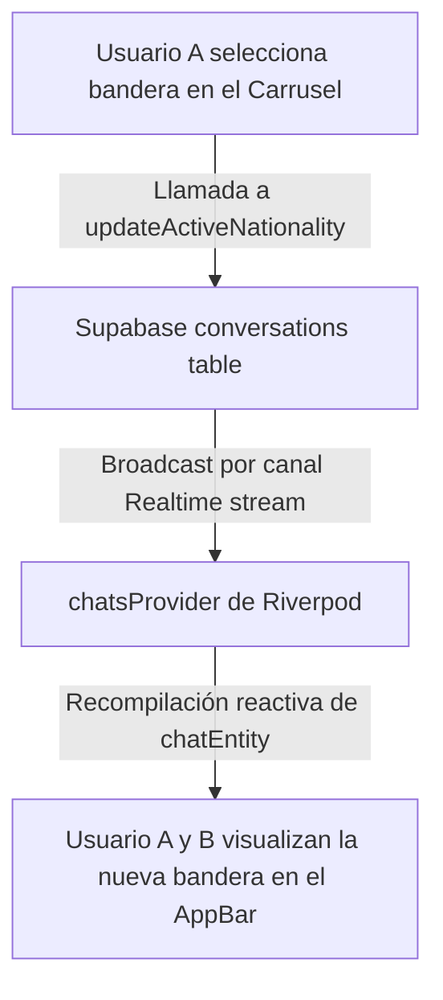

# Carrusel Horizontal de Idiomas en el Chat (Especificación Técnica)

Este documento detalla paso a paso cómo implementamos el carrusel horizontal deslizable de banderas y la lógica de nacionalidad activa dentro de cada conversación de Lingiux. 

---

## 🏗️ 1. Arquitectura y Sincronización en Tiempo Real

El carrusel permite cambiar la bandera/nacionalidad de la conversación de forma persistente y sincronizada. Si el Usuario A cambia el idioma en el chat a Francés (`fr`), el Usuario B verá de inmediato la bandera de Francia en su barra de navegación superior en tiempo real.



---

## 🗄️ 2. Modificaciones en la Base de Datos (Supabase)

Para persistir la nacionalidad activa de la conversación entre ambos participantes, agregamos la columna `active_nationality` a la tabla `conversations` ejecutando el siguiente comando SQL:

```sql
ALTER TABLE public.conversations ADD COLUMN IF NOT EXISTS active_nationality TEXT DEFAULT 'us';
```

Establecer un valor predeterminado de `'us'` asegura que todas las conversaciones existentes y nuevas comiencen por defecto en inglés (bandera de Estados Unidos), evitando valores nulos en la interfaz.

---

## 📦 3. Actualización de Entidades y Modelos

### A. [chat_entity.dart](file:///c:/Users/sebas/OneDrive/Escritorio/Lingiux/lingiux_app/lib/features/chat/domain/entities/chat_entity.dart)
Añadimos el campo `activeNationality` de tipo `String` con valor predeterminado `'us'` en el constructor para mantener compatibilidad con datos simulados (mock data) y evitar tener que modificar múltiples archivos de prueba:
```dart
final String activeNationality;

const ChatEntity({
  ...
  this.activeNationality = 'us',
});
```

### B. [chat_model.dart](file:///c:/Users/sebas/OneDrive/Escritorio/Lingiux/lingiux_app/lib/features/chat/data/models/chat_model.dart)
Actualizamos el factory `ChatModel.fromJson` para extraer la columna `active_nationality` directamente de la respuesta JSON de Supabase:
```dart
final activeNationality = json['active_nationality'] as String? ?? 'us';
```

### C. [chat_provider.dart](file:///c:/Users/sebas/OneDrive/Escritorio/Lingiux/lingiux_app/lib/features/chat/presentation/providers/chat_provider.dart)
*   **Consulta Select**: Modificamos el método `chatsProvider` para incluir `active_nationality` dentro de las columnas seleccionadas de la tabla `conversations`.
*   **Servicio de Chat**: Añadimos el método `updateActiveNationality` en la clase `ChatService`:
    ```dart
    Future<void> updateActiveNationality(String conversationId, String nationality) async {
      try {
        await _supabase
            .from('conversations')
            .update({'active_nationality': nationality})
            .eq('id', conversationId);
      } catch (e) {
        // Control de errores silencioso
      }
    }
    ```

---

## 📺 4. Interfaz de Usuario y Componentes Visuales

Reemplazamos el icono genérico de videollamada (`Icons.videocam_outlined`) en la barra superior de [chat_detail_screen.dart](file:///c:/Users/sebas/OneDrive/Escritorio/Lingiux/lingiux_app/lib/features/chat/presentation/screens/chat_detail_screen.dart) por un selector de banderas interactivo:

1.  **`_buildFlagCircle(nationality)`**:
    *   Crea un contenedor circular estilizado con bordes blancos semi-translúcidos y sombra para dar un efecto premium de "burbuja".
    *   Carga dinámicamente el archivo SVG desde `assets/flags/${nationality.toLowerCase()}.svg` utilizando la librería `flutter_svg`.
2.  **AppBar Accionable**:
    *   Al tocar el círculo de bandera activo en el AppBar, se alterna la variable de estado `_isFlagRibbonOpen = !_isFlagRibbonOpen;` ejecutando un rediseño localizado.
3.  **`_buildFlagRibbon(context, chatEntity)`**:
    *   Se dibuja directamente debajo del AppBar dentro del cuerpo del chat.
    *   Consiste en un carrusel horizontal (`ListView.builder` con `Axis.horizontal`) que muestra las banderas de los idiomas disponibles: **Estados Unidos (`us`), México (`mx`), Francia (`fr`), Alemania (`de`), Italia (`it`) y Brasil (`br`)**.
    *   El idioma seleccionado brilla con un borde circular púrpura de Lingiux (`AppColors.primary`). Al tocar otro idioma, se actualiza en Supabase y se cierra el carrusel con retroalimentación háptica de vibración.

---

## 🐛 5. Resolución de Error de Tipado en el Cast

### El Error:
Al abrir la pantalla de chat, se presentaba la siguiente excepción de tipado de Dart:
`type '() => ChatEntity' is not a subtype of type '(() => ChatModel)?' of 'orElse'`

### Causa:
Aunque `chatsProvider` está tipado estáticamente para retornar un `List<ChatEntity>`, el mapeo en tiempo de ejecución de la lista es instanciado como un `List<ChatModel>` (ya que el stream mapea los JSONs usando `ChatModel.fromJson`). Debido a esto, la llamada a `firstWhere` esperaba una función `orElse` que retornara exactamente un `ChatModel`, pero nosotros le estábamos pasando `widget.chat` (que es una instancia directa de `ChatEntity`). En Dart, no se permite hacer un downcast implícito de `ChatEntity` a `ChatModel`, lo que arrojaba la excepción en tiempo de ejecución.

### Solución:
Aplicamos un casteo explícito de los tipos de la lista mediante el operador `.cast<ChatEntity>()` sobre los datos entregados por el proveedor. Esto genera una vista segura de la colección tipada exactamente como `List<ChatEntity>`, permitiendo que la devolución de `orElse` retorne la instancia del constructor (`ChatEntity`) sin lanzar errores de tipo en tiempo de ejecución:
```dart
final chatsList = chatsListAsync.value?.cast<ChatEntity>();
final chatEntity = chatsList?.firstWhere(
  (c) => c.id == widget.chat.id,
  orElse: () => widget.chat,
) ?? widget.chat;
```

---

## 📂 6. Archivos Modificados

### [MODIFY] [chat_entity.dart](file:///c:/Users/sebas/OneDrive/Escritorio/Lingiux/lingiux_app/lib/features/chat/domain/entities/chat_entity.dart)
*   Añadido el campo `activeNationality` con valor por defecto.

### [MODIFY] [chat_model.dart](file:///c:/Users/sebas/OneDrive/Escritorio/Lingiux/lingiux_app/lib/features/chat/data/models/chat_model.dart)
*   Mapeo del nuevo campo de base de datos desde JSON.

### [MODIFY] [chat_provider.dart](file:///c:/Users/sebas/OneDrive/Escritorio/Lingiux/lingiux_app/lib/features/chat/presentation/providers/chat_provider.dart)
*   Actualización de la consulta SQL reactiva y añadido del método `updateActiveNationality` en `ChatService`.

### [MODIFY] [chat_detail_screen.dart](file:///c:/Users/sebas/OneDrive/Escritorio/Lingiux/lingiux_app/lib/features/chat/presentation/screens/chat_detail_screen.dart)
*   Implementación de los componentes de interfaz, carrusel horizontal deslizable, gestores de gestos, importación de `flutter_svg` y actualización reactiva desde `chatsProvider`.
