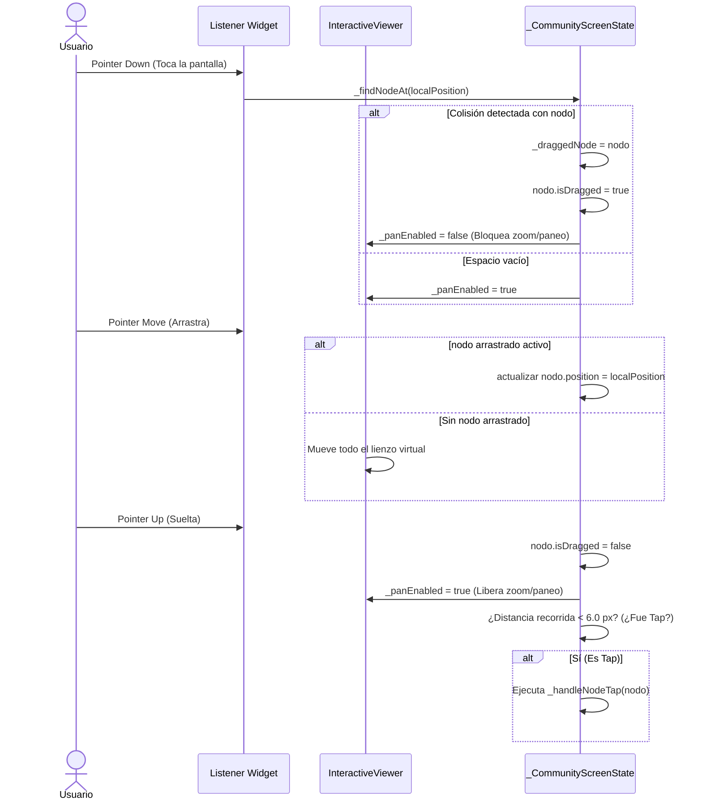

# Cerebro Digital y Constelación de Vocabulario Interactivo en Lingiux

Este documento representa la especificación técnica completa, el marco conceptual, las bases matemáticas de simulación física de partículas y la guía detallada de implementación paso a paso de la funcionalidad **Cerebro Digital (Obsidian-style Graph View)** construida para la sección de **Comunidad** de la aplicación **Lingiux**.

---

## 1. Introducción y Marco Conceptual

### 1.1. Del Aprendizaje Estático a la Constelación Mental
En la enseñanza tradicional de idiomas, el vocabulario se almacena en bases de datos que luego son consumidas en interfaces de usuario estáticas o listas verticales aburridas (como diccionarios o índices planos). El concepto del **Cerebro Digital** rompe con esta limitación. 

Inspirado en la vista de grafos de herramientas como *Obsidian*, el **Cerebro Digital de Lingiux** representa visualmente la red neuronal del conocimiento del usuario. Cada palabra aprendida no es una entidad aislada; pertenece a una categoría gramatical, se conecta a otras palabras de su misma clase y gravita en un espacio cognitivo que se expande a medida que el alumno crea y domina más tarjetas de vocabulario.

### 1.2. El Paradigma de la Constelación Neuronal
El grafo se diseña bajo un esquema jerárquico y dinámico de dos niveles:
* **Hubs Centrales (Categorías):** Actúan como núcleos masivos de atracción. Categorías como *Verbos*, *Sustantivos*, *Adjetivos* y *Frases* son representadas por círculos grandes con un brillo de neón (aura translúcida) y bordes definidos. Cuentan con un indicador visual (`+` o `-`) en su centro que denota si están expandidos o colapsados.
* **Satélites (Palabras Aprendidas):** Son nodos más pequeños que orbitan elásticamente alrededor de su categoría respectiva. Cada palabra tiene asignado el color identificativo de su categoría.
* **Sinapsis (Conexiones):** Líneas vectoriales elásticas con un gradiente lineal que viaja desde la alta opacidad del nodo central hasta desvanecerse cerca de la palabra satélite, emulando la transmisión de energía eléctrica o impulsos nerviosos en un cerebro biológico.

---

## 2. Retos de Rendimiento en Dispositivos Móviles

### 2.1. El Problema del Árbol de Widgets de Flutter
Si esta vista se hubiera construido utilizando widgets tradicionales de Flutter (por ejemplo, posicionando elementos individuales mediante un widget `Stack` con cientos de `Positioned`, `GestureDetector`, `Container` con bordes redondeados y sombras), el motor de Flutter habría colapsado. 

En cada fotograma de la animación física (a 60 Hz o 120 Hz en pantallas ProMotion/HighRefresh):
1. Flutter tendría que reconstruir, realizar el *layout* y repintar docenas de widgets individuales.
2. La recolección de basura (*Garbage Collector*) de Dart se saturaría debido al flujo constante de objetos de widgets temporales creados a cada milisegundo.
3. El hilo de UI se retrasaría, produciendo pérdidas de fotogramas (*jank*) y una experiencia inaceptable en dispositivos móviles de gama media y baja.

### 2.2. La Solución: Aceleración por Hardware Directa en GPU
Para lograr un rendimiento ultra-fluido, implementamos un enfoque basado en un lienzo único utilizando **`CustomPaint`** y **`CustomPainter`**:
* **Lienzo Único:** El árbol de widgets de Flutter solo ve un único widget (`CustomPaint`). Todo el grafo se dibuja programáticamente en un solo paso de renderizado a nivel de rasterización.
* **Motor Impeller/Skia:** Las llamadas de dibujo como `canvas.drawCircle`, `canvas.drawLine` y `canvas.drawParagraph` se traducen directamente en operaciones de rasterización de bajo nivel compiladas para la GPU del teléfono.
* **Estructuras de Datos Ligeras:** Los nodos no son widgets; son simples instancias de una clase pura de Dart (`GraphNode`), lo que minimiza el consumo de memoria y maximiza la velocidad de acceso en memoria.

---

## 3. Modelo de Datos del Grafo

El estado del grafo se compone de dos colecciones principales en memoria dentro del controlador de la vista:

```dart
final List<GraphNode> _nodes = [];
final List<GraphEdge> _edges = [];
```

### 3.1. La Clase `GraphNode`
Define las propiedades estructurales, estéticas y cinemáticas de cada partícula en el espacio bidimensional:

* `id`: Identificador único. Para categorías es `'cat_'` seguido del nombre en mayúsculas (ej. `'cat_SUSTANTIVO'`). Para palabras, coincide con el UUID de la base de datos de Supabase.
* `label`: El texto visible que se renderizará debajo de la partícula (ej. `"NOUN"`, `"Verbo"`, `"dog"`).
* `type`: Un string identificador de tipo, ya sea `'category'` (hub central) o `'word'` (satélite).
* `color`: El color base utilizado para el relleno del nodo, sus conexiones y el aura de neón.
* `wordCard`: Referencia al modelo de datos real de Supabase (`WordCardModel`). Es `null` para los nodos de categoría.
* `position` (`Offset`): Coordenadas cartesianas actuales $(x, y)$ del nodo en el lienzo virtual de $800 \times 800$ píxeles.
* `velocity` (`Offset`): Vector de velocidad instantánea $(\Delta x, \Delta y)$ expresado en píxeles por frame, utilizado por el integrador de físicas.
* `isDragged` (`bool`): Bandera que indica si el nodo está siendo manipulado activamente por el dedo del usuario (en cuyo caso se omiten los cálculos de físicas internas para ese nodo).
* `isExpanded` (`bool`): Propiedad exclusiva de los nodos de categoría. Controla si sus palabras asociadas son visibles en el lienzo y si se deben calcular sus fuerzas de enlace.

### 3.2. La Clase `GraphEdge`
Representa el enlace físico y lógico entre dos nodos:

* `source`: Nodo de origen (siempre un nodo de categoría).
* `target`: Nodo de destino (un nodo de palabra).

---

## 4. El Motor de Físicas: Simulación Matemática de Partículas

La animación interactiva se calcula fotograma a fotograma utilizando un bucle controlado por un `Ticker` de Flutter. La simulación utiliza un modelo de fuerzas combinadas (fuerza de repulsión electrostática, tensión elástica de resortes, gravedad al centro y amortiguamiento por fricción).

Sean $N$ el conjunto de nodos visibles y $E$ el conjunto de conexiones activas en el sistema.

### 4.1. Repulsión Mutua (Ley de Coulomb Modificada)
Para evitar el solapamiento y lograr que los nodos se distribuyan uniformemente por todo el lienzo, se aplica una fuerza repulsiva entre cada par de nodos visibles $i$ y $j$ ($i \neq j$).

Sean $\vec{P}_i$ y $\vec{P}_j$ los vectores de posición de los nodos $i$ y $j$.
Definimos el vector diferencia como:
$$\vec{r}_{ij} = \vec{P}_i - \vec{P}_j$$

La distancia euclidiana entre ellos es:
$$d_{ij} = \|\vec{r}_{ij}\| = \sqrt{(x_i - x_j)^2 + (y_i - y_j)^2}$$

La fuerza de repulsión $\vec{F}_{rep, i}$ aplicada sobre el nodo $i$ es la suma de los vectores de repulsión de todos los demás nodos:
$$\vec{F}_{rep, i} = \sum_{j \in N, j \neq i} \frac{k_r}{d_{ij}^2} \cdot \hat{r}_{ij}$$

Donde:
* $k_r$ es la constante de fuerza repulsiva (fijada en `15000.0` para Lingiux).
* $\hat{r}_{ij} = \frac{\vec{r}_{ij}}{d_{ij}}$ es el vector unitario que apunta desde el nodo $j$ hacia el nodo $i$ (dirección de escape).
* Si $d_{ij} < 1.0$, se fuerza $d_{ij} = 1.0$ para evitar indeterminaciones matemáticas por división entre cero.

### 4.2. Atracción Elástica de Enlaces (Ley de Hooke)
Para cada conexión o línea de unión $(s, t) \in E$ (donde $s$ es la categoría de origen y $t$ es la palabra satélite), se calcula una fuerza de atracción elástica.

Sea $\vec{r}_{st} = \vec{P}_s - \vec{P}_t$ el vector de separación y $d_{st} = \|\vec{r}_{st}\|$ la distancia actual.
La fuerza elástica de resorte $\vec{F}_{spring}$ sobre el nodo satélite $t$ es:
$$\vec{F}_{spring, t} = k_a \cdot (d_{st} - L) \cdot \hat{r}_{st}$$

Por la tercera ley de Newton (acción y reacción), la fuerza sobre el nodo central de categoría $s$ es opuesta:
$$\vec{F}_{spring, s} = - \vec{F}_{spring, t}$$

Donde:
* $k_a$ es la constante de rigidez elástica (fijada en `0.09`). Un valor mayor hace que la órbita sea más rígida; un valor menor da una apariencia de "gelatina" muy interactiva.
* $L$ es la longitud natural del muelle en reposo (fijada en `95.0` píxeles). Determina el radio orbital ideal del satélite alrededor de su hub.
* $\hat{r}_{st} = \frac{\vec{r}_{st}}{d_{st}}$ es el vector de dirección unitario.

### 4.3. Gravedad de Retorno Central
Para prevenir la deriva global del grafo (que el sistema completo derive hacia las esquinas del lienzo virtual), cada nodo experimenta una fuerza suave de atracción hacia el centro del canvas $\vec{C} = (400.0, 400.0)$.

$$\vec{F}_{grav, i} = g \cdot (\vec{C} - \vec{P}_i)$$

Donde:
* $g$ es el coeficiente de gravedad central (fijado en `0.04`).

### 4.4. Integración y Amortiguamiento (Ecuaciones de Movimiento)
En cada *tick* (aproximadamente cada $16.6\text{ ms}$ a 60 Hz), acumulamos las fuerzas aplicadas sobre cada partícula $i$ para obtener su velocidad y posición finales. Usamos el método de integración de Euler simplificado con atenuación de energía (fricción):

$$\vec{F}_{total, i} = \vec{F}_{rep, i} + \sum \vec{F}_{spring, i} + \vec{F}_{grav, i}$$

$$\vec{V}_i^{(t+1)} = \left(\vec{V}_i^{(t)} + \vec{F}_{total, i}\right) \cdot \mu$$

$$\vec{P}_i^{(t+1)} = \vec{P}_i^{(t)} + \vec{V}_i^{(t+1)}$$

Donde:
* $\vec{V}_i^{(t)}$ es la velocidad del nodo en el instante anterior.
* $\mu$ es el factor de amortiguamiento por fricción viscosa (fijado en `0.84`). 
  > [!TIP]
  > Sin este factor $\mu$ (donde $\mu \in [0, 1]$), la energía cinética del sistema crecería debido al ruido numérico y el grafo vibraría o estallaría de forma indefinida. Un factor de `0.84` disipa la energía cinética sobrante de manera logarítmica, guiando al grafo hacia un estado de energía mínima (estabilización) sumamente estético.

### 4.5. Expansión Dinámica de Nodos (Impulso Físico)
Cuando un usuario toca un nodo de categoría colapsado para expandirlo, las palabras satélites asociadas a él aparecen súbitamente. Para hacer este proceso visualmente espectacular, se inyecta un **impulso elástico instantáneo** en las palabras satélite.

Al expandir el nodo categoría $C$:
1. Ubicamos temporalmente a todos sus nodos hijos $W$ en la posición exacta del centro de la categoría: $\vec{P}_W = \vec{P}_C + \vec{\epsilon}$ (con un pequeño ruido aleatorio $\vec{\epsilon}$ para evitar colinealidad).
2. Aplicamos un vector de velocidad radial masivo $\vec{V}_W$ en una dirección aleatoria:
   $$\vec{V}_W = \left(\text{Random}(-22.5, 22.5), \text{Random}(-22.5, 22.5)\right)$$
3. El motor de físicas procesa este incremento de velocidad súbito en los siguientes fotogramas. Las palabras satélites salen expulsadas radialmente hacia afuera y luego, al superar la distancia de reposo $L$, la fuerza elástica de Hooke las detiene y las atrae hacia atrás, produciendo un efecto de oscilación elástica amortiguada ("bouncing") sumamente profesional.

---

## 5. Sincronización Incremental de Datos (Supabase + Riverpod)

### 5.1. Conexión de Datos en Tiempo Real
El grafo se alimenta directamente del flujo reactivo de la base de datos de Supabase a través del provider `wordCardsProvider`. Este proveedor está configurado para emitir actualizaciones automáticas en tiempo real en la tabla `word_cards` cada vez que el usuario añade, elimina o modifica una tarjeta.

```dart
final wordCardsAsync = ref.watch(wordCardsProvider);
```

### 5.2. Algoritmo de Sincronización `_syncNodes()`
Para evitar que el grafo se destruya y se vuelva a crear desde cero cada vez que se detecta un cambio en la base de datos (lo que haría perder las posiciones estables de los nodos y provocaría que salten bruscamente en la pantalla), implementamos un algoritmo de actualización incremental de diferencias en 4 pasos:

1. **Alta de Categorías Nuevas:**
   Se recorre la lista de tarjetas y se extrae el conjunto de categorías únicas. Si existe alguna categoría nueva que no tenga su nodo `'cat_XYZ'` registrado en la lista de nodos en memoria (`_nodes`), se genera su nodo de categoría. La posición inicial de este nodo se distribuye circularmente desde el centro del lienzo virtual para evitar amontonamientos:
   $$\theta = \text{índice} \cdot \frac{2\pi}{8}$$
   $$\vec{P}_{cat} = (400, 400) + \left(160 \cdot \cos(\theta), 160 \cdot \sin(\theta)\right)$$

2. **Alta de Palabras Nuevas:**
   Para cada tarjeta de vocabulario en la lista recibida: si su identificador `card.id` no existe en la colección de nodos en memoria, se crea un nodo satélite de tipo `'word'`. Su posición inicial se define en el centro de su categoría principal más una perturbación radial aleatoria para que el resorte elástico comience a actuar inmediatamente:
   $$\vec{P}_{word} = \vec{P}_{cat} + \vec{\delta}$$
   $$\vec{\delta} = \left(\text{Random}(-40, 40), \text{Random}(-40, 40)\right)$$

3. **Baja de Palabras Eliminadas:**
   Se remueven de `_nodes` todos los nodos de tipo `'word'` cuyo identificador no se encuentre presente en la lista de tarjetas devuelta por la base de datos de Supabase.

4. **Baja de Categorías Vacías:**
   Si una categoría se queda sin palabras asociadas (porque el usuario borró sus tarjetas), se remueve su nodo correspondiente de la simulación.

Finalmente, se llama a `_rebuildEdges()` para reconstruir el mapeo de conexiones entre los nodos sobrevivientes y asegurar que la simulación física dibuje las líneas de unión correspondientes.

---

## 6. Manejo de Gestos Concurrentes sin Conflictos

El principal desafío al implementar interacción directa en un lienzo dinámico es que la vista completa se encuentra dentro de un widget `InteractiveViewer`, el cual permite gestos de zoom (pellizco) y paneo bidimensional mediante su detector interno de gestos. 

Si colocáramos un `GestureDetector` estándar dentro de este visor, el motor de Flutter le daría prioridad a los gestos globales del visor y sería imposible arrastrar un nodo individual con precisión.

### 6.1. Intercepción de Gestos con `Listener`
La solución fue envolver nuestro `CustomPaint` en un widget `Listener` de Flutter en lugar de un `GestureDetector`. El `Listener` trabaja directamente con los eventos de puntero de más bajo nivel emitidos por el sistema operativo (`PointerDownEvent`, `PointerMoveEvent`, `PointerUpEvent`) antes de que entren a la arena de reconocimiento de gestos de Flutter.



### 6.2. Algoritmo de Detección de Colisiones Circulares (`_findNodeAt`)
Para saber si el usuario tocó un nodo, comparamos la coordenada local del puntero $\vec{P}_{touch}$ con la posición de cada nodo visible en el espacio geométrico:

```dart
GraphNode? _findNodeAt(Offset pos) {
  for (final node in _nodes) {
    if (!_isNodeVisible(node)) continue;
    final radius = node.type == 'category' ? 32.0 : 20.0;
    final dist = (node.position - pos).distance;
    if (dist <= radius + 8.0) { // Margen extra de 8px para pantallas táctiles
      return node;
    }
  }
  return null;
}
```

### 6.3. Diferenciación entre Arrastre y Clic
Para distinguir si el toque del usuario fue un arrastre de nodo o un clic rápido para ver los detalles, registramos la coordenada de inicio del contacto en `_touchStartPos`. Al soltar el dedo en `onPointerUp`, calculamos el desplazamiento euclidiano total del dedo $\Delta d$:

$$\Delta d = \|\vec{P}_{end} - \vec{P}_{start}\|$$

* Si $\Delta d < 6.0$ píxeles: Se interpreta como un **Tap**. Despachamos `_handleNodeTap(node)`.
* Si $\Delta d \ge 6.0$ píxeles: Se interpreta como un **Drag** finalizado. Las físicas del nodo se reactivan y el nodo se balancea elásticamente desde su nueva posición.

---

## 7. Renderizado Visual de Alta Calidad (VocabularyGraphPainter)

La clase `VocabularyGraphPainter` extiende de `CustomPainter` y define la lógica de pintura exacta enviada a la GPU.

### 7.1. Dibujo de Conexiones Translúcidas con Gradientes
Para dar la sensación de impulsos eléctricos neuronales, las líneas se dibujan usando un gradiente lineal que une el centro de la categoría con la palabra satélite.

```dart
final gradient = ui.Gradient.linear(
  p1, // Posición de la categoría
  p2, // Posición de la palabra
  [
    edge.source.color.withValues(alpha: 0.70), // Alta opacidad en el núcleo
    edge.target.color.withValues(alpha: 0.15), // Desvanecimiento en el satélite
  ],
);
```

### 7.2. Efecto Brillo de Neón (Aura de Categoría)
Para lograr un acabado estético premium de "brillo en la oscuridad", las categorías se dibujan con dos capas de pintura:
1. **Capa de Brillo de Fondo:** Se dibuja un círculo concéntrico ampliado ($R_{glow} = R_{base} + 6$) utilizando una opacidad baja (`alpha: 0.25`) y un filtro de desenfoque de máscara:
   ```dart
   final glowPaint = Paint()
     ..color = node.color.withValues(alpha: 0.25)
     ..maskFilter = const MaskFilter.blur(BlurStyle.normal, 10);
   ```
2. **Capa Central Sólida:** Sobre el brillo se superpone el nodo sólido estándar con un borde blanco nítido y brillante.

### 7.3. Indicadores Visuales de Estado (+ y -)
En el centro de las categorías se renderiza un símbolo de `+` o `-` para indicar el estado de expansión de forma gráfica. El icono se dibuja directamente en el lienzo extrayendo el punto de código unicode correspondiente (`Icons.add_rounded` o `Icons.remove_rounded`):

```dart
final icon = node.isExpanded ? Icons.remove_rounded : Icons.add_rounded;
final iconSpan = TextSpan(
  text: String.fromCharCode(icon.codePoint),
  style: TextStyle(
    fontSize: 16,
    fontFamily: icon.fontFamily,
    package: icon.fontPackage,
    color: Colors.white,
    fontWeight: FontWeight.bold,
  ),
);
```

### 7.4. Legibilidad Extrema de Textos
Como el fondo espacial de la aplicación es oscuro y tiene gradientes, dibujar texto blanco plano sobre el lienzo puede dificultar la legibilidad de las palabras satélites. Para solucionar esto, el painter dibuja una **tarjeta contenedora semi-translúcida** de fondo detrás de cada texto de etiqueta:

1. Calcula las dimensiones de la caja de texto llamando a `textPainter.layout()`.
2. Dibuja un rectángulo redondeado (`RRect`) debajo del texto con un relleno oscuro y translúcido:
   ```dart
   final bgRect = Rect.fromLTWH(
     textOffset.dx - 5,
     textOffset.dy - 1,
     textPainter.width + 10,
     textPainter.height + 2,
   );
   canvas.drawRRect(
     RRect.fromRectAndRadius(bgRect, const Radius.circular(5)),
     Paint()..color = Colors.black.withValues(alpha: 0.45),
   );
   ```
3. Finalmente, pinta el texto en la parte superior. Esto garantiza un excelente contraste visual sin importar la posición del nodo.

---

## 8. Resumen de Archivos Modificados

### 8.1. Pantalla del Grafo
* **Ruta del Archivo:** [community_screen.dart](file:///c:/Users/sebas/OneDrive/Escritorio/Lingiux/lingiux_app/lib/features/community/presentation/screens/community_screen.dart)
* **Función:** Define todo el motor de físicas, el bucle del `Ticker`, la gestión del `Listener` táctil para resolver conflictos con el visor, el dibujado del grafo interactivo a través de `CustomPainter` y la sincronización reactiva de las tarjetas creadas por el usuario en Supabase a través de Riverpod.

### 8.2. Enrutador y Navegación Principal
* **Ruta del Archivo:** [home_screen.dart](file:///c:/Users/sebas/OneDrive/Escritorio/Lingiux/lingiux_app/lib/features/home/presentation/screens/home_screen.dart)
* **Función:** Incorpora la nueva pantalla interactiva de `CommunityScreen` en el índice de navegación de la barra de navegación inferior de Lingiux, sustituyendo el antiguo placeholder plano de la pestaña de "Comunidad".

---

## 9. 🧠 Explicación en Modo TDAH (¡Rápido, Visual y al Grano!)

¿Mucho texto y muchas matemáticas arriba? ¡No hay problema! Aquí tienes el resumen supercargado de estímulos para entenderlo en 10 segundos:

### 💥 La Idea Loca
Imagínate que tu cerebro es una **pista de patinaje sobre hielo a oscuras**. 
* En el centro hay **luces de neón flotantes gigantes** (las Categorías, como "Verbos" o "Sustantivos").
* Alrededor de ellas orbitan **lucecitas más pequeñas** (las palabras que vas aprendiendo, como "dog" o "run").
* Todo está conectado por **hilos de luz elásticos** que vibran. ¡Es tu constelación neuronal personal!

### ⚙️ ¿Cómo funciona la física? (Sin aburrirte)
1. **Los nodos se caen mal (Repulsión):** Todos los círculos se empujan entre sí para no chocarse. Es como si tuvieran imanes con los polos iguales. ¡Nadie se amontona!
2. **Las palabras están amarradas (Atracción):** Cada palabra tiene una liga elástica (bungee) amarrada a su categoría central. Si la jalas, rebota y regresa.
3. **El imán del centro (Gravedad):** Hay un imán invisible en el puro centro de la pantalla que jala a todo el grupo para que no salgan volando al espacio infinito.
4. **La gelatina invisible (Fricción):** El aire del mapa es como una gelatina muy suave. Detiene el movimiento poco a poco para que las bolitas no vibren como locas para siempre y se queden quietecitas cuando no las tocas.

### ⚡ ¿Cómo juegas con él?
* **Pellizcar y Mover:** Haces zoom y te desplazas por el espacio como en Google Maps.
* **Arrastrar bolitas:** Tomas un nodo con el dedo y lo arrastras. ¡Todos los nodos de alrededor se estiran y rebotan elásticamente como si estuvieran vivos!
* **Explosión Radial (El Clímax):** Si tocas una categoría (ej. "Verbos"), ¡BUM! Todas sus palabras satélite salen disparadas hacia afuera con velocidad y luego regresan elásticamente a su órbita. Si la vuelves a tocar, se encogen y desaparecen en un agujero negro.
* **Viaje al Detalle:** Si tocas una palabra, viajas instantáneamente a su tarjeta completa para repasarla.

### ☁️ ¿Y Supabase?
Es el **mensajero instantáneo**. Creas una carta de vocabulario en tu perfil, la base de datos de Supabase silba por lo bajo, y el mapa capta la señal al milisegundo: crea un nodo nuevo en medio de la categoría correspondiente, le mete un empujón de velocidad y lo integra a la constelación. ¡Magia instantánea sin pantallas de carga!

