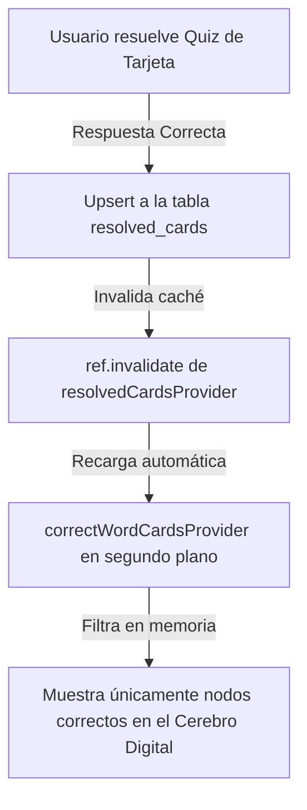

# Cerebro Digital: Lógica de Nodos de Vocabulario y Optimización de Gestos del Lienzo

Este documento detalla la especificación técnica de la lógica de negocio y las optimizaciones de interacción del usuario aplicadas sobre el **Corebro Digital** (lienzo de constelación de palabras y categorías en la sección de Comunidad).

---

## 🧠 1. Filtrado de Nodos por Respuestas Correctas

### El Problema de Origen:
Anteriormente, el Cerebro Digital cargaba y mostraba todas las palabras registradas en la tabla general de tarjetas (`word_cards`), independientemente de si el usuario las había dominado o no. Esto creaba una sobrecarga cognitiva y no reflejaba el progreso real de aprendizaje.

### La Solución Profesional:
Ligamos la red neuronal para que muestre de forma exclusiva las palabras cuyas preguntas hayan sido contestadas **correctamente** en los quizzes del *Card Scrolling* (registradas en la tabla `resolved_cards` de la base de datos).



1.  **Proveedor Híbrido Filtrado (`correctWordCardsProvider`)**:
    En [vocabulary_provider.dart](file:///c:/Users/sebas/OneDrive/Escritorio/Lingiux/lingiux_app/lib/features/vocabulary/presentation/providers/vocabulary_provider.dart), creamos un provider reactivo que combina todas las tarjetas (`wordCardsProvider`) y las tarjetas aprobadas (`resolvedCardsProvider`). Filtramos en memoria cruzando los IDs:
    ```dart
    final correctWordCardsProvider = FutureProvider.autoDispose<List<WordCardModel>>((ref) async {
      final cards = await ref.watch(wordCardsProvider.future);
      final resolved = await ref.watch(resolvedCardsProvider.future);
      final resolvedCardIds = resolved.map((r) => r['card_id'] as String).toSet();
      return cards.where((card) => resolvedCardIds.contains(card.id)).toList();
    });
    ```
2.  **Sincronización en Tiempo Real (`ref.invalidate`)**:
    En la pantalla de detalles de palabra [word_detail_screen.dart](file:///c:/Users/sebas/OneDrive/Escritorio/Lingiux/lingiux_app/lib/features/vocabulary/presentation/screens/word_detail_screen.dart), dentro del método asíncrono `_recordCorrectCard()`, llamamos a `ref.invalidate(resolvedCardsProvider)`. Esto fuerza a Riverpod a desechar el caché desactualizado y solicitar a Supabase los nuevos aciertos de inmediato al resolver correctamente un quiz, actualizando la constelación mental al instante.

---

## 🎨 2. Optimización de Gestos del Lienzo e Interacciones

Para lograr que el lienzo se sienta sumamente premium, de fácil uso y robusto, resolvimos múltiples colisiones de gestos complejas nativas de Flutter:

### A. Zoom y Pellizco Fluido (Pinch-to-Zoom sin Bloqueos de Scroll)
*   **El Conflicto**: Al deslizar dos dedos en vertical u horizontal para hacer zoom, la física del scroll principal de la página (`CustomScrollView`) secuestraba los dedos y se movía en vertical, bloqueando o interrumpiendo el escalado de `InteractiveViewer`.
*   **La Solución**: Creamos un árbitro de punteros (`_activePointerCount`) que registra la cantidad de dedos tocando el lienzo. En cuanto se detecta más de un dedo en el área de la constelación, cambiamos dinámicamente la física de la página a `NeverScrollableScrollPhysics()`. De esta manera, el scroll exterior se congela y deja libre a `InteractiveViewer` para captar el zoom de forma 100% fluida en cualquier eje.

### B. Paneo Lateral con un Solo Dedo sin Atoramientos
*   **El Conflicto**: Al mover el mapa hacia arriba con un solo dedo para navegar, el scroll de la página seguía activo, provocando que la página intentara deslizarse verticalmente en lugar de desplazar el mapa.
*   **La Solución**: Implementamos un control de interacción de lienzo (`_isCanvasTouched`). En el momento en que un usuario coloca cualquier dedo sobre el lienzo, desactivamos la física de la página exterior. El scroll externo de Pull-to-refresh solo se activa si el usuario jala desde la cabecera superior estática (donde están los botones y filtros).

### C. Eliminación de Brincos en Nodos (Delta de Agarre)
*   **El Conflicto**: Al tocar una palabra en su borde para moverla, el nodo se "teletransportaba" instantáneamente alineando su centro geométrico exacto con la punta de tu dedo, provocando un brinco tosco y poco pulido.
*   **La Solución**: Agregamos un cálculo de delta de agarre (`_dragOffset`). En `onPointerDown`, calculamos la distancia entre el centro real del nodo y las coordenadas táctiles exactas. Durante todo el movimiento, sumamos este delta para que la burbuja se desplace de forma suave, sin brinquitos, manteniéndose exactamente donde la sujetaste.
    ```dart
    _dragOffset = tappedNode.position - localPos; // Al tocar
    _draggedNode!.position = event.localPosition + _dragOffset; // Al arrastrar
    ```

---

## 📏 3. Centrado y Zoom Panorámico Inicial

*   **El Problema**: El lienzo mide `800x800` píxeles. Al abrir la app, el plano se alineaba por defecto en `(0, 0)` (arriba a la izquierda), ocultando la constelación (cuyo centro de equilibrio es `(400, 400)`) y obligándote a desplazarte manualmente. Además, la escala por defecto (1.0) se sentía demasiado apretada y cercana.
*   **La Solución**: Integramos un `TransformationController` para inicializar el lienzo con un alejamiento del **65%** (`initialScale = 0.65`) de forma panorámica y calcular la traslación exacta para que el centro de equilibrio quede alineado horizontal y verticalmente según la pantalla de tu dispositivo:
    ```dart
    final double initialScale = 0.65;
    final double targetX = (viewWidth / 2) - (400 * initialScale);
    final double targetY = (viewHeight / 2) - (400 * initialScale);
    
    _transformationController.value = Matrix4.identity()
      ..translate(targetX, targetY)
      ..scale(initialScale);
    ```
*   **Control Inteligente**: Esta matriz solo se aplica al inicio cuando el controlador está en su estado por defecto (`isIdentity()`), evitando interrumpir al usuario o regresarlo de golpe si está explorando manualmente. Al cambiar de modo o refrescar el spinner, la matriz se resetea para centrar la nueva constelación en caliente.

---

## 🧱 4. Solución al Overflow (Desbordamiento) en el Header Pinned

*   **El Problema**: Envolvíamos el toggle de vistas y filtros en un `SliverPersistentHeader` estático con altura fija de `102.0` píxeles. En ciertos teléfonos o configuraciones de texto escalado del sistema, el menú medía más (ej. 106 píxeles), lo que hacía que Flutter mostrara una franja de líneas amarillas y negras con el mensaje `BOTTOM OVERFLOWED BY 4.0 PIXELS`.
*   **La Solución**: Modificamos la altura reservada en el delegado para dar un margen de seguridad amplio:
    *   Pestaña "Palabras": Aumentado a **`112.0` píxeles**.
    *   Pestaña "Personas": Aumentado a **`56.0` píxeles**.
    Esto elimina la rejilla de overflow en cualquier dispositivo móvil.

---

## 📂 5. Archivos Modificados

### [NUEVO] [cerebro_digital_tarjetas_correctas_y_gestos_lienzo.md](file:///c:/Users/sebas/OneDrive/Escritorio/Lingiux/lingiux_app/resources/mds_relevantes/cerebro_digital_tarjetas_correctas_y_gestos_lienzo.md)
*   Documento técnico explicativo actual de arquitectura y optimizaciones del lienzo.

### [MODIFY] [vocabulary_provider.dart](file:///c:/Users/sebas/OneDrive/Escritorio/Lingiux/lingiux_app/lib/features/vocabulary/presentation/providers/vocabulary_provider.dart)
*   Inclusión del provider reactivo `correctWordCardsProvider` para filtrar palabras aprobadas en quizzes.

### [MODIFY] [word_detail_screen.dart](file:///c:/Users/sebas/OneDrive/Escritorio/Lingiux/lingiux_app/lib/features/vocabulary/presentation/screens/word_detail_screen.dart)
*   Invalidador del caché de tarjetas resueltas tras contestar el quiz de vocabulario con éxito.

### [MODIFY] [community_screen.dart](file:///c:/Users/sebas/OneDrive/Escritorio/Lingiux/lingiux_app/lib/features/community/presentation/screens/community_screen.dart)
*   Integración del `TransformationController` para centrado automático y escala panorámica (0.65).
*   Desactivación dinámica del scroll exterior en interacciones con el lienzo.
*   Cálculo de delta de arrastre en nodos para evitar teletransportación.
*   Uso de `SliverPersistentHeader` pinned con altura de seguridad contra desbordamientos.
