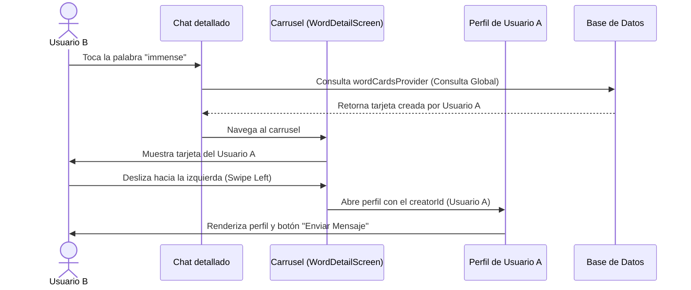

# Democratización de Tarjetas de Vocabulario y Acceso Colaborativo Global

Este documento detalla la arquitectura, el análisis de causa raíz y la solución técnica implementada en **Lingiux** para transformar el sistema de tarjetas de vocabulario de una experiencia aislada y de usuario único, a una plataforma colaborativa y global donde cualquier tarjeta creada por un miembro de la comunidad es accesible y navegable por todos los demás usuarios de la aplicación.

---

## 1. Contexto y Diagnóstico del Bug

### Problemática
Anteriormente, cuando un usuario (Usuario A) creaba una tarjeta mnemotécnica para una palabra específica (por ejemplo, *'immense'*), dicha tarjeta se guardaba de forma exitosa en la base de datos de Supabase. Sin embargo, si otro usuario (Usuario B) iniciaba sesión en el mismo dispositivo o en otro diferente:
1. Al hacer clic sobre la palabra *'immense'* en cualquier burbuja de chat de la aplicación, la palabra se comportaba como si no tuviese tarjeta enlazada (abriendo la tarjeta temporal de invitación con el botón "Diseñar Tarjeta" en su lugar).
2. La tarjeta creada por el Usuario A no aparecía en el visor vertical del carrusel de tarjetas (`WordDetailScreen`) del Usuario B.
3. El Usuario B se veía imposibilitado de realizar el gesto de deslizamiento horizontal (Swipe Left) para visitar el perfil del creador de la tarjeta (Usuario A) y chatear con él.

---

## 2. Análisis de Causa Raíz

Al inspeccionar la capa de datos de la funcionalidad de vocabulario en `lib/features/vocabulary/presentation/providers/vocabulary_provider.dart`, descubrimos que el proveedor global de Riverpod `wordCardsProvider` estaba acoplado a la sesión del usuario actual.

### Implementación Original Ineficiente
```dart
final wordCardsProvider = FutureProvider.autoDispose<List<WordCardModel>>((ref) async {
  final authState = ref.watch(authProvider);
  final user = authState.user;
  if (user == null) return [];

  final supabase = ref.read(supabaseClientProvider);
  
  final response = await supabase
      .from('word_cards')
      .select()
      .or('user_id.eq.${user.id},user_id.is.null') // <-- Filtro restrictivo
      .order('word', ascending: true);
      
  return (response as List<dynamic>)
      .map((json) => WordCardModel.fromJson(json as Map<String, dynamic>))
      .toList();
});
```

### Explicación del Filtro Restrictivo
La línea `.or('user_id.eq.${user.id},user_id.is.null')` instruía a Supabase a filtrar y retornar **exclusivamente** las tarjetas que cumplieran con uno de estos dos criterios:
1. Haber sido creadas por la cuenta activa local (`user_id` idéntico a `user.id`).
2. Tarjetas genéricas del sistema que carecieran de creador (`user_id` nulo).

Esta regla impedía que el proveedor descargara del servidor las tarjetas creadas por cualquier otra cuenta de usuario. Como consecuencia, las palabras enlazadas en el chat y las barajas del carrusel de scrolling fallaban al intentar resolver tarjetas ajenas, rompiendo la experiencia de comunidad de la aplicación.

---

## 3. Solución Técnica: Democratización del Sistema de Datos

Para que Lingiux funcione como una red social de aprendizaje colaborativo, el inventario de tarjetas de vocabulario debe ser público y accesible a nivel global.

### Implementación Optimizada
Rediseñamos el callback de `wordCardsProvider` eliminando la validación del estado de sesión y removiendo por completo la cláusula condicional de filtrado `.or(...)`:

```dart
final wordCardsProvider = FutureProvider.autoDispose<List<WordCardModel>>((ref) async {
  final supabase = ref.read(supabaseClientProvider);
  
  final response = await supabase
      .from('word_cards')
      .select()
      .order('word', ascending: true);
      
  return (response as List<dynamic>)
      .map((json) => WordCardModel.fromJson(json as Map<String, dynamic>))
      .toList();
});
```

### Beneficios Técnicos y Arquitectónicos
1. **Reducción de Latencia y Dependencias:** Al no depender de `authProvider`, la consulta no necesita esperar a que el estado del usuario sea resuelto o re-evaluado, lo que agiliza el inicio del ciclo de vida del widget.
2. **Acceso Colaborativo Dinámico:** La base de datos ahora descarga la colección completa de tarjetas de la comunidad.
3. **Consistencia Visual en Chats:** Las palabras del chat detallado (`chat_detail_screen.dart`) se enlazan dinámicamente comparando el texto con la base global. Si el Usuario A diseñó una tarjeta para la palabra, el Usuario B la verá resaltada de inmediato.
4. **Navegación e Interacción Gestual Cruzada:** Al hacer swipe hacia la izquierda en la tarjeta del Usuario A, el Usuario B lee de manera transparente el campo `card.userId` (que ahora sí se descarga en la consulta global) y es redirigido fluidamente a la pantalla del creador en Supabase.

---

## 4. Flujo de Interacción Detallado entre Cuentas



---

## 5. Archivos Modificados

* **[vocabulary_provider.dart](file:///c:/Users/sebas/OneDrive/Escritorio/Lingiux/lingiux_app/lib/features/vocabulary/presentation/providers/vocabulary_provider.dart):**
  * Simplificada la consulta de Supabase en `wordCardsProvider` eliminando el filtro restrictivo de propiedad de cuenta y el watch sobre `authProvider`.
