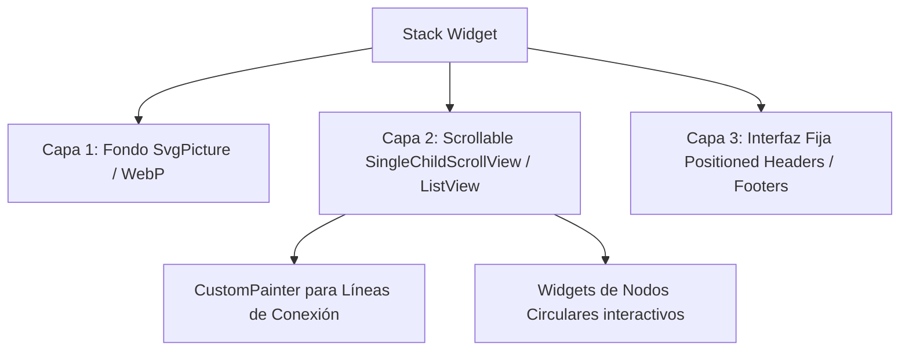

# Diseño de Fondos Ilustrados y Capas de UI en Flutter

Este documento explica cómo se diseñan e implementan los fondos ilustrados complejos y dinámicos (como el mapa de lecciones de *SuperChinese* o *Duolingo*) utilizando técnicas profesionales de capas, formatos vectoriales y animaciones de profundidad en Flutter.

---

## 🎨 1. ¿Cómo se crea el arte del fondo? (Formatos recomendados)

> [!NOTE]
> **Los profesionales casi nunca programan el dibujo del templo (u otros elementos complejos) línea por línea en Flutter** (usando código de dibujo nativo como `CustomPainter` o `Canvas.drawPath`). Programar una ilustración de esa complejidad a mano sería extremadamente lento y difícil de mantener. En su lugar, los diseñadores crean el arte en herramientas externas (Figma, Illustrator) y los desarrolladores lo importan usando assets optimizados.

Para ilustraciones complejas (como templos, paisajes o caminos sinuosos), se trabaja con assets creados en herramientas de diseño gráfico utilizando los siguientes formatos principales:

### A. Gráficos Vectoriales (SVG)
*   **Recomendación:** Principal opción para elementos planos, trazados y formas geométricas.
*   **Ventajas:** El formato SVG define los dibujos mediante fórmulas matemáticas. Esto garantiza que la imagen se escale a cualquier resolución de pantalla (desde teléfonos compactos hasta tablets 4K) sin pixelarse y pesando apenas unos pocos kilobytes.
*   **En Flutter:** Se renderizan fácilmente usando el paquete `flutter_svg`.

### B. Formato WebP / PNG Optimizado
*   **Recomendación:** Se utiliza cuando la ilustración tiene texturas realistas, degradados complejos de iluminación o efectos 3D que los archivos vectoriales no pueden procesar bien.
*   **Ventajas:** WebP (desarrollado por Google) ofrece una compresión superior a PNG, reduciendo el peso de la app hasta en un 30% manteniendo canal de transparencia (alfa).

---

## 🏗️ 2. Arquitectura de Pantalla por Capas en Flutter

Para apilar la ilustración de fondo detrás de los botones interactivos del mapa y las barras de navegación fijas, se utiliza el widget **`Stack`**.



### Capa 1: El Fondo (Background Layer)
Es la base del `Stack`, comúnmente configurada para cubrir toda la pantalla:
```dart
Positioned.fill(
  child: SvgPicture.asset(
    'assets/images/fondo_templo.svg',
    fit: BoxFit.cover,
  ),
)
```

### Capa 2: El Camino y los Nodos (Scrollable Layer)
Contiene la ruta de lecciones y los botones interactivos. Para hacer el scroll de los nodos y dibujar las líneas de conexión dinámicas:
1.  **Nodos de lecciones:** Widgets interactivos individuales colocados dentro de una columna o un scroll bidireccional.
2.  **Líneas conectoras (Path):** Se dibuja una curva suave (Curva de Bézier) utilizando un widget personalizado con **`CustomPainter`** que calcula automáticamente el trayecto entre los centros de cada nodo.

### Capa 3: Interfaz de Usuario Fija (Overlay Layer)
Contiene los elementos que no deben desplazarse con el scroll (barra de estado, barra de navegación inferior, medidores de progreso):
```dart
Positioned(
  bottom: 16,
  left: 16,
  right: 16,
  child: TarjetaProgresoFlotante(), // Elemento flotante superior a la lista
)
```

---

## 🚀 3. Efecto Parallax y Animaciones de Profundidad

Para dar una sensación premium y tridimensional a la pantalla al hacer scroll, se puede implementar el **Efecto Parallax**:

1.  **Segmentación de la Ilustración:** En lugar de exportar un único fondo plano, se exporta el arte en capas separadas:
    *   *Fondo lejano:* Cielo, sol o montañas.
    *   *Fondo medio:* Templo o pagoda central.
    *   *Frente:* Ramas de árboles y decoración lateral.
2.  **Movimiento Relativo al Scroll:** Se asocia la posición de un `ScrollController` al desplazamiento de cada capa de fondo. Si el scroll principal se desplaza 100 píxeles, la capa del templo medio solo se desplaza 30 píxeles, simulando profundidad en el espacio.
3.  **Animaciones Autónomas:** Elementos pequeños como nubes o aves (grullas) se animan de forma continua con un `AnimationController` para simular que flotan o vuelan independientemente en segundo plano.

---

## 🛠️ 4. Flujo de Trabajo Profesional

```text
[Diseñador UI/UX]                              [Desarrollador Flutter]
Dibuja el layout en Figma  ──(Exporta SVG)──>  Implementa Stack y SvgPicture
Crea capas para Parallax   ──(Exporta WebP)─>  Programa ScrollController + Translaciones
Define ruta de niveles     ──(Coordenadas)──>  Aplica CustomPainter para curvas
```
