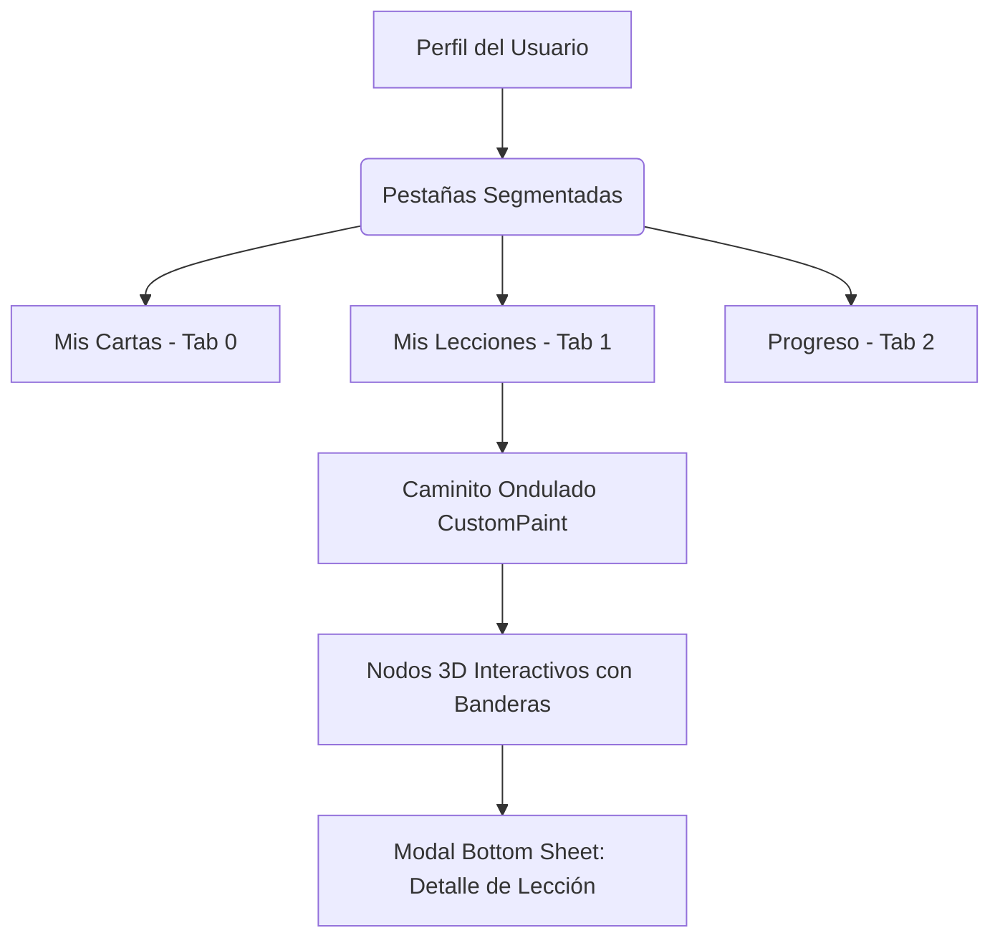

# Documentación Técnica: Editor de Lecciones (Fase 1) e Integración del Caminito en Perfil

Este documento detalla la implementación completa del **Editor de Lecciones Interactivo** en su primera fase (motor de compilación, asistente guiado y persistencia en base de datos) y su integración visual en la pestaña **Perfil** de **Lingiux**, emulando el comportamiento cromático y estructural del "caminito de aprendizaje" ondulado del feed principal.

---

## Índice
1. [Introducción y Objetivos](#1-introducción-y-objetivos)
2. [Estructura del Repositorio y Arquitectura](#2-estructura-del-repositorio-y-arquitectura)
3. [Base de Datos e Infraestructura (Supabase)](#3-base-de-datos-e-infraestructura-supabase)
4. [Dominio y Modelos de Datos (Dart)](#4-dominio-y-modelos-de-datos-dart)
5. [Compilador Inteligente de Ejercicios (Smart Compiler)](#5-compilador-inteligente-de-ejercicios-smart-compiler)
6. [Asistente de Creación (Wizard UI)](#6-asistente-de-creación-wizard-ui)
7. [Integración en la Pestaña Perfil (Caminito Ondulado)](#7-integración-en-la-pestaña-perfil-caminito-ondulado)
8. [Librerías Utilizadas y Propósito](#8-librerías-utilizadas-y-propósito)
9. [Guía de Reversión (Cómo Desinstalar la Funcionalidad)](#9-guía-de-reversión-cómo-desinstalar-la-funcionalidad)

---

## 1. Introducción y Objetivos

El objetivo de este desarrollo es dotar a **Lingiux** de la capacidad de crear lecciones interactivas personalizadas generadas a partir de las cartas de vocabulario que los usuarios ya han creado. El flujo busca dos cosas primordiales:
* **Automatización:** Que el usuario no tenga que escribir laboriosamente cada ejercicio desde cero, sino que un algoritmo compile las cartas semillas (oración de ejemplo, audio, significado, palabra) y proponga automáticamente ejercicios interactivos.
* **Personalización y Control:** Que el creador pueda reordenar, modificar y pulir cada ejercicio propuesto a través de una interfaz de arrastrar y soltar antes de publicarlo.
* **Acceso y Visibilidad:** Que los usuarios tengan una vitrina dentro de su perfil para presumir sus lecciones creadas, presentadas bajo un mapa de aprendizaje cromático idéntico al "feed" de juego.

---

## 2. Estructura del Repositorio y Arquitectura

La implementación sigue una estructura de **diseño limpio por capas (Clean Architecture)** adaptada a Flutter. El nuevo módulo de lecciones se ubica en su propia carpeta bajo `lib/features/lessons/`.

A continuación se muestra la estructura detallada de archivos creados y modificados:

```text
lingiux_app/
├── lib/
│   └── features/
│       ├── create_card/
│       │   └── presentation/
│       │       └── screens/
│       │           └── create_card_screen.dart            <-- [Modificado] Redirección al wizard
│       ├── profile/
│       │   └── presentation/
│       │       └── screens/
│       │           └── profile_screen.dart                <-- [Modificado] Integración de 3 pestañas y caminito
│       └── lessons/                                      <-- [Nuevo Módulo]
│           ├── domain/
│           │   ├── compiler/
│           │   │   └── lesson_compiler.dart               <-- Compilador inteligente de ejercicios
│           │   └── models/
│           │       ├── lesson_exercise_model.dart         <-- Modelo para los ejercicios interactivos
│           │       └── lesson_model.dart                  <-- Modelo principal de la lección
│           └── presentation/
│               ├── providers/
│               │   └── lessons_provider.dart              <-- Servicios de Supabase y providers de Riverpod
│               └── screens/
│                   └── create_lesson_wizard_screen.dart   <-- Interfaz de usuario del asistente guiado
└── resources/
    └── mds_relevantes/
        ├── walkthrough_editor_lecciones.md                <-- Historial de walkthrough
        └── editor_lecciones_fase1_y_perfil_caminito.md    <-- Este documento
```

---

## 3. Base de Datos e Infraestructura (Supabase)

Para persistir las lecciones, se diseñó una tabla centralizada en **Supabase** que almacena tanto los metadatos globales como los ejercicios estructurados jerárquicamente utilizando un campo **JSONB**. Esto evita la sobrecarga de consultas uniendo múltiples tablas relacionales (ejercicios, opciones, respuestas) y optimiza el almacenamiento local.

### Script SQL de Migración (Ejecutado en la base de datos)
```sql
-- Crear la tabla de lecciones en el esquema público
CREATE TABLE IF NOT EXISTS public.lessons (
    id UUID PRIMARY KEY DEFAULT gen_random_uuid(),
    creator_id UUID NOT NULL REFERENCES auth.users(id) ON DELETE CASCADE,
    title TEXT NOT NULL,
    description TEXT,
    language TEXT NOT NULL,
    difficulty TEXT NOT NULL,
    card_ids TEXT[] NOT NULL DEFAULT '{}',
    exercises JSONB NOT NULL DEFAULT '[]',
    created_at TIMESTAMP WITH TIME ZONE DEFAULT timezone('utc'::text, now()) NOT NULL
);

-- Habilitar Row Level Security (RLS)
ALTER TABLE public.lessons ENABLE ROW LEVEL SECURITY;

-- Políticas de Seguridad de Supabase
-- 1. Permitir lectura pública a cualquier usuario autenticado de la app
CREATE POLICY "Permitir lectura pública de lecciones" 
ON public.lessons 
FOR SELECT 
TO authenticated 
USING (true);

-- 2. Permitir inserción de lecciones solo a usuarios autenticados (dueños de su creator_id)
CREATE POLICY "Permitir inserción a creadores autenticados" 
ON public.lessons 
FOR INSERT 
TO authenticated 
WITH CHECK (auth.uid() = creator_id);

-- 3. Permitir actualización a creadores sobre sus propias lecciones
CREATE POLICY "Permitir modificación al dueño" 
ON public.lessons 
FOR UPDATE 
TO authenticated 
USING (auth.uid() = creator_id)
WITH CHECK (auth.uid() = creator_id);

-- 4. Permitir eliminación a creadores sobre sus propias lecciones
CREATE POLICY "Permitir eliminación al dueño" 
ON public.lessons 
FOR DELETE 
TO authenticated 
USING (auth.uid() = creator_id);
```

---

## 4. Dominio y Modelos de Datos (Dart)

### A. Modelo de Ejercicios (`lesson_exercise_model.dart`)
Soporta los siguientes tipos de ejercicios mapeados en un enum `ExerciseType`:
1. `multipleChoice`: Selección del significado correcto dada la palabra.
2. `listeningQuiz`: Escuchar un audio grabado y escribir/seleccionar la palabra correcta.
3. `wordOrder`: Ordenar los bloques de palabras para reconstruir una oración.
4. `pronunciation`: Ejercicio enfocado en la fonética IPA de la palabra.

#### Código del Modelo
```dart
import '../../../../vocabulary/domain/models/word_card_model.dart';

enum ExerciseType {
  multipleChoice,
  listeningQuiz,
  wordOrder,
  pronunciation,
}

class LessonExerciseModel {
  final String id;
  final ExerciseType type;
  final String prompt;
  final String correctAnswer;
  final List<String> options;
  final String? audioUrl;
  final String? phoneticSymbol;

  LessonExerciseModel({
    required this.id,
    required this.type,
    required this.prompt,
    required this.correctAnswer,
    required this.options,
    this.audioUrl,
    this.phoneticSymbol,
  });

  Map<String, dynamic> toJson() {
    return {
      'id': id,
      'type': type.name,
      'prompt': prompt,
      'correct_answer': correctAnswer,
      'options': options,
      'audio_url': audioUrl,
      'phonetic_symbol': phoneticSymbol,
    };
  }

  factory LessonExerciseModel.fromJson(Map<String, dynamic> json) {
    return LessonExerciseModel(
      id: json['id'] as String,
      type: ExerciseType.values.firstWhere((e) => e.name == json['type']),
      prompt: json['prompt'] as String,
      correctAnswer: json['correct_answer'] as String,
      options: List<String>.from(json['options'] ?? []),
      audioUrl: json['audio_url'] as String?,
      phoneticSymbol: json['phonetic_symbol'] as String?,
    );
  }
}
```

### B. Modelo Principal de Lección (`lesson_model.dart`)
Engloba metadatos como el idioma meta, dificultad, el listado de cartas semilla (`card_ids`) y los ejercicios generados.

#### Código del Modelo
```dart
import 'lesson_exercise_model.dart';

class LessonModel {
  final String id;
  final String creatorId;
  final String title;
  final String? description;
  final String language;
  final String difficulty;
  final List<String> cardIds;
  final List<LessonExerciseModel> exercises;
  final DateTime createdAt;

  LessonModel({
    required this.id,
    required this.creatorId,
    required this.title,
    this.description,
    required this.language,
    required this.difficulty,
    required this.cardIds,
    required this.exercises,
    required this.createdAt,
  });

  Map<String, dynamic> toJson() {
    return {
      'title': title,
      'description': description,
      'language': language,
      'difficulty': difficulty,
      'card_ids': cardIds,
      'exercises': exercises.map((e) => e.toJson()).toList(),
      'creator_id': creatorId,
    };
  }

  factory LessonModel.fromJson(Map<String, dynamic> json) {
    return LessonModel(
      id: json['id'] as String,
      creatorId: json['creator_id'] as String,
      title: json['title'] as String,
      description: json['description'] as String?,
      language: json['language'] as String,
      difficulty: json['difficulty'] as String,
      cardIds: List<String>.from(json['card_ids'] ?? []),
      exercises: (json['exercises'] as List)
          .map((e) => LessonExerciseModel.fromJson(e as Map<String, dynamic>))
          .toList(),
      createdAt: DateTime.parse(json['created_at'] as String),
    );
  }
}
```

---

## 5. Compilador Inteligente de Ejercicios (Smart Compiler)

El motor [lesson_compiler.dart](file:///c:/Users/sebas/OneDrive/Escritorio/Lingiux/lingiux_app/lib/features/lessons/domain/compiler/lesson_compiler.dart) toma las cartas seleccionadas y las compila transformándolas en ejercicios válidos, utilizando el contexto (definición, ejemplos, audios y fonética) provisto por el usuario.

### Algoritmo de Compilación
1. **Opción Múltiple:** Se extrae el significado/definición de la carta como respuesta correcta. Se seleccionan distractores aleatorios del resto de las cartas disponibles para evitar respuestas obvias.
2. **Quiz de Escucha:** Si la carta cuenta con un archivo de audio grabado por el usuario (`audioUrl`), se crea un ejercicio de escucha. La respuesta correcta es la palabra en sí.
3. **Ordenamiento de Palabras:** Se extrae la oración de ejemplo (`example`), se remueven caracteres especiales y signos de puntuación, se dividen en tokens de palabras y se barajan para que el estudiante las ordene.
4. **Fonética y Pronunciación:** Si la carta cuenta con una transcripción fonética (`phonetic`), se genera una pregunta solicitando al estudiante emparejar el símbolo IPA correcto.

---

## 6. Asistente de Creación (Wizard UI)

La pantalla [create_lesson_wizard_screen.dart](file:///c:/Users/sebas/OneDrive/Escritorio/Lingiux/lingiux_app/lib/features/lessons/presentation/screens/create_lesson_wizard_screen.dart) gestiona el flujo de creación en un wizard dividido en 3 pasos con validación de estados y retroalimentación háptica.

### Paso 1: Configuración de Metadatos
* **Campos:** Título de la lección, descripción (opcional), idioma meta (Dropdown) y nivel de dificultad (de A1 a C2).
* **Validación:** El botón para avanzar se bloquea si el título está vacío o si los dropdowns no tienen valores asignados.

### Paso 2: Selección de Cartas Semilla
* Consume el provider `wordCardsProvider` para listar todas las tarjetas creadas en un grid de estilo premium (márgenes suaves, gradientes en los badges de idiomas y contornos redondeados).
* **Lógica:** El creador debe seleccionar al menos **2 cartas** para poder habilitar la compilación, garantizando que el compilador tenga suficientes distractores para estructurar las opciones múltiples de traducción.

### Paso 3: Organizador y Editor de Ejercicios
* Los ejercicios auto-generados por el compilador inteligente se muestran en una lista interactiva.
* **Reordenamiento:** Envoltura en un `ReorderableListView` para permitir arrastrar y soltar cada ítem mediante controladores táctiles integrados de Flutter.
* **Acciones:**
  * **Eliminar:** Elimina la pregunta de la lección mediante un botón de bote de basura.
  * **Editar:** Abre un diálogo modal para modificar el enunciado, la respuesta correcta o los distractores específicos de esa pregunta de manera manual.
* **Publicación:** Al presionar "Publicar Lección", se invoca el provider de Riverpod que ejecuta el `insert` en Supabase y redirige al usuario de vuelta.

---

## 7. Integración en la Pestaña Perfil (Caminito Ondulado)

Para que el usuario pueda interactuar con sus lecciones creadas, se modificó [profile_screen.dart](file:///c:/Users/sebas/OneDrive/Escritorio/Lingiux/lingiux_app/lib/features/profile/presentation/screens/profile_screen.dart) para incorporar una tercera pestaña llamada **"Mis Lecciones"**.



### Características Clave de la Pestaña Perfil
1. **Cápsula Deslizable de 3 Pestañas:**
   * Rediseño del slider segmentado horizontal. Las posiciones horizontales y offsets se calculan con el ancho total de pantalla dividido por 3:
     ```dart
     final pillWidth = totalWidth / 3 - 2;
     final leftOffset = _activeTabIndex == 0 
         ? 2.0 
         : (_activeTabIndex == 1 ? (totalWidth / 3) : (totalWidth * 2 / 3));
     ```
   * Las etiquetas utilizan un tamaño tipográfico óptimo (`fontSize: 10`) con iconos estilizados (`size: 15`) para garantizar que la interfaz mantenga legibilidad.

2. **Dibuja del Camino Ondulado (`_ProfilePathPainter`):**
   * Pinta la línea ondulada que une los nodos usando curvas Bezier cúbicas consecutivas, manteniendo una correspondencia visual exacta con el feed principal de la app:
     ```dart
     double endX = size.width * xFractions[i % xFractions.length];
     double endY = i * rowHeight + rowHeight / 2;
     double controlY1 = startY + rowHeight * 0.45;
     double controlY2 = endY - rowHeight * 0.45;
     path.cubicTo(startX, controlY1, endX, controlY2, endX, endY);
     ```

3. **Nodos Interactivos 3D (`_ProfileLessonNode`):**
   * Emplea un efecto de relieve simulado usando dos contenedores circulares superpuestos (el inferior actúa como la profundidad oscura `depthColor`). Al presionar, el contenedor superior se desplaza 6 píxeles hacia abajo (`top: 6`) y la sombra se disipa para dar la sensación física de que el botón se ha hundido.

4. **Hoja de Detalle (`_showProfileLessonDetailsBottomSheet`):**
   * Al hacer tap en un nodo del perfil, se despliega una hoja inferior redondeada (`showModalBottomSheet`) con fondo translúcido y gradientes elegantes para mostrar la información del creador, la descripción de la lección, número de preguntas y un botón de llamada a la acción ("PROBAR LECCIÓN").

---

## 8. Librerías Utilizadas y Propósito

El módulo de lecciones se apoya enteramente en la infraestructura tecnológica aprobada para el proyecto:

1. **`flutter_riverpod`:**
   * **Propósito:** Gestor de estado reactivo y desacoplado. Utilizado para inyectar servicios (`lessonServiceProvider`), observar cartas creadas (`wordCardsProvider`) y consultar asíncronamente las lecciones de la base de datos a través de `userLessonsProvider` y `lessonsListProvider`.
2. **`supabase_flutter`:**
   * **Propósito:** Persistencia remota en la nube. Permite realizar consultas seguras aplicando políticas RLS integradas, mapeando los payloads JSONB a objetos tipados en Dart.
3. **`flutter_svg`:**
   * **Propósito:** Dibujar las banderas vectoriales (archivos `.svg`) que marcan las banderas del idioma destino en los badges de selección de los grids y en la hoja de detalle.
4. **`cached_network_image`:**
   * **Propósito:** Caching eficiente del avatar del usuario creador en las tarjetas de detalle de la lección.

---

## 9. Guía de Reversión (Cómo Desinstalar la Funcionalidad)

Si en el futuro se requiere revertir completamente esta funcionalidad y restaurar el código a su estado original previo al Editor de Lecciones, siga detalladamente las siguientes instrucciones paso a paso:

### Paso 1: Eliminar Archivos Creados
Borre los directorios y archivos correspondientes al módulo de lecciones:
```bash
# Eliminar la carpeta del feature de lecciones
Remove-Item -Recururse -Force .\lib\features\lessons\

# Eliminar bitácoras y documentaciones asociadas
Remove-Item .\resources\mds_relevantes\walkthrough_editor_lecciones.md
Remove-Item .\resources\mds_relevantes\editor_lecciones_fase1_y_perfil_caminito.md
```

### Paso 2: Revertir Modificaciones en `create_card_screen.dart`
Abra [create_card_screen.dart](file:///c:/Users/sebas/OneDrive/Escritorio/Lingiux/lingiux_app/lib/features/create_card/presentation/screens/create_card_screen.dart) y realice los siguientes cambios:

1. **Quitar Imports:** Elimine las importaciones de `create_lesson_wizard_screen.dart` cerca de las líneas 9-11.
2. **Revertir Acción del Botón "Lección" (Líneas 374-386 aprox.):**
   * Reemplace la navegación al wizard con un SnackBar informativo de función futura:
   ```diff
   -                              Navigator.push(
   -                                context,
   -                                MaterialPageRoute(
   -                                  builder: (_) => const CreateLessonWizardScreen(),
   -                                ),
   -                              );
   +                              _showFutureFeatureSnackbar(context, 'Crear Lección');
   ```

### Paso 3: Revertir Modificaciones en `profile_screen.dart`
Abra [profile_screen.dart](file:///c:/Users/sebas/OneDrive/Escritorio/Lingiux/lingiux_app/lib/features/profile/presentation/screens/profile_screen.dart) y revierta a un diseño bidireccional (2 pestañas):

1. **Eliminar Imports:** Remueva los imports de lecciones agregados en el bloque superior:
   ```dart
   import '../../../lessons/presentation/providers/lessons_provider.dart';
   import '../../../lessons/domain/models/lesson_model.dart';
   ```
2. **Revertir Tab Index Variable:**
   ```dart
   int _activeTabIndex = 0; // 0 for grid, 1 for stats
   ```
3. **Revertir Controles de Desplazamiento (`onHorizontalDragEnd`):** Restaure los límites rígidos a `0` y `1` y remueva el cálculo de 3 pestañas.
4. **Revertir Slider Cápsula Segmentada:** Cambie el divisor a `2` (`totalWidth / 2 - 2`) y elimine la pestaña del medio ("Mis Lecciones").
5. **Revertir `contentHeight` y `PageView`:**
   * Restaure `contentHeight` a: `final contentHeight = _activeTabIndex == 0 ? gridHeight : statsHeight;`
   * Remueva la página intermedia del `PageView` (`_buildLessonsPathTab`).
6. **Eliminar Clases Helpers del Final del Archivo:** Borre todos los métodos y clases agregadas después de `_MiniWordCard`, incluyendo `_buildLessonsPathTab`, `_buildProfileLessonCard`, `_showProfileLessonDetailsBottomSheet`, `_ProfilePathPainter` y `_ProfileLessonNode`.

### Paso 4: Eliminar Tabla en Supabase (SQL Rollback)
Abra el editor de SQL de su proyecto de Supabase y ejecute el siguiente comando para destruir la tabla de lecciones y sus políticas RLS:
```sql
DROP TABLE IF EXISTS public.lessons CASCADE;
```
