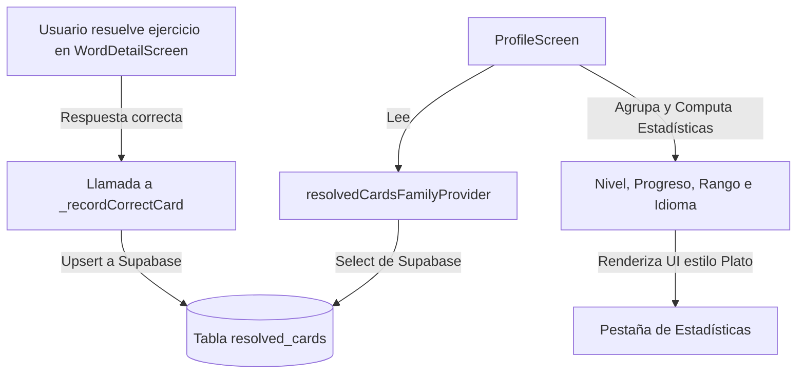

# Implementación de Estadísticas de Tarjetas Resueltas por Idioma (Estilo Plato)

Este documento detalla la especificación técnica, la arquitectura de base de datos en Supabase, los proveedores de estado reactivos en Riverpod y la maquetación visual implementada para el sistema de estadísticas de tarjetas de vocabulario resueltas por idioma. Esta funcionalidad emula la interfaz gamificada de niveles de la aplicación **Plato** dentro de la pestaña de estadísticas del perfil del usuario.

---

## 🏗️ 1. Arquitectura del Sistema

Para registrar el progreso de aprendizaje del usuario de manera persistente, implementamos un pipeline que conecta la interacción de los ejercicios en el carrusel de estudio con el backend de Supabase y lo expone de forma reactiva en el Perfil:



---

## 🗄️ 2. Estructuración en la Base de Datos (Supabase)

Creamos una tabla dedicada en PostgreSQL para guardar los aciertos individuales. Para optimizar el almacenamiento y evitar contar múltiples veces la misma tarjeta resuelta, definimos una restricción de unicidad compuesta.

### A. Sentencia de Migración SQL
La migración fue aplicada satisfactoriamente en el proyecto Supabase `LX Flutter` (ID: `nlzossymgltwvognvemv`):

```sql
CREATE TABLE public.resolved_cards (
    id UUID PRIMARY KEY DEFAULT gen_random_uuid(),
    user_id UUID REFERENCES auth.users(id) ON DELETE CASCADE NOT NULL,
    card_id UUID REFERENCES public.word_cards(id) ON DELETE CASCADE NOT NULL,
    language VARCHAR(100) NOT NULL,
    created_at TIMESTAMP WITH TIME ZONE DEFAULT timezone('utc'::text, now()) NOT NULL,
    UNIQUE (user_id, card_id) -- Asegura un registro único por tarjeta por usuario
);

-- Habilitar Row Level Security (RLS)
ALTER TABLE public.resolved_cards ENABLE ROW LEVEL SECURITY;

-- Políticas de Seguridad RLS
CREATE POLICY "Users can insert their own resolved cards"
    ON public.resolved_cards FOR INSERT
    WITH CHECK (auth.uid() = user_id);

CREATE POLICY "Anyone can read resolved cards"
    ON public.resolved_cards FOR SELECT
    USING (true);
```

*   **Restricción `UNIQUE(user_id, card_id)`**: Es crucial para evitar que el conteo de estadísticas se altere si un usuario repite y acierta el mismo quiz múltiples veces. Permite usar sentencias `upsert` sin duplicar filas.
*   **Políticas de RLS**: Aseguran que los usuarios solo puedan escribir sus propios registros de aciertos (comprobando su ID mediante `auth.uid()`), pero permiten lectura libre para que cualquier usuario pueda ver las estadísticas en perfiles ajenos.

---

## ⚡ 3. Proveedores de Estado Reactivos (Riverpod)

Para consultar e invalidar la caché de los aciertos, añadimos nuevos proveedores asíncronos en [vocabulary_provider.dart](file:///c:/Users/sebas/OneDrive/Escritorio/Lingiux/lingiux_app/lib/features/vocabulary/presentation/providers/vocabulary_provider.dart).

```dart
final resolvedCardsFamilyProvider = FutureProvider.family.autoDispose<List<Map<String, dynamic>>, String?>((ref, userId) async {
  final effectiveUserId = userId ?? ref.watch(authProvider).user?.id;
  if (effectiveUserId == null) {
    return [];
  }

  final supabase = ref.read(supabaseClientProvider);
  
  try {
    final response = await supabase
        .from('resolved_cards')
        .select()
        .eq('user_id', effectiveUserId)
        .order('created_at', ascending: false);
        
    return List<Map<String, dynamic>>.from(response as List);
  } catch (e) {
    return [];
  }
});

final resolvedCardsProvider = FutureProvider.autoDispose<List<Map<String, dynamic>>>((ref) async {
  return ref.watch(resolvedCardsFamilyProvider(null).future);
});
```

*   **`resolvedCardsFamilyProvider`**: Acepta un `userId` opcional. Si es nulo, toma el ID del usuario actualmente autenticado. Realiza la consulta a Supabase ordenando por fecha de resolución descendente.

---

## 🎯 4. Captura de Aciertos en los Quizzes (`WordDetailScreen`)

Modificamos el estado del carrusel en [word_detail_screen.dart](file:///c:/Users/sebas/OneDrive/Escritorio/Lingiux/lingiux_app/lib/features/vocabulary/presentation/screens/word_detail_screen.dart) para inyectar la persistencia al acertar un ejercicio.

### A. Método `_recordCorrectCard`
Dentro de `_WordCardState`, declaramos el siguiente método asíncrono:

```dart
  Future<void> _recordCorrectCard() async {
    try {
      final supabase = ref.read(supabaseClientProvider);
      final user = ref.read(authProvider).user;
      if (user == null) return;

      await supabase.from('resolved_cards').upsert({
        'user_id': user.id,
        'card_id': widget.wordCard.id,
        'language': widget.wordCard.language ?? 'Inglés',
      }, onConflict: 'user_id,card_id');
      
      debugPrint('Tarjeta resuelta registrada: ${widget.wordCard.word}');
    } catch (e) {
      debugPrint('Error al registrar tarjeta resuelta: $e');
    }
  }
```
*   **`upsert` con `onConflict`**: Envía la petición a Supabase. Si la restricción única `(user_id, card_id)` se activa, Supabase ignora la inserción sin retornar error (idempotente).

### B. Enlace de Ejecución por Tipo de Ejercicio
1.  **Ejercicio `acomodar`**:
    Se dispara al ordenar correctamente la frase y comparar la longitud del arreglo con la frase esperada:
    ```dart
    if (correct) {
      _recordCorrectCard();
    }
    ```
2.  **Ejercicio `completar`**:
    Se dispara inmediatamente al tocar la opción correcta que rellena el espacio en blanco:
    ```dart
    if (isCorrect) {
      _recordCorrectCard();
    }
    ```
3.  **Ejercicio `pregunta` (Verdadero/Falso)**:
    Se dispara al presionar los botones "Sí" o "No" si el valor de la opción elegida coincide con la respuesta correcta:
    ```dart
    if (isCorrect) {
      _recordCorrectCard();
    }
    ```

---

## 🎨 5. Pestaña de Estadísticas en el Perfil de Usuario (`ProfileScreen`)

Refactorizamos completamente [profile_screen.dart](file:///c:/Users/sebas/OneDrive/Escritorio/Lingiux/lingiux_app/lib/features/profile/presentation/screens/profile_screen.dart) para convertirlo de `ConsumerWidget` a `ConsumerStatefulWidget` e incorporar la pestaña interactiva estilo **Plato** con navegación por deslizamiento.

### A. Alternancia de Pestañas e Iconografía
Añadimos la variable de estado `int _activeTabIndex = 0` y la inicialización de `late final PageController _pageController` en `initState()`.
Las pestañas se controlan mediante gestos táctiles e iconos interactivos:
*   **Index 0**: Grid de publicaciones (icono `Icons.grid_on_rounded`).
*   **Index 1**: Estadísticas de estudio (icono `Icons.style_outlined` - mazo de tarjetas).

El indicador púrpura (`AppColors.primary`) se desplaza de manera animada cuando el usuario pulsa las pestañas o desliza horizontalmente.

### B. Navegación por Deslizamiento (Swipe Navigation) con Altura Dinámica
Para emular el comportamiento de desplazamiento horizontal fluido de Instagram sin romper el scroll vertical de la pantalla, implementamos un widget `PageView` envuelto en un `AnimatedContainer` con transición de altura reactiva:
*   **Fórmula de Altura de la Cuadrícula (Grid)**:
    $$\text{alturaGrid} = (\text{filas} \times (\text{alturaCarta} + 6)) + 24.0$$
    donde $\text{alturaCarta} = \text{anchoCarta} \times 1.5$.
*   **Fórmula de Altura de Estadísticas (Stats)**:
    $$\text{alturaStats} = (\text{cantidadIdiomas} \times 80.0) + 60.0$$
*   **Transición**: El `AnimatedContainer` se ajusta a la altura correspondiente a la página activa en 200 milisegundos con curvas suavizadas.

### C. Banderas en las Miniaturas del Grid
Para identificar de forma rápida a qué idioma corresponde cada carta del grid:
*   Envolvemos `_MiniWordCard` en un `Stack` dentro de la cuadrícula.
*   Añadimos un widget flotante circular (`Positioned` en la esquina superior derecha `top: 6, right: 6`) con la bandera del idioma de la tarjeta, borde blanco fino de $1.5\text{px}$ y sombras.

### D. Botones de Acción Simétricos (Remoción de Editar Perfil)
Removemos el botón "EDITAR PERFIL" de la sección del perfil propio. Para mantener el equilibrio estético y la simetría del diseño:
*   Transformamos los dos accesos directos (**Ajustes** y **Compartir**) en dos botones expandidos que comparten el ancho disponible de forma equitativa (50/50).
*   Llevan los rótulos **AJUSTES** y **COMPARTIR** acompañados de sus respectivos iconos vectoriales.

### E. Lógica de Negocio y Fórmulas de Gamificación
Cuando se visualiza la sección de estadísticas, el widget realiza las siguientes agrupaciones:

1.  **Recopilación de Idiomas**: Une todos los idiomas de las cartas que el usuario ha creado y las que ha resuelto, evitando duplicados en un `Set<String>` y ordenándolas alfabéticamente.
2.  **Cálculo de Nivel**:
    El nivel se calcula de forma lineal a partir del número de tarjetas resueltas:
    $$\text{Nivel} = \lfloor \frac{\text{Aciertos}}{3} \rfloor + 1$$
    *(Cada 3 tarjetas correctas el usuario sube un nivel. Ejemplo: 0 resolved = Lvl 1; 3 resolved = Lvl 2; 6 resolved = Lvl 3).*
3.  **Cálculo de Progreso**:
    La fracción de progreso para la barra indicadora es:
    $$\text{Progreso} = \frac{\text{Aciertos} \pmod 3}{3.0}$$
4.  **Asignación de Rango**:
    En función del nivel, asignamos un título honorífico de maestría:
    *   **Nivel 1**: "Novato"
    *   **Nivel 2**: "Aprendiz"
    *   **Nivel 3**: "Avanzado"
    *   **Nivel 4**: "Experto"
    *   **Nivel 5+**: "Leyenda"

### F. Maquetación Visual estilo Plato
El diseño visual se construyó meticulosamente con Vanilla CSS/Flutter Widgets para brindar una estética premium:

*   **Bandera Circular de Nacionalidad**: Contenedor circular con borde blanco y sombra difuminada que renderiza el asset vectorial SVG correspondiente.
    *   Inglés: `assets/flags/us.svg`
    *   Español/Otros: `assets/flags/mx.svg`
*   **Insignia de Nivel**: Un círculo azul superpuesto en la esquina inferior derecha de la bandera (`Positioned`) con el número de nivel en negrita blanca.
*   **Barra de Progreso**: Un widget `LinearProgressIndicator` encerrado en un `ClipRRect` para darle esquinas redondeadas, usando verde vibrante (`Color(0xFF22C55E)`) para la barra y un color de contraste oscuro para el fondo.
*   **Estadísticas cuantitativas**: En la parte inferior derecha, muestra de forma sutil las métricas `"Resueltas: X  Creadas: Y"`.

---

## 📚 6. Librerías y Dependencias Utilizadas

1.  **`supabase_flutter`**: Facilita la conexión directa con las API REST de Supabase Postgrest y el envío de peticiones `upsert` seguras mediante OAuth JWT.
2.  **`flutter_riverpod`**: Administrador de estado reactivo global para almacenar en caché las tarjetas resueltas, facilitando su invalidación y recarga asíncrona mediante el `RefreshIndicator`.
3.  **`flutter_svg`**: Renderiza de manera nativa e instantánea las banderas vectoriales SVG sin pérdida de resolución en pantallas de alta densidad.
4.  **`cached_network_image`**: Encargado de cargar de manera eficiente con caché de disco local las portadas de las minicartas en la pestaña de Grid.
