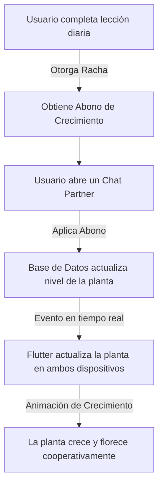

# Gamificación: Sistema de Planta Cooperativa y Animaciones Interactivas

Este documento detalla la especificación de diseño, análisis de rendimiento y flujo de trabajo técnico para la futura implementación de la **Planta Cooperativa de Chat** en Lingiux. Esta función reemplazará o complementará las dinámicas del rompecabezas cooperativo dentro de la sección secundaria de los chats individuales.

---

## 🌿 1. Concepto del Flujo de Gamificación

La idea central une el progreso individual de estudio diario de dos usuarios en un chat compartido, promoviendo la consistencia mutua mediante una recompensa visual dinámica: una planta en crecimiento constante.



1.  **Obtención de Abono**: Al completar las lecciones diarias y mantener activa la racha, el usuario recibe "Abono" (nutrientes para la planta).
2.  **Distribución de Nutrientes**: El usuario puede elegir libremente a qué chat socio (partner chat) decide abonar.
3.  **Progreso Mutuo**: La planta de la conversación compartida crece únicamente mediante la suma de los abonos aplicados por ambos integrantes.

---

## 🛠️ 2. Tecnologías de Animación Profesional: Código vs. Software Externo

Para lograr animaciones que luzcan premium, ligeras y fluidas, el desarrollo profesional nunca programa el movimiento de las ramas u hojas a mano en código línea por línea. Se utilizan motores de animación interactivos:

### A. Rive (La opción recomendada para Lingiux)
*   **¿Qué es?**: Un software interactivo de diseño y animación vectorial en tiempo real en la nube ([rive.app](https://rive.app)).
*   **¿Por qué es ideal?**: Rive está diseñado específicamente para interactuar con código. Permite definir una **Máquina de Estados (State Machine)** dentro del propio archivo de animación.
*   **Integración**: Puedes modificar variables en tiempo real desde Flutter (por ejemplo, cambiar la variable `progreso` de 0 a 100), y Rive interpolará de forma matemática el crecimiento y las deformaciones del tallo de manera nativa sin recargar la GPU.

### B. Lottie (Airbnb)
*   **¿Qué es?**: Un motor de renderizado de animaciones vectoriales exportadas desde Adobe After Effects en formato JSON.
*   **¿Por qué es ideal?**: Excelente para animaciones lineales de corta duración (confeti al abonar, partículas de destellos o la regadera flotando).
*   **Integración**: Fácil uso con `lottie_flutter`, aunque tiene menos interactividad dinámica en tiempo real que Rive.

---

## 📊 3. Preguntas Clave y Especificaciones Técnicas

### 1. ¿Cuesta mucho en rendimiento de la aplicación?
*   **Rendimiento excepcional**: Rive y Lottie son formatos vectoriales renderizados directamente en la GPU (tarjeta gráfica) del dispositivo usando trazos matemáticos (curvas de Bézier).
*   **Consumo de recursos**: Un archivo de Rive `.riv` con una planta compleja pesa apenas **50 KB - 150 KB** y consume una cantidad insignificante de memoria RAM (menos de 1 MB).
*   **Evitar GIFs/Videos**: Los GIFs de alta definición consumen megabytes de RAM, requieren decodificación continua por software y congelarían el hilo de ejecución principal de Flutter al desplazarse por el chat.

### 2. ¿Es posible dar la sensación de que la planta se mueve ligeramente en bucle?
*   **Sí, mediante animaciones de reposo (*Idle Animations*)**:
    *   En Rive se diseña un bucle infinito de 3 o 4 segundos donde las hojas y ramas oscilan suavemente simulando el viento.
    *   Esta animación se ejecuta constantemente en segundo plano. Al ser una deformación elástica de vectores mediante huesos (*rigging*), el procesador apenas lo nota.

### 3. Al abonar la planta, ¿es posible animar el crecimiento?
*   **Sí, mediante transiciones de la Máquina de Estados**:
    *   En Rive se configuran los estados de crecimiento (`Semilla` -> `Brote` -> `Joven` -> `Adulto`).
    *   Cuando el usuario presiona el botón "Abonar" en Flutter, se dispara una variable de transición:
        ```dart
        final StateMachineController? controller = ...
        final SMINumber? progressInput = controller?.findInput<double>('growth_progress') as SMINumber?;
        progressInput?.value = newGrowthPercentage; // ej. 45.0
        ```
    *   Rive calcula automáticamente la interpolación física para que las hojas se estiren y nazcan nuevas flores de forma fluida mientras el balanceo del viento continúa sin interrumpirse.

### 4. ¿Qué se necesita para que se vea profesional?
*   **Rigging Esquelético**: En Rive, se asocian "huesos" (*bones*) a los trazos del tallo y las hojas. Esto permite mover una sola articulación central y lograr que toda la planta se doble de forma elástica y natural con gravedad simulada.
*   **Feedback Táctil**: Al regar o abonar la planta, se debe disparar una vibración háptica de intensidad media:
    ```dart
    HapticFeedback.mediumImpact();
    ```
*   **Feedback Visual Secundario**: Acompañar el crecimiento con partículas flotantes, confeti de colores, o un destello de luz dorado alrededor de la maceta utilizando Lottie.

---

## 📦 4. Librerías Recomendadas para la Implementación

Para llevar esto a cabo en Lingiux, se deben añadir las siguientes dependencias a `pubspec.yaml` (una vez habilitado el acceso a red):

1.  **`rive`** (v0.13.0+):
    *   *Propósito*: Renderizar el archivo de la planta cooperativa `.riv`, escuchar eventos e interactuar con la máquina de estados de crecimiento.
2.  **`lottie`** (v3.1.0+):
    *   *Propósito*: Renderizar efectos secundarios satisfactorios como la regadera, gotas de agua o confeti festivo.
3.  **`flutter_animate`** (v4.5.0+):
    *   *Propósito*: Controlar animaciones de interfaz del usuario (ej. hacer que el botón de abonar pulse o rebote sutilmente para llamar la atención del usuario).

---

## 📂 5. Archivos Relacionados con la Implementación Futura

### [NUEVO] [gamificacion_planta_cooperativa_y_animaciones_interactivas.md](file:///c:/Users/sebas/OneDrive/Escritorio/Lingiux/lingiux_app/resources/mds_relevantes/gamificacion_planta_cooperativa_y_animaciones_interactivas.md)
*   Este documento técnico que especifica el plan de diseño, rendimiento y flujo de gamificación de la planta.

### [MODIFY] [chat_detail_screen.dart](file:///c:/Users/sebas/OneDrive/Escritorio/Lingiux/lingiux_app/lib/features/chat/presentation/screens/chat_detail_screen.dart)
*   Pantalla donde se ubica la sección lateral accesible mediante swipe (actualmente con el rompecabezas cooperativo), la cual se modificará en el futuro para incrustar el widget de la planta interactiva (`RiveAnimation.asset`).
