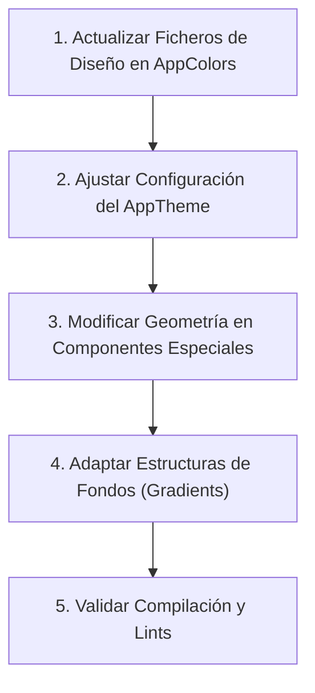

# Guía del Rediseño Visual y Manual de Cambios 360° en Lingiux

Este documento detalla cómo se implementó el rediseño visual de la aplicación Lingiux (v1.0), los archivos modificados durante el proceso y las pautas técnicas necesarias para llevar a cabo un cambio de diseño de 360 grados en el futuro.

---

## 1. Explicación del Rediseño Implementado (Lingiux v1.0)

El rediseño se basó en el lineamiento **"Light Mode First"** (Modo Claro Primero) con acentos de degradado de marca y una estética premium, minimalista y tecnológica:
* **Fondo Principal**: Un gris claro sumamente limpio (`#F8F9FD`) que reemplaza las interfaces oscuras o grises previas.
* **Degradado Superior de Marca**: Un degradado lineal que va de azul cobalto (`#6E8EDC`) a violeta vibrante (`#B183E9`) con opacidad del 45% en la zona superior de las 5 pantallas principales. Se desvanece a transparente para fusionarse con el fondo general antes de la mitad de la pantalla.
* **Barra de Navegación "Cápsula"**: Sustitución del BottomNavigationBar nativo por una fila horizontal animada con píldoras negras sólidas para la pestaña activa y contornos minimalistas para las inactivas.
* **Tarjetas e Hilos de Chats**: Eliminación de líneas de división rígidas. En su lugar, se usan tarjetas blancas flotantes con bordes muy redondeados (`24px`) y sombras sutiles.
* **Mensajería Limpia**: Burbujas de chat del emisor pintadas con el degradado principal de la marca y burbujas del receptor en tarjetas blancas con borde sutil.
* **Excepción Crítica - Independencia de Vocabulario**: El visor de tarjetas (`Word Cards`) conserva de forma intencional su tema completamente oscuro e inmersivo (`#0F0E1A`), aislado del tema claro de la aplicación.

---

## 2. Archivos Afectados en el Rediseño

El cambio estético requirió la modificación de los siguientes componentes core y de presentación:

### Core / Estilos Globales
* **[app_colors.dart](file:///c:/Users/sebas/OneDrive/Escritorio/Lingiux/lingiux_app/lib/core/constants/app_colors.dart)**
  * *Cambio:* Agregado de tokens para el modo claro (`background`, `surface`, `border`, `onSurface`, `onSurfaceMuted`).
  * *Cambio:* Definición de variables oscuras para componentes independientes (`darkBackground`, `darkSurface`, etc.).
  * *Cambio:* Definición de los hex oficiales del degradado de referencia (`gradientBgStart` y `gradientBgEnd`).
* **[app_theme.dart](file:///c:/Users/sebas/OneDrive/Escritorio/Lingiux/lingiux_app/lib/core/theme/app_theme.dart)**
  * *Cambio:* Cambio de brillo general a `Brightness.light`. Configuración de `ColorScheme.light`.
  * *Cambio:* AppBars transparentes por defecto con iconos y textos en gris pizarra oscuro.
  * *Cambio:* Radio de borde para campos de texto configurado a `16px` y colores de inputs estilizados.

### Navegación y Shell Principal
* **[home_screen.dart](file:///c:/Users/sebas/OneDrive/Escritorio/Lingiux/lingiux_app/lib/features/home/presentation/screens/home_screen.dart)**
  * *Cambio:* Reemplazo de barra nativa por píldoras animadas horizontales con fondo negro y tipografía blanca al estar activas.

### Módulo de Chats
* **[chats_list_screen.dart](file:///c:/Users/sebas/OneDrive/Escritorio/Lingiux/lingiux_app/lib/features/chat/presentation/screens/chats_list_screen.dart)**
  * *Cambio:* Stack de degradado superior. Implementación de tarjetas blancas flotantes en vez de list tiles divisorios.
  * *Cambio:* Filtro segmentado superior "Mensajes/Grupos" con radio de bordes de `20px` y color negro activo.
* **[chat_detail_screen.dart](file:///c:/Users/sebas/OneDrive/Escritorio/Lingiux/lingiux_app/lib/features/chat/presentation/screens/chat_detail_screen.dart)**
  * *Cambio:* Caja de texto inferior tipo cápsula con bordes de `24px` y botón de enviar en forma de círculo negro sólido.
* **[message_bubble.dart](file:///c:/Users/sebas/OneDrive/Escritorio/Lingiux/lingiux_app/lib/features/chat/presentation/widgets/message_bubble.dart)**
  * *Cambio:* Burbujas del emisor con gradiente de marca (`#815BF5` a `#5A45FF`) y texto blanco. Burbujas del receptor en blanco puro con sombras sutiles.

### Módulo de Vocabulario (Aislado)
* **[word_detail_screen.dart](file:///c:/Users/sebas/OneDrive/Escritorio/Lingiux/lingiux_app/lib/features/vocabulary/presentation/screens/word_detail_screen.dart)**
  * *Cambio:* Forzado de color de fondo a `AppColors.darkBackground`.
  * *Cambio:* Textos de AppBar e iconos de navegación forzados a blanco.
  * *Cambio:* Rediseño del widget `_WordCardsSkeleton` (cargador de tarjetas) para que pulse utilizando las variables oscuras (`darkSurfaceVariant` y `darkOnSurface.withOpacity(0.1)`).

### Otras Pantallas de Navegación (Wrapper de Degradado)
* **[feed_screen.dart](file:///c:/Users/sebas/OneDrive/Escritorio/Lingiux/lingiux_app/lib/features/feed/presentation/screens/feed_screen.dart)**
* **[create_card_screen.dart](file:///c:/Users/sebas/OneDrive/Escritorio/Lingiux/lingiux_app/lib/features/create_card/presentation/screens/create_card_screen.dart)**
* **[community_screen.dart](file:///c:/Users/sebas/OneDrive/Escritorio/Lingiux/lingiux_app/lib/features/community/presentation/screens/community_screen.dart)**
* **[profile_screen.dart](file:///c:/Users/sebas/OneDrive/Escritorio/Lingiux/lingiux_app/lib/features/profile/presentation/screens/profile_screen.dart)**
  * *Cambio:* Scaffold envuelto en `Container` + `Stack` para inyectar el fondo degradado en la parte superior.

---

## 3. Guía de Futuros Cambios de Diseño en 360 Grados

Si en el futuro se decide cambiar por completo la identidad visual de Lingiux (por ejemplo, migrar a un **Dark Mode First** completo, cambiar la tipografía corporativa, o rediseñar la geometría de las esquinas), se debe seguir este flujo paso a paso:

### Paso 1: Reconfigurar la Paleta en `AppColors`
Todo cambio inicia en [app_colors.dart](file:///c:/Users/sebas/OneDrive/Escritorio/Lingiux/lingiux_app/lib/core/constants/app_colors.dart). 
* Si se desea cambiar el color de acento de Violeta a Verde Esmeralda, simplemente actualiza las constantes `primary`, `accent`, `gradientBgStart` y `gradientBgEnd`.
* Si deseas que el tema del visor de tarjetas de vocabulario deje de ser oscuro, puedes mapear los colores `darkBackground`, `darkSurface`, etc., a valores claros.

### Paso 2: Ajustar el Tema del SDK en `AppTheme`
Abre [app_theme.dart](file:///c:/Users/sebas/OneDrive/Escritorio/Lingiux/lingiux_app/lib/core/theme/app_theme.dart):
* **Modo Oscuro Global:** Cambia `brightness: Brightness.light` a `Brightness.dark` y reconfigura `ColorScheme.dark`.
* **Geometría (Bordes):** Para cambiar la apariencia de Soft UI a un diseño más cuadrado o plano, modifica `BorderRadius.circular(16)` en `InputDecorationTheme` por `8` o `12`.
* **Tipografías:** Cambia la propiedad `fontFamily` de la cabecera (por ejemplo, reemplaza `'Inter'` por `'Roboto'` o `'Outfit'`).

### Paso 3: Rediseñar los Fondos (Gradients) de las Pantallas
Actualmente, el degradado superior está implementado en la estructura del `Stack` de cada una de las 5 pantallas de navegación.
* **Buenas prácticas futuras:** Si el diseño cambia frecuentemente, se recomienda extraer este código de fondo superior y crear un widget común (por ejemplo, `MainScreenWrapper`) que reciba la cabecera y el cuerpo, centralizando las reglas de degradado en un solo lugar.
* **Cambiar el comportamiento del degradado:** Si ya no se desea un degradado y se prefiere un color sólido de fondo, remueve el widget `Positioned` que contiene el degradado lineal en las pantallas principales.

### Paso 4: Ajustar Componentes Específicos
Algunos componentes utilizan estilos manuales o personalizados que no se alimentan del `ThemeData` global de Flutter:
1. **La barra inferior en `HomeScreen`**: Si se quiere volver a una barra de navegación clásica o a un menú lateral (NavigationDrawer), reescribe el método `bottomNavigationBar` en `home_screen.dart` para consumir componentes estándares o modificar el color de la cápsula activa (`Color(0xFF0F172A)`).
2. **Las burbujas en `MessageBubble`**: Si se decide cambiar el diseño de la conversación, ajusta el degradado `LinearGradient` de los mensajes del emisor y el fondo de los mensajes del receptor directamente en `message_bubble.dart`.
3. **El mini pop-up de palabras**: Si la visualización rápida de palabras clave cambia, modifica `_WordMiniCard` en `chat_detail_screen.dart` para cambiar su opacidad, escala o el sombreado del texto.

---

## 4. Recomendaciones Técnicas de Flutter para Mantener Limpieza
* **Usar `withValues()`:** Al aplicar opacidades dinámicas en colores de diseño, utiliza `color.withValues(alpha: 0.45)` en lugar de `withOpacity()`, ya que este último está en proceso de depreciación en las versiones recientes de Flutter.
* **Cero variables mágicas (Hardcoded Colors):** Nunca definas colores directos en los widgets del tipo `Color(0xFF815BF5)`. Llama siempre a `AppColors.primary` para garantizar que un cambio de diseño se propague automáticamente a toda la aplicación con solo editar el archivo de constantes.
* **Respetar RLS y Seguridad en Supabase:** Si el rediseño incluye nuevos modelos de datos visuales, asegúrate de actualizar las políticas de Row Level Security (RLS) en la consola de Supabase correspondientemente.
