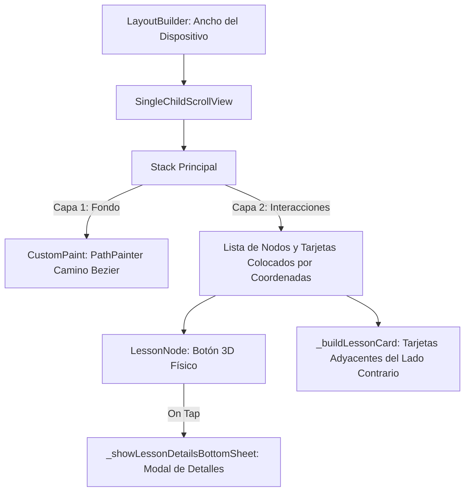

# Implementación del Camino de Aprendizaje Interactivo (3D) en la Pantalla de Inicio

Este documento detalla la arquitectura, el diseño visual, la física de interacción y la especificación técnica de la implementación del **Camino de Aprendizaje Interactivo ("Caminito de Lecciones")** en la pantalla de inicio (`FeedScreen`) de Lingiux.

---

## 🌿 1. Introducción y Propósito

El objetivo principal es reemplazar la maqueta estática previa por una experiencia de usuario gamificada y fluida. Este sistema de navegación visual guía al estudiante a través de un camino sinuoso de lecciones interactivas.

### Inspiración y Adaptación
Inspirado en el flujo de lecciones clásico de aplicaciones móviles como *Duolingo* y *SuperChinese*, este camino se adaptó al sistema de diseño de Lingiux (Premium Soft UI) mediante:
*   **Acentos degradados de la marca** en lugar de colores planos de dibujos animados.
*   **Efectos translúcidos (glassmorphism)** en las tarjetas adyacentes de las lecciones.
*   **Esquinas ultra-redondeadas (`20px` a `24px`)** que siguen los lineamientos de diseño corporativos.
*   **Identificación del creador de la lección:** Un aspecto diferenciador que permite a los usuarios identificar qué persona de la comunidad elaboró la lección, fomentando el aprendizaje social colaborativo.

---

## 🎨 2. Arquitectura Visual y Componentes del Sistema

La pantalla se estructura en base a un lienzo responsivo donde se calculan dinámicamente las coordenadas en base al ancho de la pantalla disponible.



### A. Camino Ondulado con Curvas Bezier (`PathPainter`)
Para evitar el uso de imágenes pesadas o GIFs que degradarían el rendimiento de renderizado en scroll, la línea de guía es dibujada dinámicamente usando la GPU mediante `CustomPainter`:
*   **Trazado de Curva Cúbica:** Se utiliza la ecuación de curvas de Bezier cúbicas (`cubicTo`) de Flutter. El punto de control vertical se desplaza `rowHeight * 0.45` para asegurar que las curvas se sientan orgánicas, suaves y sin quiebres angulares.
*   **Efecto 3D Embosado:** Se pintan dos trazos sobre la misma ruta:
    1.  Un trazo inferior grueso (`9.0` de ancho) de color gris translúcido que simula el canal profundo o sombra del camino en relieve.
    2.  Un trazo superior brillante (`5.0` de ancho) pintado con un degradado de colores de Lingiux (`Violeta -> Coral -> Celeste -> Orquídea -> Violeta`) utilizando un shader linear.
*   **Alineación Dinámica:** Las coordenadas en el eje X se calculan en base a fracciones del ancho de pantalla (`xFractions = [0.25, 0.65, 0.35, 0.70, 0.40, 0.65]`), haciendo que el camino se adapte a cualquier resolución móvil en vertical.

### B. Nodos con Botón 3D Físico (`LessonNode`)
Este widget interactivo (`StatefulWidget`) simula la sensación táctil de un botón plástico con profundidad real tridimensional:
*   **Física de Hundimiento:** Compuesto por dos capas dentro de un `Stack`:
    *   *Capa de profundidad (trasera):* Desplazada permanentemente 6px hacia abajo con un tono de color oscurecido (obtenido mediante la mezcla de color con negro usando `Color.alphaBlend`).
    *   *Capa de superficie (delantera):* Se desplaza verticalmente en base al estado `_isPressed`. Al presionarse (`onTapDown`), el margen superior pasa de 0 a 6px y la sombra difusa desaparece, dando el efecto óptico de que el botón se ha hundido físicamente bajo el dedo.
*   **Retroalimentación Háptica:** En el momento de iniciar la pulsación del botón, se ejecuta una vibración ligera del motor del teléfono (`HapticFeedback.lightImpact()`) para incrementar la satisfacción del usuario.

### C. Anillo Indicador de Progreso Radial
Alrededor de cada lección desbloqueada que tenga un progreso mayor a 0.0, se renderiza un anillo circular:
*   **Animación de Carga:** Utiliza un `TweenAnimationBuilder` para animar suavemente el arco desde 0% hasta el nivel de progreso cuando la pantalla se renderiza por primera vez.
*   **Pintor de Arco (`ProgressRingPainter`):** Dibuja el fondo del anillo en color gris claro (`AppColors.border`) y dibuja el progreso activo utilizando un arco (`drawArc`) que inicia a las 12 en punto (`-π / 2` radianes) con un grosor de `3.5px` y puntas redondeadas (`StrokeCap.round`).

### D. Mini-Badge del Creador
Superpuesto en la esquina inferior derecha del botón 3D de lección:
*   Consiste en un contenedor circular (`26px`) que alberga un `CircleAvatar`.
*   Para evitar que el avatar se fusione visualmente con el degradado del botón, se le aplica un borde grueso (`2.5px`) del mismo color que el fondo de la pantalla (`AppColors.background`). Esto genera una máscara de recorte limpia y con apariencia flotante profesional.
*   Si la lección está bloqueada (`isLocked`), el avatar se renderiza en escala de grises con opacidad reducida.

### E. Tarjetas Flotantes de Título Adyacentes (`_buildLessonCard`)
Muestran la información clave de cada lección al lado de su respectivo nodo interactivo de forma responsiva:
*   **Posicionamiento Inteligente:** Evita la superposición calculando la posición en base al eje del nodo:
    *   Si el nodo está en el hemisferio izquierdo de la pantalla (ej. `xFraction = 0.25`), la tarjeta de texto se coloca en la derecha (`left: nodeX + 50`, `right: 20`).
    *   Si el nodo está en el hemisferio derecho (ej. `xFraction = 0.65`), la tarjeta se coloca en la izquierda (`right: (width - nodeX) + 50`, `left: 20`).
*   **Estilo Soft UI:** Fondo blanco traslúcido (`opacity: 0.85`), bordes sutiles y sombra difusa muy suave. Contiene la bandera del idioma en formato emoji, la categoría de aprendizaje destacada en una micro-píldora con el color del gradiente de la lección, el título principal y la mención al autor.

### F. Modal de Detalles de Lección (`_showLessonDetailsBottomSheet`)
Al hacer clic en un nodo de lección activo, se levanta un modal inferior premium utilizando `showModalBottomSheet`:
*   Presenta el icono de lección ampliado con su gradiente original.
*   Muestra el perfil completo del creador con la leyenda *"Creador/a verificado/a de la comunidad"*.
*   Incluye una sección de descripción de contenidos formateada en un bloque de superficie variante.
*   Presenta el botón píldora negro de acción principal (*"¡Empezar Lección!"*) conforme a las reglas del sistema de diseño de Lingiux.

---

## 📂 3. Archivos Modificados y Creados

### [MODIFY] [feed_screen.dart](file:///c:/Users/sebas/OneDrive/Escritorio/Lingiux/lingiux_app/lib/features/feed/presentation/screens/feed_screen.dart)
Se reemplazó por completo la maqueta provisional por el sistema interactivo detallado. Este archivo ahora contiene la lógica integrada y limpia en su sección inferior:
*   Clase principal `FeedScreen` (modificada en su propiedad `body` de Scaffold).
*   Función auxiliar de construcción `_buildLessonCard`.
*   Función auxiliar de presentación `_showLessonDetailsBottomSheet`.
*   Widget interactivo `LessonNode` (`StatefulWidget`).
*   Pintor `ProgressRingPainter` (`CustomPainter`).
*   Pintor `PathPainter` (`CustomPainter`).
*   Modelo estructurado `Lesson`.
*   Mock de base de datos local `mockLessons`.

---

## 🛠️ 4. Dependencias y Librerías Utilizadas

Para garantizar un rendimiento móvil óptimo e inmersivo, **no se agregaron librerías externas de animación pesadas a la app** (evitando aumentar el peso del ejecutable o generar incompatibilidades futuras). Toda la lógica se programó con herramientas de rendimiento nativas de Flutter:

1.  **`flutter/services.dart`:** Utilizada para disparar las micro-vibraciones del motor háptico (`HapticFeedback.lightImpact()` y `HapticFeedback.mediumImpact()`).
2.  **`flutter/material.dart`:** Utilizada para toda la paleta de componentes gráficos estándar, modal inferior (`showModalBottomSheet`), e interactores de pulsación rápida (`GestureDetector`).
3.  **`AnimatedPositioned` y `AnimatedContainer`:** Componentes implícitos de animación de Flutter utilizados en el botón 3D para transicionar las propiedades de margen vertical en tan solo **60 milisegundos**, asegurando que el "hundimiento" se sienta instantáneo y físico.
4.  **`TweenAnimationBuilder`:** Utilizado para animar de forma asíncrona y fluida la propiedad de avance de los anillos de progreso radial al abrir la pantalla de inicio.

---

## ⏪ 5. Guía de Reversión (Cómo Deshacer los Cambios)

Si en el futuro se decide remover esta funcionalidad y volver a la pantalla de inicio vacía original con el mensaje descriptivo centrado, se puede revertir fácilmente siguiendo estos pasos:

### Paso 1: Reemplazar el `body` de `FeedScreen` en `feed_screen.dart`
Encuentra la propiedad `body` del `Scaffold` dentro de la clase `FeedScreen` (aproximadamente en la línea 155) y reemplaza toda la sección de `LayoutBuilder` por la columna centrada original:

```dart
            body: Center(
              child: Column(
                mainAxisAlignment: MainAxisAlignment.center,
                children: [
                  Container(
                    padding: const EdgeInsets.all(28),
                    decoration: const BoxDecoration(
                      color: AppColors.surfaceVariant,
                      shape: BoxShape.circle,
                    ),
                    child: const Icon(
                      Icons.home_rounded,
                      size: 52,
                      color: AppColors.primary,
                    ),
                  ),
                  const SizedBox(height: 24),
                  const Text(
                    AppStrings.navInicio,
                    style: TextStyle(
                      color: AppColors.onSurface,
                      fontSize: 24,
                      fontWeight: FontWeight.bold,
                    ),
                  ),
                  const SizedBox(height: 8),
                  const Padding(
                    padding: EdgeInsets.symmetric(horizontal: 40),
                    child: Text(
                      'Explora tus tarjetas mnemotécnicas, practica tu pronunciación con Inteligencia Artificial y chatea en tiempo real con otros estudiantes de la comunidad.',
                      style: TextStyle(color: AppColors.onSurfaceMuted, fontSize: 14),
                      textAlign: TextAlign.center,
                    ),
                  ),
                ],
              ),
            ),
```

### Paso 2: Eliminar las clases de soporte al final del archivo
Borra por completo todo el contenido desde el comentario `// ========================================== \n // WIDGETS Y PINTORES DE SOPORTE PARA LECCIONES` hasta el fin del archivo. Esto incluye:
*   Las funciones `_buildLessonCard` y `_showLessonDetailsBottomSheet`.
*   Las clases `LessonNode`, `ProgressRingPainter`, `PathPainter`, `Lesson`.
*   El mock de datos `mockLessons`.

Una vez realizados estos dos pasos, la pantalla de inicio retornará a su estado base e idéntico al original.
