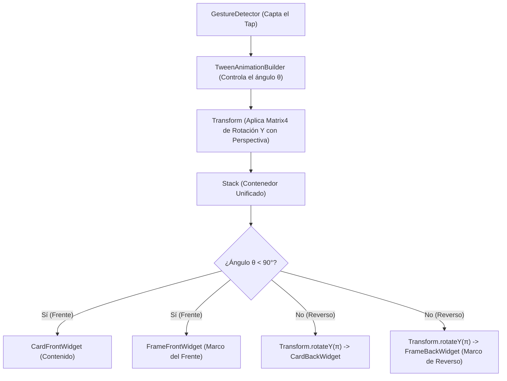

# Arquitectura de Marcos Decorativos y Animación de Volteo 3D en Cartas (Flutter)

Este documento detalla la arquitectura, el flujo de diseño gráfico y la implementación técnica necesaria para acoplar **marcos decorativos (frames)** a cartas de vocabulario que se voltean mediante animaciones tridimensionales (3D) en Flutter. 

---

## 1. El Desafío Geométrico: Sincronización y Perspectiva 3D

Cuando se diseña una interfaz de usuario interactiva basada en cartas físicas digitales (como las Flashcards de Lingiux), uno de los requerimientos premium es la capacidad de voltear la carta con un gesto de toque (`Tap`) o arrastre lateral. Si a esta carta se le añade un marco decorativo (por ejemplo, para denotar su nivel de rareza, categoría gramatical o logros del usuario), surge un problema técnico de diseño tridimensional:

* **Sincronización:** Si el marco decorativo y el contenido de la carta se animan como dos widgets independientes, cualquier micro-retraso en el hilo de animación del dispositivo desfasará el movimiento, destruyendo la ilusión de que el marco y la carta forman un único objeto sólido.
* **Coincidencia de Perspectiva:** El renderizado 3D en Flutter utiliza transformaciones de proyección aplicadas a matrices de transformación. Si el marco y la carta no comparten la misma matriz y la misma distancia de cámara virtual (punto de fuga), se proyectarán con ángulos de distorsión ligeramente diferentes, haciendo que el marco parezca "flotar" o desencajarse de la carta durante la rotación.

---

## 2. Estrategia de Diseño: Acoplamiento Unificado en el Stack de Transformación

Para lograr un volteo consistente, el motor de renderizado debe aplicar la transformación tridimensional al **contenedor padre común** de todos los elementos visuales de la carta. De esta forma, cualquier transformación aplicada a la matriz se heredará de manera uniforme tanto en la carta de fondo como en el marco superpuesto.

### 2.1. Jerarquía del Árbol de Widgets

El siguiente diagrama de bloques ilustra la jerarquía recomendada para estructurar los elementos:



Al colocar la lógica de frente/reverso dentro del `Stack` bajo un único widget `Transform` padre, garantizamos que el giro de ambos elementos sea $100\%$ idéntico y síncrono.

---

## 3. Formatos de Diseño de Marcos: Flujo de Trabajo y Tecnologías

El marco decorativo puede ser implementado mediante diferentes tecnologías gráficas según las necesidades de fidelidad visual y rendimiento:

| Formato | Estilo Visual Recomendado | Peso de Archivo | Impacto en GPU / CPU | Ventajas Principales | Desventajas |
| :--- | :--- | :--- | :--- | :--- | :--- |
| **PNG (Raster)** | Fotorrealista (oro, madera, metal, relieves) | Alto (requiere @2x, @3x) | Bajo (Texturizado en GPU) | Permite detalles artísticos hipercomplejos y texturas reales. | Se pixela si no tiene la densidad adecuada; mayor tamaño de app. |
| **SVG (Vector)** | Minimalista, moderno, geométrico o neon | Muy Bajo (2 - 10 KB) | Medio (Cálculo de trazados) | Resoluciones infinitas; no se pixela al hacer zoom; escalable. | Computar gradientes y sombras complejos en SVG consume CPU. |
| **CustomPaint** | Dinámico, Soft UI, colores adaptables en código | Nulo (0 KB) | Bajo / Medio (GPU nativo) | Flexibilidad total en código; tematización reactiva. | Curva de aprendizaje alta para programar formas orgánicas. |
| **Lottie / Rive** | Marcos animados (fuego, magia, destellos, runas) | Medio (50 - 300 KB) | Alto (Animaciones continuas) | Efectos visuales interactivos y dinámicos espectaculares. | Requiere software especializado (After Effects / Rive). |

---

### 3.1. Flujo de Trabajo Gráfico con PNG con Transparencia
Cuando se opta por marcos fotorrealistas (estilo juego de cartas RPG), el diseñador gráfico debe seguir estas pautas:

1. **Definición de Canvas:** Diseñar el marco en Figma o Photoshop sobre un canvas con la relación de aspecto exacta de la carta (ej. $300 \times 450\text{ px}$).
2. **Zona Transparente (Canal Alpha):** El centro de la carta debe ser $100\%$ transparente para permitir ver la información del vocabulario debajo. Los bordes y esquinas deben contener las decoraciones sólidas o semi-translúcidas.
3. **Esquinas Redondeadas:** El borde interno y externo del marco debe coincidir con el radio de redondeado (`BorderRadius.circular(24)` o similar) de la carta base.
4. **Slices Multi-Resolución (Asset Density):** Para evitar que el marco se vea borroso en pantallas modernas de alta resolución, el asset debe exportarse en tres carpetas de densidad en Flutter:
   * **Assets Base:** `assets/images/marco_oro.png` (resolución de $300 \times 450\text{ px}$)
   * **Densidad 2.0x (Retina):** `assets/images/2.0x/marco_oro.png` (resolución de $600 \times 900\text{ px}$)
   * **Densidad 3.0x (QuadHD+):** `assets/images/3.0x/marco_oro.png` (resolución de $900 \times 1350\text{ px}$)

En Flutter, al invocar `Image.asset('assets/images/marco_oro.png')`, el framework seleccionará automáticamente la versión óptima según la densidad del dispositivo.

---

### 3.2. Flujo Vectorial con SVG
Si el marco es minimalista o tiene luces de neón:

1. Diseñar el marco en curvas en Adobe Illustrator o Figma.
2. Exportar como SVG plano, asegurándose de **esbozar todos los trazos (Outline Strokes)** para evitar que Flutter interprete grosores de línea diferentes.
3. Añadir la dependencia en `pubspec.yaml`:
   ```yaml
   dependencies:
     flutter_svg: ^2.0.10-hotfix.1
   ```
4. Renderizar usando `SvgPicture.asset`:
   ```dart
   SvgPicture.asset(
     'assets/svgs/marco_neon.svg',
     fit: BoxFit.fill,
   )
   ```

---

### 3.3. Marcos Dinámicos Mediante Widgets Nativos (`CustomPaint` o `Container`)
Esta opción es ideal cuando el color del marco debe coincidir con la categoría gramatical de la palabra (ejemplo: marco rojo para verbos, verde para sustantivos) y se administra dinámicamente con Riverpod:

```dart
Container(
  decoration: BoxDecoration(
    borderRadius: BorderRadius.circular(24),
    border: Border.all(
      color: categoryColor, // Color dinámico desde el estado de la palabra
      width: 6.0,
    ),
    boxShadow: [
      BoxShadow(
        color: categoryColor.withValues(alpha: 0.35),
        blurRadius: 16.0,
        spreadRadius: 2.0,
      ),
    ],
  ),
)
```

---

## 4. Implementación en Código: El Widget `FlippableCardWithFrame`

A continuación se presenta el código completo de un componente modular y reutilizable en Flutter que implementa el volteo 3D sincronizado y permite añadir marcos personalizados a ambos lados de la carta:

```dart
import 'dart:math' as math;
import 'package:flutter/material.dart';

class FlippableCardWithFrame extends StatefulWidget {
  final Widget cardFront;       // Contenido frontal de la carta
  final Widget cardBack;        // Contenido trasero de la carta
  final Widget frameFront;      // Marco decorativo frontal
  final Widget frameBack;       // Marco decorativo trasero
  final double width;           // Ancho de la carta
  final double height;          // Alto de la carta
  final Duration duration;      // Duración de la animación de volteo

  const FlippableCardWithFrame({
    super.key,
    required this.cardFront,
    required this.cardBack,
    required this.frameFront,
    required this.frameBack,
    this.width = 300.0,
    this.height = 450.0,
    this.duration = const Duration(milliseconds: 600),
  });

  @override
  State<FlippableCardWithFrame> createState() => _FlippableCardWithFrameState();
}

class _FlippableCardWithFrameState extends State<FlippableCardWithFrame> {
  bool _isFlipped = false;

  void _toggleFlip() {
    setState(() {
      _isFlipped = !_isFlipped;
    });
  }

  @override
  Widget build(BuildContext context) {
    return GestureDetector(
      onTap: _toggleFlip,
      child: SizedBox(
        width: widget.width,
        height: widget.height,
        child: TweenAnimationBuilder<double>(
          tween: Tween<double>(begin: 0.0, end: _isFlipped ? math.pi : 0.0),
          duration: widget.duration,
          curve: Curves.easeInOutCubic, // Curva de aceleración premium
          builder: (context, angle, child) {
            // Evaluamos si superamos el punto crítico de rotación (90 grados)
            final isBack = angle >= math.pi / 2;

            return Transform(
              transform: Matrix4.identity()
                ..setEntry(3, 2, 0.0012) // Coeficiente de perspectiva 3D (eje Z)
                ..rotateY(angle),        // Rotación en el eje vertical Y
              alignment: Alignment.center,
              child: RepaintBoundary(
                child: Stack(
                  fit: StackFit.expand,
                  clipBehavior: Clip.none,
                  children: [
                    // ==========================================
                    // 1. RENDERIZADO DEL CUERPO DE LA CARTA
                    // ==========================================
                    if (!isBack)
                      widget.cardFront
                    else
                      // Se aplica rotación interna en Y de pi radianes (180°)
                      // para evitar el efecto de lectura invertida (espejo)
                      Transform(
                        transform: Matrix4.identity()..rotateY(math.pi),
                        alignment: Alignment.center,
                        child: widget.cardBack,
                      ),

                    // ==========================================
                    // 2. RENDERIZADO DEL MARCO SUPERPUESTO
                    // ==========================================
                    if (!isBack)
                      widget.frameFront
                    else
                      // Se aplica la misma contrarrotación al reverso del marco
                      Transform(
                        transform: Matrix4.identity()..rotateY(math.pi),
                        alignment: Alignment.center,
                        child: widget.frameBack,
                      ),
                  ],
                ),
              ),
            );
          },
        ),
      ),
    );
  }
}
```

---

## 5. Explicación Matemática y Física de la Animación

### 5.1. El Coeficiente de Perspectiva (Proyección Cónica)

En el código se modifica la matriz de transformación del widget `Transform` mediante la línea:

```dart
Matrix4.identity()..setEntry(3, 2, 0.0012)
```

La matriz de identidad de Flutter es una matriz de $4 \times 4$. La entrada en la fila 3, columna 2 (indexación base 0, por lo que es la celda `[3][2]`) representa la proyección en perspectiva de la coordenada $Z$ (profundidad). 

$$\begin{bmatrix} 
1 & 0 & 0 & 0 \\ 
0 & 1 & 0 & 0 \\ 
0 & 0 & 1 & \mathbf{0.0012} \\ 
0 & 0 & 0 & 1 
\end{bmatrix}$$

* Si este valor se mantiene en `0.0` (por defecto), la rotación se calcula mediante una **proyección ortogonal**. La carta se verá bidimensional, simplemente encogiéndose horizontalmente hasta desaparecer y volviendo a crecer. No se aprecia ningún efecto de profundidad 3D.
* Al poner un valor pequeño (típicamente entre `0.001` y `0.002`), se aplica una **proyección cónica**. Esto simula una cámara a una distancia finita. El borde de la carta que rota "hacia el usuario" se ve más grande, mientras que el borde que rota "hacia el fondo" se ve más pequeño, dando la ilusión perfecta de profundidad tridimensional.

### 5.2. Resolución de la Inversión Especular (Efecto Espejo)

Cuando rotamos un plano bidimensional $180^\circ$ en el espacio tridimensional, el reverso de la imagen se invierte horizontalmente. Si la carta trasera tiene un texto como "Dog", este se leería "goD" al revés.

Para resolver esto, cuando el ángulo $\theta \ge \pi/2$ ($90^\circ$), aplicamos un transformador secundario `Transform.rotateY(math.pi)` al widget trasero. Matemáticamente, esto multiplica la matriz de rotación original por otra rotación de $180^\circ$, neutralizando la inversión del texto:

$$\vec{P}_{final} = R_{Y}(\theta) \cdot R_{Y}(\pi) \cdot \vec{P}_{local}$$

Esto asegura que cuando la carta se detenga en $\theta = \pi$ ($180^\circ$), la rotación acumulada sea:

$$\text{Rotación Efectiva} = 180^\circ - 180^\circ = 0^\circ$$

Esto permite que el reverso de la carta y el reverso del marco se rendericen al derecho de forma consistente.

---

## 6. Optimizaciones y Consideraciones de Diseño

### 6.1. La Zona de Seguridad del Contenido (Content Safe Zone)
Debido a que el marco se dibuja por encima del cuerpo de la carta mediante un `Stack`, este tapará físicamente los bordes exteriores de la carta de fondo. 

* **Cálculo de Márgenes:** Si el marco decorativo diseñado tiene un ancho de borde de $B\text{ px}$, el contenido crítico de la carta (ej. texto de la palabra, transcripción fonética, botón de reproducción de audio) debe tener un margen interior (`padding`) que cumpla con:
  $$\text{Padding} \ge B + 8.0\text{ px}$$
* **Ejemplo:** Si tu marco PNG tiene un grosor de borde visual de $16\text{ px}$ en Figma, configura el contenedor interno de tu carta con un padding mínimo de $24\text{ px}$. Esto evitará solapamientos visuales desprolijos.

```
┌───────────────────────────────────────────────┐
│              MARCO DECORATIVO (B = 16px)      │
│   ┌───────────────────────────────────────┐   │
│   │  ◄── Padding Seguro (24px) ──►        │   │
│   │                                       │   │
│   │        [TEXTO DE LA PALABRA]          │   │
│   │                                       │   │
│   └───────────────────────────────────────┘   │
└───────────────────────────────────────────────┘
```

### 6.2. Uso de `RepaintBoundary` para Evitar Fatiga de GPU
Durante la transición del volteo de la carta (que ocurre a 60 fotogramas por segundo), Flutter debe actualizar la matriz en cada frame. 
* Si no se utiliza un `RepaintBoundary`, en cada fotograma del volteo, Flutter invalidará el árbol de renderizado del `Stack` completo y forzará a que el `CustomPaint` o los widgets de imagen de la carta se vuelvan a calcular y dibujar desde cero. Esto produce pequeños saltos y caídas de fotogramas (lag).
* Al envolver el `Stack` en un widget `RepaintBoundary`, el framework guarda en la memoria caché de la GPU el bitmap del frente y del reverso ya renderizados de forma estática. Durante el volteo de 600 milisegundos, Flutter simplemente transforma geométricamente esta imagen en caché, lo cual es sumamente rápido y eficiente, logrando animaciones suaves de **60 o 120 FPS** en cualquier dispositivo.
