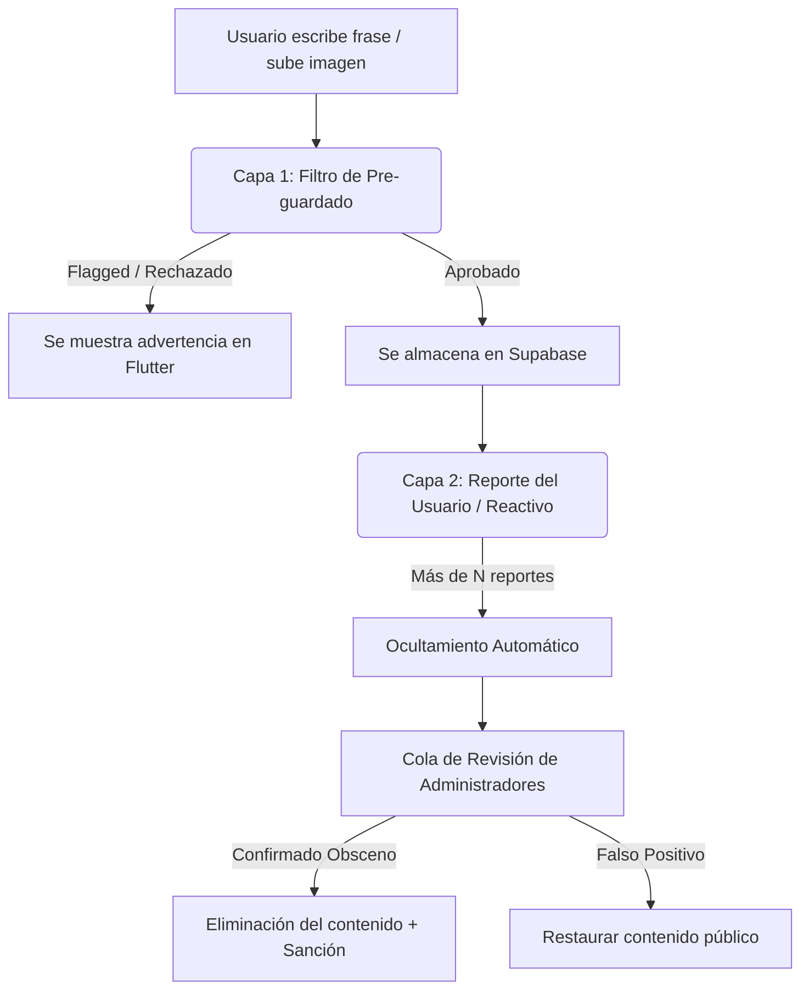

# Documentación del Sistema de Moderación de Contenido y Filtro de Obscenidades

Este documento describe a nivel técnico, conceptual y de cumplimiento legal las estrategias para implementar un sistema de control de contenido generado por el usuario (UGC, por sus siglas en inglés) en la aplicación **Lingiux**, combinando el framework **Flutter** en el frontend y **Supabase** en el backend.

---

## 1. Introducción y Relevancia del Control de Contenido

En cualquier aplicación donde los usuarios tengan la libertad de redactar texto (como frases de ejemplo en las tarjetas de estudio) o subir recursos multimedia (imágenes o notas de voz), existe el riesgo latente de que se comparta material inapropiado. Esto incluye:
*   Contenido obsceno o vulgar (groserías, insultos).
*   Contenido sexualmente explícito o pornográfico.
*   Contenido que incita al odio, acoso o violencia.
*   Material con derechos de autor o spam comercial.

Implementar mecanismos de moderación no solo protege la experiencia de los usuarios de la comunidad, sino que también es un **requisito obligatorio** establecido por las tiendas de aplicaciones para su distribución pública.

---

## 2. Requisitos de las Tiendas de Aplicaciones (App Store y Google Play)

Las dos plataformas de distribución de aplicaciones móviles más grandes del mundo aplican directrices estrictas respecto al contenido generado por el usuario.

### Apple App Store: Directriz de Revisión de App Store 1.2 (UGC)
Para ser aprobada en la App Store, cualquier aplicación con funciones sociales o de creación de contenido debe cumplir rigurosamente con lo siguiente:
1.  **Aceptación de Términos de Servicio (TOS)**: Los usuarios deben aceptar un contrato que defina claramente qué tipo de contenido está prohibido.
2.  **Mecanismo de Filtro**: Implementar métodos para detectar y prevenir de manera proactiva que se publique material objetable.
3.  **Sistema de Reporte**: Permitir a los usuarios reportar contenido inapropiado con un solo toque.
4.  **Sistema de Bloqueo**: Permitir a los usuarios bloquear a creadores de contenido abusivo para no volver a visualizar sus publicaciones.
5.  **Moderación Activa**: El desarrollador debe comprometerse a revisar y eliminar el contenido denunciado en un plazo máximo de **24 horas**, además de poder suspender la cuenta del infractor.

### Google Play Store: Política de Contenido Generado por el Usuario
De forma similar, Google requiere que todas las aplicaciones que alojen UGC cuenten con sistemas de denuncia robustos y demuestren que actúan eficazmente ante comportamientos dañinos o acoso cibernético.

---

## 3. Arquitectura del Sistema de Moderación en 3 Capas

Un sistema de moderación profesional no depende de un único filtro, sino que se compone de tres capas complementarias:



### Capa 1: Filtros de Pre-guardado (Automáticos)
Se ejecutan en el backend antes de insertar el registro en la base de datos de Supabase. Consiste en dos mecanismos:
1.  **Filtro de Obscenidades Local (Offline)**: Verifica contra una lista estática de palabras prohibidas de forma instantánea.
2.  **Clasificación de Texto por IA (Online)**: Envía el texto a una API externa de procesamiento de lenguaje natural (NLP) para medir toxicidad, acoso y contenido sexual.

### Capa 2: Moderación Reactiva (Sistema de Denuncias)
Permite a la propia comunidad señalar contenido ofensivo que haya logrado eludir los filtros automáticos. Consiste en las funciones de **Reportar** y **Bloquear**.

### Capa 3: Control y Moderación Administrativa
El backend cuenta con reglas que eliminan o marcan el contenido para auditoría humana una vez superado cierto umbral de denuncias.

---

## 4. Implementación Técnica en el Backend (Supabase)

Para soportar las funciones de reporte y bloqueo obligatorias, se diseñan las siguientes tablas y reglas de base de datos en Supabase:

### 1. Tabla de Reportes de Tarjetas (`card_reports`)
Almacena las denuncias que hacen los usuarios sobre tarjetas específicas creadas por otros:

```sql
create table card_reports (
  id uuid default gen_random_uuid() primary key,
  reporter_id uuid references auth.users(id) on delete cascade not null, -- Usuario que denuncia
  card_id uuid references word_cards(id) on delete cascade not null,     -- Tarjeta denunciada
  reason text,                                                          -- Categoría o explicación
  created_at timestamp with time zone default timezone('utc'::text, now()) not null,
  
  -- Restricción única para evitar reportar la misma tarjeta repetidamente
  unique (reporter_id, card_id)
);

-- Habilitar Row Level Security (RLS)
alter table card_reports enable row level security;

-- Política: Los usuarios autenticados pueden insertar sus propios reportes
create policy "Users can insert their own reports"
on card_reports for insert
to authenticated
with (auth.uid() = reporter_id);
```

### 2. Tabla de Bloqueos entre Usuarios (`user_blocks`)
Almacena la relación de usuarios bloqueados por otros para filtrar su visualización en tiempo real:

```sql
create table user_blocks (
  id uuid default gen_random_uuid() primary key,
  blocker_id uuid references auth.users(id) on delete cascade not null, -- Quien bloquea
  blocked_id uuid references auth.users(id) on delete cascade not null, -- El bloqueado
  created_at timestamp with time zone default timezone('utc'::text, now()) not null,
  
  unique (blocker_id, blocked_id)
);

alter table user_blocks enable row level security;

-- Políticas de seguridad RLS para que solo el bloqueador pueda gestionar sus bloqueos
create policy "Users can block other users"
on user_blocks for insert
to authenticated
with (auth.uid() = blocker_id);

create policy "Users can view their own blocked list"
on user_blocks for select
to authenticated
using (auth.uid() = blocker_id);
```

### 3. Vista Segura de Tarjetas Públicas (`public_cards_view`)
En lugar de cargar la información directamente de la tabla `word_cards`, el frontend de Flutter consumirá una **Vista de SQL** que filtra automáticamente las tarjetas inapropiadas o pertenecientes a usuarios bloqueados:

```sql
create or replace view public_cards_view as
select wc.*
from word_cards wc
where 
  -- Oculta la tarjeta si ha acumulado 3 o más reportes
  (
    select count(*)
    from card_reports cr
    where cr.card_id = wc.id
  ) < 3
  
  -- Oculta la tarjeta si pertenece a un usuario que el usuario actual tiene bloqueado
  and not exists (
    select 1 
    from user_blocks ub 
    where ub.blocked_id = wc.user_id 
      and ub.blocker_id = auth.uid()
  );
```

---

## 5. Implementación de Pre-moderación con Supabase Edge Functions y OpenAI

Las Edge Functions de Supabase son ideales para interceptar las creaciones de tarjetas antes de guardarse en la base de datos, conectándose a APIs de inteligencia artificial.

### Código TypeScript para Edge Function (`supabase/functions/moderate-card/index.ts`)
Esta función recibe los datos de la tarjeta en formato JSON, analiza la frase de ejemplo utilizando la API gratuita **OpenAI Moderation** y decide si permitir el almacenamiento o rechazarlo:

```typescript
import { serve } from "https://deno.land/std@0.168.0/http/server.ts"

const OPENAI_API_KEY = Deno.env.get('OPENAI_API_KEY') ?? '';

serve(async (req) => {
  if (req.method === 'OPTIONS') {
    return new Response('ok', { headers: { 'Access-Control-Allow-Origin': '*' } })
  }

  try {
    const { word, exampleText } = await req.json();

    if (!exampleText || exampleText.trim() === '') {
      return new Response(JSON.stringify({ error: 'La frase no puede estar vacía' }), {
        status: 400,
        headers: { 'Content-Type': 'application/json' },
      });
    }

    // Llamada a la API de OpenAI Moderation
    const moderationResponse = await fetch('https://api.openai.com/v1/moderations', {
      method: 'POST',
      headers: {
        'Content-Type': 'application/json',
        'Authorization': `Bearer ${OPENAI_API_KEY}`
      },
      body: JSON.stringify({ input: exampleText })
    });

    const moderationData = await moderationResponse.json();
    const result = moderationData.results[0];

    // Si el contenido infringe las políticas de OpenAI, se rechaza
    if (result.flagged) {
      // Obtener categorías marcadas
      const flaggedCategories = Object.keys(result.categories).filter(
        (key) => result.categories[key] === true
      );

      return new Response(JSON.stringify({
        flagged: true,
        error: 'Tu frase de ejemplo infringe las directivas de contenido inapropiado.',
        categories: flaggedCategories
      }), {
        status: 200, // Se responde exitosamente pero con flag
        headers: { 'Content-Type': 'application/json' },
      });
    }

    return new Response(JSON.stringify({ flagged: false }), {
      status: 200,
      headers: { 'Content-Type': 'application/json' },
    });

  } catch (error) {
    return new Response(JSON.stringify({ error: error.message }), {
      status: 500,
      headers: { 'Content-Type': 'application/json' },
    });
  }
})
```

---

## 6. Filtros Locales y Librerías recomendadas para Flutter (Frontend)

Para acelerar la experiencia del usuario y no depender exclusivamente de la red, es ideal validar el contenido de manera local en el dispositivo del usuario antes de enviar peticiones a Supabase.

### 1. Librería recomendada: `profanity_filter`
El paquete [profanity_filter](https://pub.dev/packages/profanity_filter) en Dart permite realizar escaneos locales de texto buscando profanidades de manera extremadamente rápida.

#### Instalación en `pubspec.yaml`:
```yaml
dependencies:
  profanity_filter: ^2.1.0
```

#### Uso en el Editor de Tarjetas:
```dart
import 'package:profanity_filter/profanity_filter.dart';

class CardContentValidator {
  static final filter = ProfanityFilter();

  /// Verifica si el texto ingresado contiene palabras obscenas
  static bool hasObscenities(String text) {
    return filter.hasProfanity(text);
  }

  /// Devuelve las palabras ofensivas encontradas
  static List<String> getWordsFound(String text) {
    return filter.getAllProfanity(text);
  }
}
```

---

## 7. Documentación del Editor de Tarjetas Actualizado

Durante la sesión actual y previas, se modificaron y reestructuraron múltiples archivos dentro de la sección "Crear" para estructurar un flujo interactivo y centrado en la tarjeta:

### Archivos Modificados e Impacto

1.  **[card_editor_widget.dart](file:///c:/Users/sebas/OneDrive/Escritorio/Lingiux/lingiux_app/lib/features/create_card/presentation/widgets/card_editor_widget.dart)**:
    *   **KeywordHighlightingController**: Implementamos un controlador de edición de texto personalizado para el `TextField` de la frase de ejemplo. Este controlador intercepta en tiempo real el texto ingresado y colorea la palabra clave en **negrita verde claro (`#86EFAC`)** de forma automática y fluida sin aplicar decoraciones subrayadas.
    *   **Edición Directa Transparent**: Sustituimos la visualización estática por un campo de texto invisible en el frente de la tarjeta. Eliminamos cualquier borde o fondo blanco del input estableciendo `filled: false` y `fillColor: Colors.transparent` para que el campo blendee perfectamente con el fondo degradado de la tarjeta.
    *   **resizeToAvoidBottomInset: false**: Configuramos esta propiedad en el Scaffold del editor para evitar que al abrir el teclado virtual de edición de texto la interfaz responsiva encoja o colapse el tamaño del recuadro de la foto, manteniéndola inmóvil y estática.
2.  **[create_card_screen.dart](file:///c:/Users/sebas/OneDrive/Escritorio/Lingiux/lingiux_app/lib/features/create_card/presentation/screens/create_card_screen.dart)**:
    *   Sincronizamos la palabra clave desde el input de validación principal a la propiedad `keyword` del `KeywordHighlightingController` en tiempo real.
    *   Añadimos validaciones estrictas antes del guardado de Supabase para evitar que el usuario registre cartas sin frase de ejemplo o sin la palabra clave contenida en ella.
3.  **[word_detail_screen.dart](file:///c:/Users/sebas/OneDrive/Escritorio/Lingiux/lingiux_app/lib/features/vocabulary/presentation/screens/word_detail_screen.dart)**:
    *   **Letra Capital**: Cambiamos la representación del título de la palabra clave en la tarjeta de exploración de mayúsculas fijas a formato capital (primera letra mayúscula, el resto minúsculas).
    *   **Estilo del Keyword**: Actualizamos el resaltado de la frase de contexto al formato unificado (negritas y verde claro, sin subrayar) con fuente tamaño 16.
    *   **Botón de Audio**: Agrandeamos su dimensión a 26px e incrementamos el padding táctil para maximizar la usabilidad en dispositivos móviles.
    *   **Reemplazo de Botones**: Intercambiamos los botones de *Save* y *Practice* de la base de la tarjeta por los botones interactivos de Quizz (**Sí** / **No**), asignándoles la anchura expandida completa y su comportamiento haptico.

---

## 8. Conclusiones y Siguientes Pasos

El diseño del editor actual está completamente optimizado para la experiencia del usuario y previene de forma local que se intenten guardar datos sin palabra clave. Los siguientes pasos para la producción de **Lingiux** son:
1.  **Ejecutar los scripts de migración SQL** descritos en la sección 4 en la pestaña de consultas de Supabase.
2.  **Configurar las credenciales de OpenAI** en el backend para poder activar la pre-moderación por IA en entornos de producción y producción-staging.
3.  **Implementar los términos y condiciones (TOS)** en la pantalla de registro para cubrir al 100% las directivas 1.2 de la App Store.
