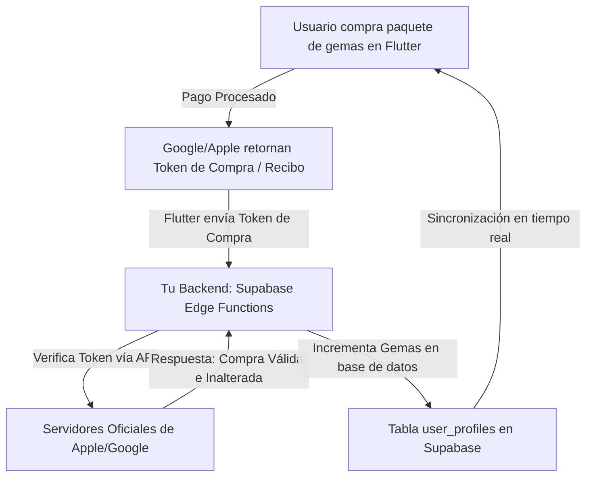

⚖️ 1. ¿Es legal? y las Reglas Estrictas de las Tiendas (Apple y Google)
Sí, es 100% legal, pero estás obligado a seguir las políticas monopolísticas de las tiendas si vendes elementos digitales:

*   **Uso Obligatorio de sus Pasarelas**: Para vender cualquier bien digital (suscripciones, gemas, vidas, desbloqueo de tarjetas), debes utilizar obligatoriamente In-App Purchases (IAP) de Apple App Store y Google Play Billing de Android. Si intentas meter un formulario de tarjeta de crédito directo con Stripe o un botón de PayPal para esto, banearán tu app de inmediato.
*   **Comisión de las Tiendas**: Tanto Apple como Google se quedan con una comisión del 15% de tus ventas si te registras en sus programas de pequeños desarrolladores (ingresos menores a 1 millón de dólares al año). Si superas esa cantidad, la comisión sube al 30%.
*   **Impuestos**: La gran ventaja de usar sus pasarelas es que Apple y Google se encargan automáticamente de calcular, retener y pagar los impuestos locales (IVA, GST, etc.) de cada país en el que se venda tu app, liberándote de esa carga contable internacional.

---

💰 2. ¿Suscripción o Gemas (Consumibles)? La Mejor Estrategia
Las aplicaciones profesionales más exitosas (como Duolingo, Tinder o Brawl Stars) utilizan un Modelo Híbrido (Freemium). Esto es lo que conviene más según cada tipo:

### A. El Modelo de Suscripción (Ingresos Recurrentes)
*   **Qué es**: Ofrecer un plan premium (ej. "Lingiux Pro").
*   **Mejor combinación de planes**:
    *   **Mensual**: Precio de entrada alto por mes (ej. $9.99 USD) para empujar a los usuarios a los planes más largos.
    *   **Anual**: El plan estrella con un descuento agresivo (ej. $59.99 USD, lo que equivale a $4.99 USD/mes). Esto te da flujo de caja inmediato y retiene al usuario por un año para que se enganche a la app.
    *   **Nota**: El plan trimestral se suele omitir porque añade confusión cognitiva en la toma de decisiones. Es mejor dar a elegir solo entre Mensual y Anual (Efecto de Elección Simple).
*   **Beneficios**: Ingresos mensuales estables y predecibles.

### B. El Modelo de Consumibles (Gemas / Compras Únicas)
*   **Qué es**: Comprar paquetes de monedas virtuales (ej. "1,000 gemas por $1.99 USD").
*   **Para qué sirve**: Para que el usuario compre impulsivamente ventajas inmediatas (ej. saltarse un nivel de rompecabezas, comprar una mascota premium en la tienda o desbloquear mazos de tarjetas especiales).
*   **Beneficios**: Permite monetizar a los "Whales" (ballenas), que son usuarios muy enganchados que están dispuestos a gastar cientos de dólares al mes en compras pequeñas dentro del juego/app.

---

🧠 3. Psicología de Precios y la Tienda de Gemas
Para definir las cantidades y precios de las gemas, los diseñadores de economía de juego (Game Economy Designers) usan principios psicológicos:

*   **El Efecto Señuelo (Decoy Effect)**: Si ofreces solo dos opciones, la gente comprará la más barata. Si ofreces tres, puedes dirigir la compra a la que tú quieras.
    *   **Paquete Chico**: 500 gemas por $1.99 USD (sientes que es caro por pocas gemas).
    *   **Paquete Mediano (El Señuelo)**: 1,500 gemas por $4.99 USD.
    *   **Paquete Grande (Mejor Valor)**: 4,000 gemas por $9.99 USD (el usuario ve que por el doble de dinero del mediano, se lleva casi el triple de gemas. La mente percibe el paquete grande como una "ganga" y es el que más se compra).
*   **Disociación del Dinero Real**: Al usuario le duele gastar dinero real directamente. Si un artículo cuesta $2.00 USD, lo pensará mucho. Pero si compra un paquete de gemas, la mente pierde la relación del valor real de la gema. Gastar "50 gemas" para desbloquear una tarjeta duele un 90% menos psicológicamente que pagar $0.20 USD centavos directamente.

---

🖥️ 4. Arquitectura Técnica de Seguridad (Backend)
**Regla de Oro**: NUNCA confíes en el celular del usuario. Si manejas las gemas en el código interno de Flutter (ej. guardándolas en un archivo local o en variables del teléfono), un usuario con un celular rooteado o usando programas de edición de memoria (como Game Guardian en Android) podrá ponerse "gemas infinitas" en dos minutos.

**El Flujo Técnico Seguro de los Profesionales**:


Cualquier consumo de gemas (ej. restar 20 gemas al comprar algo) debe ejecutarse estrictamente mediante transacciones en la base de datos (Postgres Functions en Supabase) para evitar que el usuario intente duplicar transacciones abriendo la app en dos celulares al mismo tiempo.

---

📦 5. La Librería Estándar del Mercado: RevenueCat
En lugar de programar desde cero la validación de recibos con Apple y Google (lo cual es un dolor de cabeza por la cantidad de casos extremos como suscripciones canceladas, reembolsos, tarjetas rechazadas, etc.), el 95% de las startups y apps profesionales del mundo utilizan RevenueCat (purchases_flutter).

*   **¿Qué hace?**: Es una plataforma que unifica las compras de iOS y Android en una sola línea de código en Flutter.
*   **Seguridad**: Ellos verifican los recibos en sus servidores seguros de forma automática.
*   **Dashboard**: Te dan un panel web espectacular donde ves cuánta gente se suscribe, cuántos cancelan, gráficos de ingresos, reembolsos, etc.
*   **Costo**: Es gratis hasta que tu aplicación facture más de $10,000 USD al mes.

---

📖 6. Guía Práctica de Implementación y Código Fuente (Masterclass)

A continuación se presenta el diseño arquitectónico detallado a nivel de base de datos en Supabase y del SDK de Flutter para estructurar la tienda de gemas y suscripciones.

### A. Estructura de Tablas en Supabase (PostgreSQL)

Para garantizar la integridad y auditoría de la economía virtual, debemos tener una columna de balance y una tabla histórica de transacciones. Jamás permitas actualizaciones directas desde el cliente en la columna de gemas.

```sql
-- 1. Actualizar la tabla de perfiles para soportar el balance de gemas
ALTER TABLE public.profiles ADD COLUMN IF NOT EXISTS gems_balance INTEGER DEFAULT 0 CHECK (gems_balance >= 0);

-- 2. Crear tabla histórica de transacciones de gemas
CREATE TABLE public.gem_transactions (
    id UUID PRIMARY KEY DEFAULT gen_random_uuid(),
    profile_id UUID NOT NULL REFERENCES public.profiles(id) ON DELETE CASCADE,
    amount INTEGER NOT NULL, -- Positivo para compras/bonos, Negativo para consumos
    reason TEXT NOT NULL,    -- Ej: 'purchase_pack_1', 'unlock_card', 'quiz_bonus'
    created_at TIMESTAMP WITH TIME ZONE DEFAULT timezone('utc'::text, now()) NOT NULL
);

-- Habilitar RLS en transacciones
ALTER TABLE public.gem_transactions ENABLE ROW LEVEL SECURITY;

-- Políticas RLS: Los usuarios solo pueden ver su propio historial
CREATE POLICY "Users can view their own gem transactions" 
ON public.gem_transactions FOR SELECT 
USING (auth.uid() = profile_id);
```

### B. Transacciones Seguras en Base de Datos (Función PL/pgSQL)

Para evitar duplicaciones de saldo o saldos negativos debido a condiciones de carrera, el consumo de gemas debe realizarse a través de una función transaccional en la base de datos:

```sql
CREATE OR REPLACE FUNCTION public.spend_gems(
    user_id UUID,
    gems_to_spend INTEGER,
    spend_reason TEXT
) RETURNS BOOLEAN AS $$
DECLARE
    current_balance INTEGER;
BEGIN
    -- 1. Bloquear la fila del perfil del usuario para evitar actualizaciones concurrentes
    SELECT gems_balance INTO current_balance
    FROM public.profiles
    WHERE id = user_id
    FOR UPDATE;

    -- 2. Verificar si tiene gemas suficientes
    IF current_balance < gems_to_spend THEN
        RAISE EXCEPTION 'Saldo de gemas insuficiente. Balance actual: %, Requerido: %', current_balance, gems_to_spend;
        RETURN FALSE;
    END IF;

    -- 3. Restar las gemas del perfil
    UPDATE public.profiles
    SET gems_balance = gems_balance - gems_to_spend
    WHERE id = user_id;

    -- 4. Registrar la transacción en el historial
    INSERT INTO public.gem_transactions (profile_id, amount, reason)
    VALUES (user_id, -gems_to_spend, spend_reason);

    RETURN TRUE;
END;
$$ LANGUAGE plpgsql SECURITY DEFINER;
```

---

## 📱 7. Integración de RevenueCat en Flutter

### A. Inicialización del SDK
En tu archivo de entrada principal `lib/main.dart` o en el proveedor de inicio de tu app, configura el SDK con las API Keys correspondientes a cada plataforma:

```dart
import 'dart:io';
import 'package:purchases_flutter/purchases_flutter.dart';

class RevenueCatService {
  static const _apiKeyAndroid = "goog_xxxxxxxxxxxxxxxxxxxxxxxx"; // Reemplazar con tu API Key
  static const _apiKeyIOS = "appl_xxxxxxxxxxxxxxxxxxxxxxxx";     // Reemplazar con tu API Key

  static Future<void> initialize(String userId) async {
    await Purchases.setLogLevel(LogLevel.debug);

    PurchasesConfiguration configuration;
    if (Platform.isAndroid) {
      configuration = PurchasesConfiguration(_apiKeyAndroid);
    } else if (Platform.isIOS) {
      configuration = PurchasesConfiguration(_apiKeyIOS);
    } else {
      return; // Plataforma no soportada
    }

    // Vincula las compras al ID del usuario de Supabase
    configuration.appUserId = userId; 
    await Purchases.configure(configuration);
  }
}
```

### B. Obtención de Ofertas y Precios en la Tienda (Paywall UI)
Para pintar los precios reales configurados en App Store Connect o Google Play Console de forma dinámica en tu pantalla de tienda:

```dart
Future<List<Package>> fetchStoreOfferings() async {
  try {
    Offerings offerings = await Purchases.getOfferings();
    if (offerings.current != null && offerings.current!.availablePackages.isNotEmpty) {
      // Retorna los paquetes configurados (Mensual, Anual, Consumibles)
      return offerings.current!.availablePackages; 
    }
  } catch (e) {
    // Manejo de errores de conexión con RevenueCat
  }
  return [];
}
```

### C. Procesamiento de la Compra y Callback de Éxito
Cuando el usuario da tap a comprar un paquete, ejecutas la pasarela nativa (huella/rostro):

```dart
Future<bool> purchasePackage(Package package) async {
  try {
    CustomerInfo customerInfo = await Purchases.purchasePackage(package);
    
    // Si es una suscripción, verificamos si tiene activa la membresía premium
    if (customerInfo.entitlements.all["premium"]?.isActive == true) {
      return true; // Compra exitosa
    }
    
    // Si es un consumible (Gemas), la validación de consumo se ejecuta en el backend
    // mediante webhooks que RevenueCat envía directamente a tus Supabase Edge Functions.
  } on PlatformException catch (e) {
    var errorCode = PurchasesErrorHelper.getErrorCode(e);
    if (errorCode != PurchasesErrorCode.purchaseCancelledError) {
      // Mostrar mensaje de error si no fue cancelado por el usuario
    }
  }
  return false;
}
```

---

## 💡 8. Reglas de Aprobación de Tiendas (Evita Rechasos de Apple)

Apple tiene un equipo de revisión humano sumamente estricto con las compras integradas. Para que no te rechacen la app al enviarla a producción, debes cumplir obligatoriamente lo siguiente:

1.  **Botón "Restaurar Compras" (Restore Purchases)**:
    En tu pantalla de suscripciones debes poner un botón visible que permita al usuario restaurar sus compras previas. Si un usuario cambia de iPhone, debe poder recuperar su suscripción tocando ese botón (el cual ejecuta `await Purchases.restorePurchases();`).
2.  **Términos de Uso y Política de Privacidad**:
    Justo debajo del botón de suscripción, debes poner enlaces directos a tus políticas de privacidad y a los Términos de Servicio estándar de Apple (EULA). Apple exige el link a su EULA estándar.
3.  **Proporcionar Cuentas de Prueba (Sandbox)**:
    En la consola de App Store Connect, debes crear un usuario de pruebas en la sección de "Usuarios Sandbox". Al enviar la app a revisión, debes proporcionar estas credenciales en las notas de revisión para que el evaluador de Apple pueda probar la compra sin gastar dinero real.
4.  **Consumo de Gemas Claro**:
    Si vendes gemas, el usuario debe tener una sección visible donde se explique detalladamente en qué puede gastar esas gemas y qué valor aporta cada consumo dentro de la aplicación.
