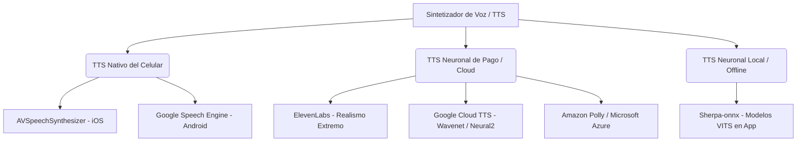

# 🎙️ Paradigmas de Síntesis de Voz (Text-to-Speech) en Entornos Profesionales

Este documento detalla los diferentes enfoques técnicos y de arquitectura de software para integrar la funcionalidad de lectura de texto en voz alta (**Text-to-Speech o TTS**) en aplicaciones móviles profesionales. Analiza las ventajas y desventajas de los motores nativos locales, las APIs de Inteligencia Artificial neurales en la nube y los modelos locales offline de código abierto.

---

## 🗺️ 1. Introducción al Text-to-Speech (TTS)

En aplicaciones móviles dedicadas al aprendizaje de idiomas (como Lingiux), la síntesis de voz es un pilar fundamental para el entrenamiento auditivo del estudiante. El reto de ingeniería consiste en reproducir cualquier palabra, frase o definición ingresada por el usuario en tiempo real con una pronunciación nativa precisa, una velocidad controlable y un tono de voz que resulte agradable e interactivo.

Existen tres paradigmas de implementación en la industria:

---

## 📱 2. Módulo A: TTS Nativo del Dispositivo (On-Device)

Utiliza los sintetizadores de voz que vienen instalados por defecto en el sistema operativo del teléfono móvil del usuario. La aplicación móvil delega por completo la generación de las ondas de audio al chip del hardware local.

### A. APIs Propias del Sistema
* **iOS:** Utiliza el framework `AVFoundation` mediante la clase `AVSpeechSynthesizer` y los datos de voz de `AVSpeechSynthesisVoice`. Las voces dependen de las descargas de Siri e idiomas instalados en los Ajustes del iPhone.
* **Android:** Utiliza la clase nativa `android.speech.tts.TextToSpeech`. Generalmente delega al motor de *Síntesis de voz de Google* preinstalado en los servicios de Google Mobile Services (GMS), aunque capas de personalización (como las de Samsung) pueden usar sus propios motores propietarios.
* **Integración en Flutter:** Se consume utilizando la librería de enlace nativo [flutter_tts](https://pub.dev/packages/flutter_tts) o [text_to_speech](https://pub.dev/packages/text_to_speech).

### B. Flujo de Trabajo
1. La app de Flutter invoca la función de pronunciación pasándole el texto y el código de idioma (ej: `es-MX`, `en-US`).
2. Flutter abre un canal de plataforma (`MethodChannel`) hacia la sección nativa (Java/Kotlin en Android o Swift/Objective-C en iOS).
3. El sistema operativo lee el texto en caliente, realiza el mapeo de grafemas a fonemas y genera el archivo binario PCM de audio en la memoria RAM del celular utilizando la CPU del hardware local.
4. El hilo de audio del sistema operativo reproduce el sonido resultante por el altavoz de manera inmediata.

### C. ⚖️ Ventajas y Desventajas
* **Ventajas:**
  * **100% Gratuito:** No tiene costos de licenciamiento, servidores ni cobro por volumen de peticiones o caracteres.
  * **Offline Completo:** Funciona sin cobertura de red ni internet.
  * **Latencia Mínima:** Al procesarse en local, la reproducción se inicia en milisegundos.
* **Desventajas:**
  * **Estética Robótica:** Las voces nativas suelen sonar mecánicas, planas, sin la modulación emocional, entonación ni pausas orgánicas de un humano.
  * **Inconsistencia de Calidad:** La voz varía significativamente según el dispositivo del usuario. En un dispositivo Android antiguo o de gama baja, la pronunciación puede sonar distorsionada o incomprensible debido a motores desactualizados, mientras que en un iPhone de última generación sonará aceptable.

---

## ☁️ 3. Módulo B: TTS Neuronal en la Nube (Neural Cloud TTS)

Utiliza APIs de pago que corren en servidores externos de alto rendimiento. Estos servidores procesan el texto utilizando modelos avanzados de **Inteligencia Artificial y Deep Learning** (Redes Neuronales) entrenados con miles de horas de grabaciones de locutores humanos de carne y hueso.

### A. Principales Soluciones Cloud de la Industria

#### 1. ElevenLabs
* **Descripción:** Considerado actualmente el rey de la generación de voz hiperrealista. Sus modelos generativos de audio emulan la respiración humana, la modulación contextual del tono (ej. susurros, enojo, entusiasmo), las pausas lógicas y los acentos regionales de forma casi perfecta. Cuenta además con herramientas para la **clonación de voces**.
* **Integración:** Se envía una petición HTTP `POST` con el texto a su API de REST y devuelve de inmediato un stream de audio codificado en `MP3` o `WAV` de alta calidad que se reproduce en la app móvil.
* **Costo:** Cuenta con un plan gratuito de 10,000 caracteres mensuales. Planes de suscripción de pago a partir de \$5.00 USD al mes con tarifas por volumen extra de uso.

#### 2. Google Cloud Text-to-Speech (Neural2 y WaveNet)
* **Descripción:** Utiliza los algoritmos **WaveNet** (desarrollados originalmente por *DeepMind*) y el motor de nueva generación **Neural2** (el mismo que alimenta a las respuestas complejas de Google Assistant). Es excelente para aplicaciones educativas porque su precisión fonética en idiomas extranjeros es del 100%, admitiendo múltiples variaciones regionales.
* **Costo:** Google ofrece una capa gratuita permanente sumamente generosa de hasta **1 millón de caracteres WaveNet/Neurales gratis al mes**. Posterior al límite gratuito, el costo es de \$16.00 USD por cada millón de caracteres adicionales.
* **Caso de Uso:** Es la opción favorita de desarrollo comercial de volumen medio por su gran relación calidad/precio y estabilidad.

#### 3. Microsoft Azure Neural TTS & Amazon Polly (AWS)
* **Descripción:** APIs corporativas robustas con voces conversacionales de gran realismo. Permiten modelar la velocidad de lectura, entonación y estilo conversacional a través de marcas en formato **SSML** (`Speech Synthesis Markup Language`).
* **Costo:** Tarifa estándar de pago por uso (~\$16.00 USD por millón de caracteres).

---

## 🛡️ 4. Módulo C: TTS Neuronal Local/Offline (On-Device Neural)

Consiste en empaquetar un modelo de Inteligencia Artificial neuronal ligero e integrarlo directamente en los assets del archivo instalable (`APK` / `IPA`) de la aplicación móvil. El procesamiento de Deep Learning ocurre directamente en la CPU/NPU del teléfono del usuario sin requerir internet.

### A. Alternativas Destacadas
1. **Sherpa-onnx (Siguiente generación de Kaldi/VITS):**
   * Es una librería multiplataforma para Flutter que permite correr modelos de síntesis de voz neuronales avanzados (como **VITS**) en formato ONNX de manera local en el teléfono sin conexión a internet.
   * **Calidad:** La voz suena con una entonación natural impresionante, muy superior al motor por defecto de Android.
   * **Costo:** 100% gratuito e ilimitado (los modelos se descargan y empaquetan en los assets de la app).
2. **Coqui TTS (Self-Hosted):**
   * Un motor de TTS en Python de código abierto. Permite entrenar y hospedar tus propios modelos de voces neurales en un servidor dedicado (ej: una instancia de Linux VPS en la nube). Tu app de Flutter simplemente le envía las palabras al servidor y este le devuelve el archivo de audio.
   * **Costo:** Gratuito en licenciamiento (solo pagas el costo de renta de tu servidor VPS).

---

## 💡 5. Propuesta de Arquitectura para Lingiux

Para Lingiux, la mejor estrategia para compaginar costos y la experiencia del usuario es implementar un **sistema de TTS híbrido/progresivo**:

1. **Fase de Prototipado y Desarrollo:**
   * Utilizar la librería **`flutter_tts` (Nativo / Local)**. Es inmediata de programar, no tiene costos de desarrollo y permite validar el funcionamiento de los botones y la experiencia de usuario general del reproductor sin configurar credenciales de red.
2. **Fase de Producción Comercial:**
   * Conectar la app con **Google Cloud Text-to-Speech (Neural2)**. Ofrece una pronunciación nativa perfecta del inglés, español, francés, etc., y su capa gratuita de 1 millón de caracteres mensuales cubrirá holgadamente a miles de usuarios activos en la app sin generar costos reales en la factura de la base de datos.
