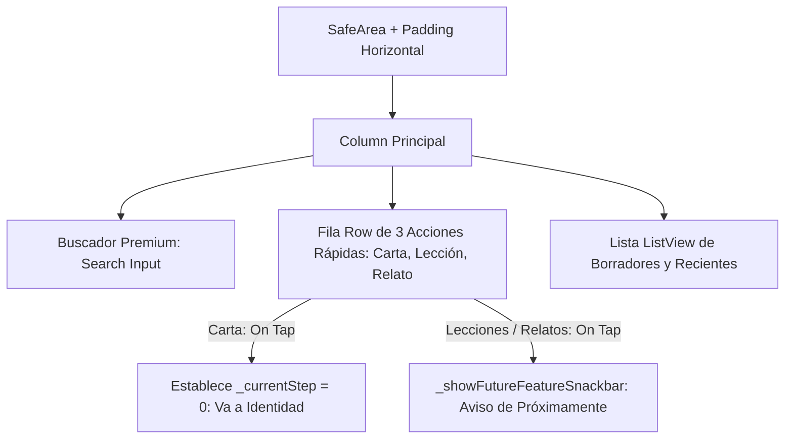

# Rediseño del Selector de Creación y Panel de Estudio Creativo

Este documento detalla la arquitectura, el diseño visual, la resolución de problemas de desbordamiento de pantalla (overflows) y la especificación técnica de la implementación de la **Pantalla de Selección de Creación ("Estudio Creativo")** en la tercera pestaña de la aplicación Lingiux.

---

## 🌿 1. Introducción y Propósito

El objetivo principal es transformar el acceso directo e inmediato al editor de cartas de vocabulario (que ocurría anteriormente al pulsar la pestaña de creación) en un **menú de selección de contenido modular y profesional**. Esta pantalla sirve de base para que los usuarios puedan elegir entre tres tipos de contenido interactivo:
1. **Crear Carta:** (Funcionalidad activa) Redirige al editor paso a paso de cartas.
2. **Crear Lección:** (Próximamente) Camino interactivo gamificado.
3. **Crear Relato:** (Próximamente) Ejercicios de audio y lecturas integradas.

### Evolución del Diseño
El diseño original se basaba en una lista vertical con largas descripciones de texto, la cual presentaba problemas de encuadre en pantallas móviles compactas. La interfaz evolucionó hacia un **Estudio Creativo** de tres bloques de acción superior colocados horizontalmente, acompañados de una barra de búsqueda premium en la cabecera y una sección inferior de borradores/recientes para una experiencia de usuario limpia, balanceada y de alto rendimiento.

---

## 🎨 2. Arquitectura Visual y Componentes del Sistema

La pantalla se divide en tres secciones verticales contenidas en un `Column` responsivo protegido por un `SafeArea`:



### A. Buscador Premium (Search Input Field)
Ubicado en la parte superior para dar una sensación de centro de control o gestor de contenidos:
*   **Contenedor Estilizado:** Un `Container` de 50px de altura con sombra difusa suave y un borde circular continuo de `25px`.
*   **Solución al Solapamiento del Tema Global (Background Overlap):** En la versión inicial, el buscador se renderizaba como un cuadrado extraño superpuesto debido a que el tema global de Flutter configuraba la propiedad `filled: true` en los `InputDecorationTheme`. Esto pintaba una caja rectangular blanca sobre nuestro contenedor redondeado. Para solucionarlo, configuramos explícitamente en el `TextField`:
    *   `filled: false` para anular la herencia rectangular del tema.
    *   `fillColor: Colors.transparent` para garantizar total transparencia en el fondo del input.
    *   `clipBehavior: Clip.antiAlias` en el contenedor padre, asegurando que las esquinas y los efectos de los bordes redondeados recorten correctamente el lienzo del `TextField`.
*   **Iconografía de Marca:** Incluye un icono de lupa (`Icons.search_rounded`) en color gris atenuado a la izquierda y un icono de sintonización de filtros (`Icons.tune_rounded`) con el color violeta primario de Lingiux a la derecha.

### B. Fila de Acciones Rápidas (3 Recuadros Superiores)
Coloca las opciones de creación una al lado de la otra mediante un `Row` cuyos hijos son widgets `Expanded` para distribuir el espacio uniformemente:
*   **Solución al Desbordamiento de 16 Píxeles (Vertical Overflow):** Inicialmente, se usó un widget `AspectRatio` de `0.85` en cada tarjeta. Al ejecutarse en pantallas con menor ancho, el ancho de cada celda `Expanded` disminuía y reducía proporcionalmente su altura vertical, dejando sin espacio vertical al texto e iconos internos, lo que rompía la pantalla. Se solucionó eliminando `AspectRatio` y asignando una **altura fija de 125px** (`height: 125`).
*   **Estilo Visual de los Botones:**
    *   **Carta (Activa):** Fondo blanco brillante, icono en un círculo con el gradiente de la marca de violeta a índigo.
    *   **Lección y Relato (Futuras):** Opacidad reducida del fondo (`white.withOpacity(0.65)`), bordes atenuados, icono de candado (`Icons.lock_outline_rounded`) con gradiente grisáceo, y una insignia flotante en la esquina superior derecha con la leyenda **"PRONTO"**.
*   **Alineamiento y Truncado de Texto:** Para evitar desalineaciones verticales de texto o roturas de caja:
    *   El contenido de la tarjeta se centra vertical y horizontalmente usando `Center` y `mainAxisAlignment: MainAxisAlignment.center`.
    *   Se configuró `maxLines: 1` y `overflow: TextOverflow.ellipsis` en los widgets de texto de título y subtítulo, previniendo cualquier desbordamiento si las traducciones de idioma superan el ancho disponible.

### C. Dashboard de Borradores y Recientes ("Borradores y Recientes")
Ubicado en la mitad inferior de la pantalla para rellenar el espacio vacío con información interactiva útil:
*   **Estructura Dinámica:** Un `ListView` con física de rebote (`BouncingScrollPhysics`) que renderiza tarjetas de borradores previos mediante la función constructora `_buildRecentItemCard`.
*   **Solución a la Barra de Desbordamiento Vertical Derecha (Horizontal Overflow):** En pantallas pequeñas de prueba, aparecía una barra rayada amarilla y negra a la derecha de cada elemento de lista, indicando que el texto secundario (tipo de creación y fecha de modificación) excedía el límite de la fila. Ocurría porque se utilizaba un `Row` anidado con dos textos. Se solucionó reemplazando el `Row` interno por un widget **`Text.rich`** configurado con:
    *   `TextSpan` para permitir diferentes colores en la misma línea (tipo de recurso en color temático, fecha en gris).
    *   `maxLines: 1` y `overflow: TextOverflow.ellipsis`, forzando a Flutter a pintar puntos suspensivos (`...`) si la combinación de textos es mayor al espacio restante de la pantalla.

### D. Bypass Inteligente de Flujo
Para evitar frustrar al usuario cuando el chat de IA le solicita explícitamente crear una tarjeta:
*   Se agregó un listener en el provider `pendingWordProvider` en el método `build`.
*   Si el provider detecta que se inyectó una palabra pendiente, la interfaz omite automáticamente la pantalla de selección (`_currentStep = -1`) y avanza de forma inmediata a la pantalla de Identidad (`_currentStep = 0`), precargando la palabra.

---

## 📂 3. Archivos Modificados y Estructura

El rediseño y sus optimizaciones están contenidos en un único archivo modular, lo que facilita el mantenimiento y aislamiento de la lógica de creación:

*   **Ruta del Archivo:** [create_card_screen.dart](file:///c:/Users/sebas/OneDrive/Escritorio/Lingiux/lingiux_app/lib/features/create_card/presentation/screens/create_card_screen.dart)
*   **Ubicación en la Arquitectura:**
    ```text
    lib/
    └── features/
        └── create_card/
            └── presentation/
                └── screens/
                    └── create_card_screen.dart  <-- (Contiene el selector y flujo de pasos)
    ```

---

## 🛠️ 4. Dependencias y Librerías Utilizadas

Todo el rediseño se implementó de forma nativa utilizando los widgets del SDK de Flutter y Riverpod para el estado de navegación:

1.  **`flutter/services.dart`:** Utilizada para accionar vibraciones del motor háptico físico en el botón de creación (`HapticFeedback.mediumImpact()`).
2.  **`flutter/material.dart`:** Para componentes estándar (`TextField`, `InputDecoration`, `Text.rich`, `SnackBar`, `GestureDetector`, etc.).
3.  **`flutter_riverpod`:** Escucha los providers de estado (`activeTabProvider`, `pendingWordProvider`, `isCardEditorActiveProvider`) para coordinar la navegación global y ocultar o mostrar el Bottom Bar.

---

## 🔄 5. Instrucciones para Revertir o Quitar la Funcionalidad

Si en el futuro se decide eliminar la pantalla del selector de creación y regresar al flujo antiguo (donde al tocar la pestaña de creación se abría directamente el editor de cartas), sigue estos sencillos pasos de reversión:

### Paso 1: Cambiar el estado inicial del paso en el constructor
En [create_card_screen.dart](file:///c:/Users/sebas/OneDrive/Escritorio/Lingiux/lingiux_app/lib/features/create_card/presentation/screens/create_card_screen.dart), busca la variable de estado `_currentStep` y restablécela a `0` (el paso de Identidad) en lugar de `-1`:

```diff
class _CreateCardScreenState extends ConsumerState<CreateCardScreen> {
- int _currentStep = -1; // -1 indica pantalla de seleccion de creacion
+ int _currentStep = 0;  // 0 inicia directamente en el formulario de la carta
```

### Paso 2: Quitar la condición del paso -1 en el método `build`
Busca el bloque condicional `if (_currentStep == -1) { ... }` y elimínalo por completo del método `build`:

```diff
-   if (_currentStep == -1) {
-     return Scaffold(
-       backgroundColor: AppColors.background,
-       body: Stack(
-         ...
-       ),
-     );
-   }
```

### Paso 3: Modificar la lógica de retorno del paso anterior (`_prevStep`)
Edita la función de retroceso para evitar que asigne `-1`:

```diff
  void _prevStep() {
-   if (_currentStep == 0) {
-     setState(() {
-       _currentStep = -1;
-     });
-     return;
-   }
    if (_currentStep > 0) {
      setState(() {
        _currentStep--;
      });
    }
  }
```

### Paso 4: Eliminar las funciones auxiliares al final de la clase
Puedes borrar de la sección inferior de la clase los siguientes widgets de soporte para dejar el archivo libre de código muerto:
*   `Widget _buildSelectionCard(...)`
*   `Widget _buildRecentItemCard(...)`
