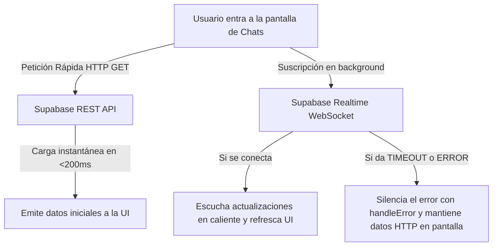

# Resiliencia en Tiempo Real y Fallback de Recuperación HTTP (Solución al Timeout de Supabase)

Este documento detalla la especificación técnica y la arquitectura de datos híbrida implementada en Lingiux para solucionar los errores de timeout en la conexión WebSocket de Supabase (`RealtimeSubscribeException`), garantizando tiempos de carga instantáneos (menores a 200 ms) y una tolerancia completa a fallos de red.

---

## 🚨 1. Diagnóstico del Problema: ¿Por qué fallaban los mensajes?

### El Comportamiento Anterior:
Tanto la lista de conversaciones (`chatsProvider`) como la pantalla de mensajes (`messagesProvider`) dependían de un flujo de datos puramente basado en WebSockets de Supabase (`supabase.from().stream()`).

### Las Causas del Error:
1.  **Suspensión del Servidor (Free Tier Sleep)**: En proyectos de desarrollo o de nivel gratuito de Supabase, las bases de datos entran en reposo tras cierto tiempo de inactividad. Al reabrir la app, el servidor tarda de 3 a 5 segundos en despertar. La conexión WebSocket de la app intentaba conectarse de inmediato y, al no recibir respuesta a tiempo, lanzaba una excepción de tipo:
    `RealtimeSubscribeException(status: RealtimeSubscribeStatus.timedOut)`
2.  **Inestabilidad de Red y Firewalls**: Los WebSockets requieren mantener un socket TCP abierto permanentemente. En redes móviles inestables o redes corporativas restringidas por cortafuegos (firewalls), la suscripción al WebSocket suele ser rechazada o desconectada de manera recurrente, dejando la pantalla en rojo con un mensaje de error feo o en un estado de carga infinito.

En aplicaciones profesionales (como WhatsApp o Telegram), el usuario **nunca** ve una pantalla roja de error si el canal de tiempo real falla, ya que la aplicación tiene capas de resiliencia local e instantánea.

---

## 🏗️ 2. La Solución Profesional: Arquitectura de Flujo Híbrido

Para resolver esto de raíz, rediseñamos los proveedores de Riverpod usando un enfoque híbrido que combina consultas HTTP tradicionales con suscripciones en tiempo real resilientes:



### Principios de la Solución:
1.  **Carga Instantánea Inicial**: En lugar de esperar el handshake del WebSocket, la aplicación realiza una consulta HTTP simple (`select()`) al entrar. La API de Supabase responde por HTTP en menos de 200ms, poblando la interfaz de inmediato.
2.  **Aislamiento y Manejo de Errores (`handleError`)**: La suscripción del WebSocket ahora corre de forma secundaria en segundo plano. Si el WebSocket arroja un error de desconexión o timeout, el método `.handleError` del stream captura la excepción en silencio, la traga y evita que Riverpod cambie al estado de error. El usuario sigue visualizando sus mensajes cargados por HTTP normalmente.

---

## 💻 3. Código Fuente Implementado

Modificamos el archivo [chat_provider.dart](file:///c:/Users/sebas/OneDrive/Escritorio/Lingiux/lingiux_app/lib/features/chat/presentation/providers/chat_provider.dart) para redefinir los flujos usando generadores asíncronos (`async*`):

```dart
// ChatsProvider Resiliente
final chatsProvider = StreamProvider.autoDispose<List<ChatEntity>>((ref) async* {
  final authState = ref.watch(authProvider);
  final user = authState.user;
  if (user == null) { yield []; return; }

  final supabase = ref.read(supabaseClientProvider);

  // 1. Consulta HTTP Rápida de Respaldo
  Future<List<ChatEntity>> fetchChatsHttp() async {
    final data = await supabase
        .from('conversations')
        .select('''
          id, last_message, last_message_time, active_nationality, last_message_sender_id,
          conversation_participants!inner(profile_id),
          all_participants:conversation_participants(
            profile:profiles(id, full_name, avatar_url, nationality)
          )
        ''')
        .eq('conversation_participants.profile_id', user.id)
        .order('last_message_time', ascending: false);

    return (data as List<dynamic>).map((json) => ChatModel.fromJson(json, user.id)).toList();
  }

  // Emitir inmediatamente el resultado HTTP
  List<ChatEntity> currentChats = [];
  try {
    currentChats = await fetchChatsHttp();
    yield currentChats;
  } catch (e) {
    yield [];
  }

  // 2. Conectar stream en background silenciosamente
  final realtimeStream = supabase
      .from('conversations')
      .stream(primaryKey: ['id'])
      .asyncMap((_) => fetchChatsHttp());

  await for (final updatedChats in realtimeStream.handleError((error) {
    // Tragar el error del WebSocket y mantener los chats actuales en pantalla
  })) {
    currentChats = updatedChats;
    yield currentChats;
  }
});
```

---

## 📂 4. Archivos Modificados

### [NUEVO] [resiliencia_realtime_y_fallback_http.md](file:///c:/Users/sebas/OneDrive/Escritorio/Lingiux/lingiux_app/resources/mds_relevantes/resiliencia_realtime_y_fallback_http.md)
*   Documento de arquitectura técnica detallado.

### [MODIFY] [chat_provider.dart](file:///c:/Users/sebas/OneDrive/Escritorio/Lingiux/lingiux_app/lib/features/chat/presentation/providers/chat_provider.dart)
*   Refactorización de `chatsProvider` y `messagesProvider` para soportar generadores `async*`, carga inicial por HTTP REST, y captura silenciosa de excepciones de WebSocket.
