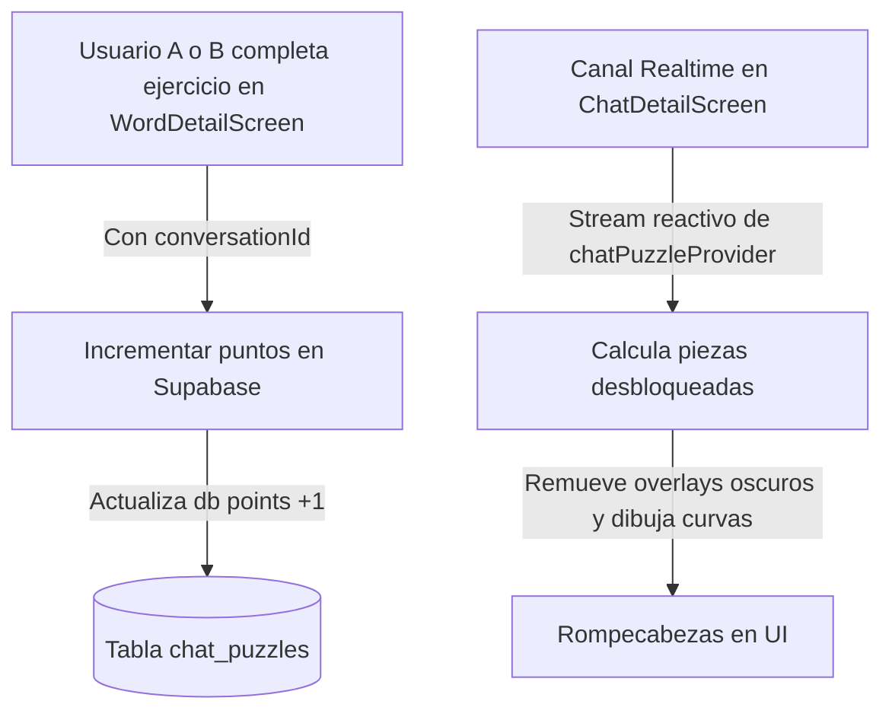

# Rompecabezas Cooperativo en Conversaciones

Este documento detalla la especificación técnica, la estructura de datos en Supabase, los proveedores reactivos en Riverpod y la maquetación matemática de curvas de encaje (clipping) implementadas para el sistema de rompecabezas cooperativo dentro de los chats de Lingiux.

---

## 🏗️ 1. Arquitectura del Juego

El rompecabezas cooperativo incentiva el estudio diario vinculando los ejercicios correctos completados desde el chat con la revelación progresiva de un lienzo artístico compartido:



---

## 🗄️ 2. Diseño de la Tabla en Supabase

Creamos la tabla `public.chat_puzzles` para guardar el estado y progreso del rompecabezas para cada chat. 

### Sentencia SQL de la Migración:
La migración fue aplicada exitosamente en el proyecto Supabase `LX Flutter` (ID: `nlzossymgltwvognvemv`):

```sql
CREATE TABLE public.chat_puzzles (
    id UUID PRIMARY KEY DEFAULT gen_random_uuid(),
    conversation_id UUID REFERENCES public.conversations(id) ON DELETE CASCADE UNIQUE NOT NULL,
    points INT DEFAULT 0 NOT NULL,
    total_pieces INT DEFAULT 12 NOT NULL,
    piece_order INT[] NOT NULL,
    image_url TEXT NOT NULL,
    created_at TIMESTAMP WITH TIME ZONE DEFAULT timezone('utc'::text, now()) NOT NULL
);

-- Habilitar Row Level Security (RLS)
ALTER TABLE public.chat_puzzles ENABLE ROW LEVEL SECURITY;

-- Políticas de RLS
CREATE POLICY "Anyone can read chat puzzles"
    ON public.chat_puzzles FOR SELECT
    USING (true);

CREATE POLICY "Authenticated users can insert chat puzzles"
    ON public.chat_puzzles FOR INSERT
    WITH CHECK (auth.uid() IS NOT NULL);

CREATE POLICY "Authenticated users can update chat puzzles"
    ON public.chat_puzzles FOR UPDATE
    USING (auth.uid() IS NOT NULL);
```

*   **`piece_order` (Arreglo de enteros `INT[]`)**: Almacena el orden en el que se desbloquearán las piezas del rompecabezas. Se pre-desordena de manera aleatoria al inicializar el lienzo para que los usuarios experimenten un desbloqueo dinámico y no-secuencial.
*   **`points` (Puntos acumulados)**: Cada respuesta correcta suma 1 punto. Cada pieza cuesta exactamente **3 puntos**, por lo que un rompecabezas de 12 piezas requiere un total de 36 aciertos acumulados entre ambos miembros.

---

## ⚡ 3. Proveedores de Estado en Riverpod (`chat_puzzle_provider.dart`)

Declaramos e implementamos el archivo [chat_puzzle_provider.dart](file:///c:/Users/sebas/OneDrive/Escritorio/Lingiux/lingiux_app/lib/features/chat/presentation/providers/chat_puzzle_provider.dart) para gestionar las operaciones y el flujo de datos:

1.  **`chatPuzzleProvider(conversationId)`**: Un `StreamProvider` que escucha los cambios mediante el canal de streaming nativo de Supabase.
2.  **`_getOrCreatePuzzle()`**: Método interno asíncrono que comprueba si existe un lienzo activo para la conversación. Si es nulo, inicializa una nueva partida asignando un orden aleatorio a las 12 piezas y seleccionando una imagen artística premium de Unsplash.
3.  **`incrementPuzzlePoints()`**: Aumenta en 1 los puntos de la conversación si no se ha alcanzado la puntuación máxima del rompecabezas.
4.  **`resetPuzzle()`**: Reinicia la puntuación a 0, baraja una nueva secuencia de desbloqueo y selecciona una nueva imagen al azar del repertorio.

---

## 📐 4. Maquetación Matemática de las Piezas (Clipping y Painting)

Para dibujar las piezas individuales con sus respectivas curvas de encaje (pestañas salientes y entrantes), diseñamos dos componentes clave en [chat_detail_screen.dart](file:///c:/Users/sebas/OneDrive/Escritorio/Lingiux/lingiux_app/lib/features/chat/presentation/screens/chat_detail_screen.dart):

### A. `JigsawPieceClipper` (Recortador Bézier)
Un `CustomClipper<Path>` que calcula dinámicamente los bordes según la posición celular `(x, y)` en la matriz de $4 \times 3$:

*   Los bordes exteriores (ej. arriba en la primera fila, o a la derecha en la última columna) se trazan rectos.
*   Los bordes interiores se dibujan como salientes (tabs) o entrantes (blanks) de forma alternada y perfectamente complementaria basándose en una paridad matemática determinista `((x + y) % 2 == 0)`.
*   Para lograr la curvatura redondeada característica, empleamos curvas de Bézier cúbicas (`Path.cubicTo`):

```dart
    final p0 = Offset(startX + length * 0.35, centerY);
    final p1 = Offset(startX + length * 0.35, centerY + tabSize * direction);
    final p2 = Offset(startX + length * 0.45, centerY + tabSize * direction);
    final p3 = Offset(startX + length * 0.45, centerY + tabSize * 0.6 * direction);
    final p4 = Offset(startX + length * 0.5, centerY + tabSize * 1.5 * direction); // Punta del tab
    ...
```

### B. `JigsawBorderPainter` (Pintor de Intersecciones)
Para resaltar las divisiones de las piezas de forma premium, creamos un `CustomPainter` que redibuja el trazado del clipper con un estilo blanco semi-translúcido (`strokeWidth = 1.5` y `alpha = 0.5`), permitiendo visualizar la retícula del rompecabezas sobre la imagen de fondo.

---

## 🚀 5. Flujo de Navegación y Conexión de Eventos

1.  **Propagación de Contexto**:
    *   Modificamos [chat_detail_screen.dart](file:///c:/Users/sebas/OneDrive/Escritorio/Lingiux/lingiux_app/lib/features/chat/presentation/screens/chat_detail_screen.dart) y [message_bubble.dart](file:///c:/Users/sebas/OneDrive/Escritorio/Lingiux/lingiux_app/lib/features/chat/presentation/widgets/message_bubble.dart) para inyectar y transferir el parámetro opcional `conversationId` hacia [word_detail_screen.dart](file:///c:/Users/sebas/OneDrive/Escritorio/Lingiux/lingiux_app/lib/features/vocabulary/presentation/screens/word_detail_screen.dart).
2.  **Registro y Desbloqueo**:
    *   Al completar con éxito una carta dentro del estudio habiendo accedido desde el chat, el método `_recordCorrectCard()` invoca a `incrementPuzzlePoints()`.
    *   Esta operación gatilla la actualización en Supabase.
    *   El stream del chat reacciona inmediatamente en ambos dispositivos, actualizando la barra de progreso verde e iluminando la pieza correspondiente.

---

## 🏆 6. Mecánica de Completado y Reinicio de Partidas

El rompecabezas cooperativo funciona bajo un flujo de recompensas cíclico que premia la constancia de los usuarios en común:

1.  **Condición de Completado**:
    *   El sistema calcula el número de piezas reveladas usando la puntuación actual de la conversación dividida entre el coste por pieza:
        $$\text{piezasDesbloqueadas} = \min\left(\lfloor \frac{\text{puntos}}{3} \rfloor, 12\right)$$
    *   Una vez que los puntos acumulados alcanzan **36 puntos**, la condición `isCompleted` se evalúa como `true`.
2.  **Revelación Total e Interfaz de Victoria**:
    *   Al completarse, se retiran automáticamente todos los overlays oscuros y candados de las 12 celdas del lienzo, mostrando la imagen artística en su totalidad y a todo color.
    *   La barra de progreso se llena al 100% y se tiñe de color verde esmeralda.
    *   El texto de estado cambia a `"¡Rompecabezas completado!"`.
    *   Se muestra un botón especial e interactivo: **CARGAR NUEVO ROMPECABEZAS**.
3.  **Flujo de Reinicio (Nuevo Lienzo)**:
    *   Al presionar el botón de reinicio, se invoca la función asíncrona `resetPuzzle()`.
    *   Esto actualiza la tabla `chat_puzzles` en Supabase de la siguiente manera:
        *   Restablece los puntos a `0`.
        *   Genera una nueva lista de índices desordenada (`piece_order`).
        *   Selecciona un nuevo enlace aleatorio desde nuestro repertorio de imágenes de alta resolución de Unsplash (playas, bosques, los Alpes suizos, Yosemite, lagos y montañas).
    *   El stream reacciona al instante, bloqueando de nuevo el tablero y presentando un lienzo misterioso para iniciar una nueva temporada de estudio compartido.

---

## 📂 7. Archivos Creados y Modificados

### [NUEVO] [chat_puzzle_provider.dart](file:///c:/Users/sebas/OneDrive/Escritorio/Lingiux/lingiux_app/lib/features/chat/presentation/providers/chat_puzzle_provider.dart)
*   Contiene la lógica de negocio de Riverpod para interactuar de forma reactiva con la tabla `chat_puzzles` de Supabase.
*   Declara los métodos `chatPuzzleProvider`, `_getOrCreatePuzzle()`, `incrementPuzzlePoints()` y `resetPuzzle()`.

### [MODIFY] [chat_detail_screen.dart](file:///c:/Users/sebas/OneDrive/Escritorio/Lingiux/lingiux_app/lib/features/chat/presentation/screens/chat_detail_screen.dart)
*   Importa el proveedor del rompecabezas.
*   Actualiza el `itemBuilder` de la lista de mensajes para pasar la conversación a `MessageBubble`.
*   Actualiza la navegación del pop-up de cartas (`WordMiniCardFront`/`WordMiniCardBack`) para pasar la propiedad `conversationId` a `WordDetailScreen`.
*   Reemplaza el antiguo contenedor placeholder por el widget reactivo del rompecabezas `_ChatPuzzleWidget`.
*   Contiene las clases auxiliares de dibujo `JigsawPieceClipper` y `JigsawBorderPainter`.

### [MODIFY] [message_bubble.dart](file:///c:/Users/sebas/OneDrive/Escritorio/Lingiux/lingiux_app/lib/features/chat/presentation/widgets/message_bubble.dart)
*   Añade la propiedad `conversationId` en su constructor.
*   Actualiza la navegación interna a `WordDetailScreen` (al presionar cartas compartidas) para propagar el `conversationId`.

### [MODIFY] [word_detail_screen.dart](file:///c:/Users/sebas/OneDrive/Escritorio/Lingiux/lingiux_app/lib/features/vocabulary/presentation/screens/word_detail_screen.dart)
*   Añade el parámetro opcional `conversationId` a su constructor y lo propaga a su widget hijo `_WordCard`.
*   Modifica el método `_recordCorrectCard` para disparar el incremento de puntos del rompecabezas en la base de datos si la propiedad `conversationId` está presente.

