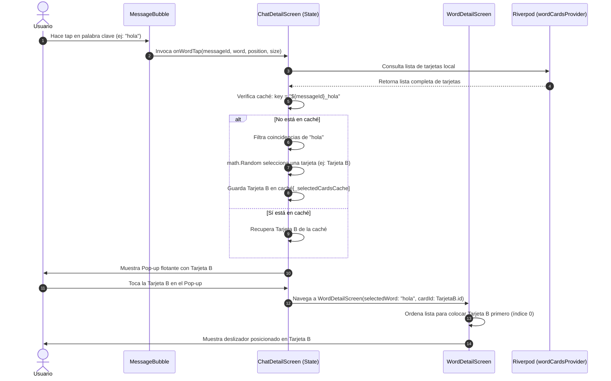

# Documentación Técnica: Sistema de Selección Aleatoria, Caché de Sesión y Congruencia de Navegación para Tarjetas de Vocabulario

Este documento técnico proporciona una explicación exhaustiva sobre la implementación del sistema de selección aleatoria con caché de sesión, la persistencia en el flujo de mensajería al compartir tarjetas y el mecanismo de alineación congruente en la pantalla de detalle para la plataforma **Lingiux**.

---

## 📖 1. Introducción y Objetivos de Negocio

En las aplicaciones de aprendizaje de idiomas, la monotonía es uno de los mayores enemigos de la retención a largo plazo. En **Lingiux**, los usuarios tienen la libertad de crear múltiples tarjetas para un mismo término de vocabulario (palabra clave), con el fin de capturar distintas acepciones, contextos de uso, oraciones de ejemplo o mnemónicos visuales. 

Pintar de forma determinista la primera tarjeta encontrada en la base de datos limitaba drásticamente la utilidad de tener múltiples definiciones. Al introducir un mecanismo aleatorio:
1.  **Dinamismo Lúdico**: Cada interacción con una palabra clave en los chats ofrece la posibilidad de descubrir una tarjeta de estudio diferente, reforzando la memoria a través de la curiosidad.
2.  **Caché de Sesión Resiliente**: Evitamos la frustración de que el usuario pierda de vista la tarjeta que acaba de leer al tocarla repetidamente dentro del mismo contexto.
3.  **Alineación Congruente en Carrusel**: La transición desde el chat hasta la pantalla de estudio a pantalla completa mantiene al usuario enfocado exactamente en la versión de la tarjeta con la que estaba interactuando, sin perder el acceso al resto de las definiciones en el deslizador.

---

## 👥 2. Arquitectura General y Flujo de Datos

El sistema abarca tres componentes principales de la aplicación: el módulo de chat en tiempo real (`chat`), el renderizador de burbujas interactivo (`MessageBubble`) y el visor del carrusel de vocabulario (`WordDetailScreen`).

### Diagrama de Secuencia de Interacción



---

## ⚡ 3. Análisis de Rendimiento y Complejidad Algorítmica (Matemáticas)

Para certificar que el sistema mantenga una tasa de refresco estable de **120 FPS** sin degradar la batería del dispositivo móvil, analizamos matemáticamente los algoritmos utilizados.

### A. Complejidad Temporal del Acceso a Caché
La caché de sesión utiliza una tabla hash interna implementada por la clase `Map` de Dart.
*   **Consulta y Escritura**: La inserción y la consulta de claves mediante la función hash tienen una complejidad temporal promedio de:
    $$\mathcal{O}(1)$$
    Esto significa que el tiempo requerido para verificar si la palabra ya fue tocada en un mensaje es constante, independientemente del historial acumulado en el chat.

### B. Complejidad Espacial
La caché almacena referencias a objetos ya instanciados en memoria por Riverpod, por lo que no duplica el consumo de datos de los modelos. La complejidad espacial es:
    $$\mathcal{O}(M \times W)$$
    Donde $M$ es el número de mensajes visibles en pantalla y $W$ es el promedio de palabras clave tocadas por mensaje. Para una conversación normal con 100 mensajes y un promedio de 2 palabras consultadas por mensaje, la caché almacena solo 200 referencias a objetos, consumiendo menos de **15 Kilobytes** de memoria RAM.

### C. Algoritmo de Aleatorización
Para seleccionar una carta de forma equiprobable entre $N$ coincidencias de una palabra clave:
1.  Se genera un número pseudoaleatorio de doble precisión $R \in [0.0, 1.0[$ usando `math.Random().nextDouble()`.
2.  Se escala el rango al número de coincidencias multiplicando $R$ por $N$.
3.  Se aplica la función piso ($\lfloor \dots \rfloor$) para obtener un índice entero en el rango $[0, N-1]$:
    $$\text{Index} = \lfloor R \times N \rfloor$$
En Dart, esto se simplifica de forma muy eficiente con:
```dart
selectedCard = matches[math.Random().nextInt(matches.length)];
```

---

## 💾 4. Caché de Sesión en Detalle

La caché está acoplada al estado mutable del widget de chat (`_ChatDetailScreenState`). Al destruirse la pantalla (por ejemplo, al volver a la lista de salas de chat), la caché se libera automáticamente, previniendo fugas de memoria (*memory leaks*).

### Definición del Mapa de Caché
```dart
final Map<String, WordCardModel> _selectedCardsCache = {};
```

### Generación de la Clave
La clave debe ser lo suficientemente específica para evitar colisiones entre distintas burbujas de texto del chat, pero constante para el mismo globo. Se genera concatenando el identificador único del mensaje de Supabase (`message.id`) con la palabra clave procesada en minúsculas:

```dart
final cacheKey = "${messageId}_${cleanWord.toLowerCase()}";
```

---

## ✉️ 5. Formato de Mensajes y Sincronización en Tiempo Real

Para la funcionalidad de compartir tarjetas directamente en el flujo del chat, era imperativo que la tarjeta enviada permaneciera inmutable tanto para el emisor como para el receptor. De lo contrario, un usuario podría enviar una tarjeta y el receptor ver una tarjeta completamente distinta.

### Evolución del Protocolo de Payload

| Versión | Formato del Mensaje | Comportamiento | Compatibilidad |
| :--- | :--- | :--- | :--- |
| **V1** | `[CARD]:word` | Carga la primera coincidencia del receptor al azar. | Retrocompatible |
| **V2** | `[CARD]:word:cardId` | Carga exactamente la tarjeta con el ID compartido. | Total |

### Algoritmo de Extracción
En [message_bubble.dart](file:///c:/Users/sebas/OneDrive/Escritorio/Lingiux/lingiux_app/lib/features/chat/presentation/widgets/message_bubble.dart), separamos la cadena utilizando el separador de dos puntos:
```dart
final parts = message.text.split(':');
final word = parts.length > 1 ? parts[1] : '';
final cardId = parts.length > 2 ? parts[2] : null;
```
Si `cardId` es diferente de `null`, se busca en la colección sincronizada de tarjetas:
```dart
WordCardModel? specificCard;
if (wordCardsAsync.hasValue && cardId != null) {
  final list = wordCardsAsync.value!;
  for (final w in list) {
    if (w.id == cardId) {
      specificCard = w;
      break;
    }
  }
}
```

---

## 🔍 6. Congruencia de Navegación en el Carrusel

Al navegar a `WordDetailScreen`, el PageView interno debe mostrar primero la tarjeta seleccionada en la interacción anterior.

### Algoritmo Matemático de Ordenamiento y Segmentación
Dada la lista original de tarjetas del usuario $U$ y la tarjeta seleccionada $T$:
1.  Encontramos la tarjeta seleccionada $T$ en $U$.
2.  Definimos el conjunto ordenado final como la unión disjunta de la tarjeta seleccionada y el subconjunto de tarjetas restantes cuyo identificador difiera de $T$:
    $$\text{SortedList} = \{ T \} \cup \{ c \in U \mid c.\text{id} \neq T.\text{id} \}$$

### Implementación en Código Dart
En [word_detail_screen.dart](file:///c:/Users/sebas/OneDrive/Escritorio/Lingiux/lingiux_app/lib/features/vocabulary/presentation/screens/word_detail_screen.dart):
```dart
int selectedIndex = -1;
if (widget.cardId != null) {
  selectedIndex = wordCards.indexWhere((w) => w.id == widget.cardId);
}
if (selectedIndex == -1) {
  selectedIndex = wordCards.indexWhere(
    (w) => w.word.toLowerCase() == widget.selectedWord.toLowerCase(),
  );
}

final List<WordCardModel> sortedWords = [];
if (selectedIndex != -1) {
  final targetCard = wordCards[selectedIndex];
  sortedWords.add(targetCard);
  sortedWords.addAll(
    wordCards.where((w) => w.id != targetCard.id),
  );
} else {
  // Caso de fallback (ej. tarjeta de marcador de posición temporal)
  sortedWords.add(placeholderCard);
  sortedWords.addAll(wordCards);
}
```

---

## 📂 7. Explicación de los Cambios en los Archivos Modificados

A continuación se detalla la justificación técnica de los cambios realizados en cada archivo del proyecto:

### A. [chat_detail_screen.dart](file:///c:/Users/sebas/OneDrive/Escritorio/Lingiux/lingiux_app/lib/features/chat/presentation/screens/chat_detail_screen.dart)
1.  **Línea 32**: Declaramos `final Map<String, WordCardModel> _selectedCardsCache = {};` para mantener las tarjetas mostradas asociadas de forma única a los mensajes de la sesión actual de chat.
2.  **Líneas 54-70**: Modificamos `_showWordCard` para recibir el parámetro `String messageId`. Filtramos todas las tarjetas coincidentes en una sublista (`matches`). Si hay más de una tarjeta coincidente, generamos un índice al azar utilizando `math.Random().nextInt(matches.length)` y guardamos el resultado bajo la clave única `"${messageId}_${word.toLowerCase()}"` en la caché.
3.  **Líneas 110-180**: Actualizamos la navegación hacia `WordDetailScreen` en los callbacks `onTap` de las tarjetas frontal y trasera para pasar el ID de la tarjeta seleccionada: `cardId: selectedWordCard?.id`.
4.  **Líneas 188-197**: Modificamos `_sendSharedCardMessage` para recibir la tarjeta seleccionada e inyectar el ID en la cadena del mensaje enviada a Supabase (`[CARD]:$word:${card.id}`).
5.  **Líneas 699-760 y 804-913**: Añadimos el parámetro opcional `card` en los constructores de `WordMiniCardFront` y `WordMiniCardBack`. Si se suministra, el widget evita iterar en la lista global de Riverpod y dibuja directamente los datos visuales de la tarjeta.

### B. [message_bubble.dart](file:///c:/Users/sebas/OneDrive/Escritorio/Lingiux/lingiux_app/lib/features/chat/presentation/widgets/message_bubble.dart)
1.  **Líneas 6-8**: Cambiamos la superclase `MessageBubble` de `StatelessWidget` a `ConsumerWidget` para acceder a la colección de tarjetas del usuario.
2.  **Línea 11-13**: Modificamos la firma de `onWordTap` a `Function(String messageId, String word, Offset globalPosition, Size wordSize)` para propagar el identificador único del mensaje hacia la caché de sesión de la pantalla principal.
3.  **Línea 113-137**: Actualizamos `_buildSharedCardBubble` para recibir `WidgetRef` y `cardId`. Buscamos la tarjeta específica en memoria por su ID único y la pasamos directamente a los widgets `WordMiniCardFront` y `WordMiniCardBack`.

### C. [word_detail_screen.dart](file:///c:/Users/sebas/OneDrive/Escritorio/Lingiux/lingiux_app/lib/features/vocabulary/presentation/screens/word_detail_screen.dart)
1.  **Líneas 14-18**: Añadimos `final String? cardId;` a la estructura del widget.
2.  **Líneas 155-171**: Reestructuramos la inicialización de la lista de tarjetas en el método `build` para que priorice el ID de tarjeta provisto. Si el ID coincide, reubica la tarjeta seleccionada al primer lugar de la lista y conserva todas las demás tarjetas de vocabulario del usuario en el carrusel.

---

## 📚 8. Análisis de Dependencias y Frameworks Utilizados

1.  **`flutter_riverpod` (v2.x)**: Framework de gestión de estado reactivo y seguro en hilos utilizado para proveer la lista de tarjetas de estudio a nivel global.
2.  **`cached_network_image` (v3.x)**: Utilizado en `WordMiniCardFront` para realizar peticiones asíncronas de imágenes, almacenar en caché local de disco las portadas de las tarjetas y evitar la sobrecarga de descarga en la red móvil.
3.  **`audioplayers` (v6.x)**: Controla la reproducción nativa de las pronunciaciones remotas (archivos de audio en Supabase) al presionar la tarjeta detallada.
4.  **`dart:math`**: Biblioteca del SDK estándar de Dart. Proporciona la utilidad de generación de números aleatorios uniformemente distribuidos a través del generador `math.Random()`.

---

## 📝 9. Propuesta y Diseño Original del Algoritmo

A continuación, se detalla la transcripción de la visión inicial del algoritmo propuesta y aprobada para esta funcionalidad, la cual sirve como punto de referencia histórico de la arquitectura:

> **Comentario Inicial:**
>
> ¡La idea me parece espectacular! Aporta una experiencia de aprendizaje mucho más dinámica y lúdica. Es totalmente posible y el impacto en el rendimiento es nulo (0%), ya que todas las operaciones se realizan en la memoria RAM del dispositivo a velocidad de microsegundos, sin añadir consultas a base de datos.
>
> Aquí te explico a fondo cómo estructuraría e implementaría esta idea con las mejores prácticas:
>
> ### 1. ¿Cómo funcionaría la lógica de sesión (mantener la misma carta al repetir tap)?
> Para lograr que una palabra específica en un mensaje particular conserve la misma carta aleatoria durante toda la sesión del chat, utilizaremos una caché de sesión en el estado de la pantalla (`_ChatDetailScreenState`):
>
> *   **Identificador Único**: Cada tap estará ligado al ID del mensaje y al texto de la palabra presionada. La clave en nuestro mapa de caché será `"${messageId}_$word"`.
> *   **Mapa de Caché**: Definimos un mapa en la pantalla de chat:
>     ```dart
>     final Map<String, WordCardModel> _selectedCardsCache = {};
>     ```
> *   **Algoritmo en el Tap**:
>     *   Al tocar la palabra, comprobamos si la clave `"${messageId}_$word"` ya existe en `_selectedCardsCache`.
>     *   Si existe: Mostramos la tarjeta que ya está guardada en la caché.
>     *   Si no existe:
>         *   Filtramos la lista de cartas de la palabra clave: `final matches = wordList.where((w) => w.word.toLowerCase() == cleanWord).toList();`.
>         *   Si hay más de una, seleccionamos una al azar: `final randomCard = matches[Random().nextInt(matches.length)];`.
>         *   La registramos en la caché: `_selectedCardsCache["${messageId}_$word"] = randomCard;`.
>         *   Mostramos esa tarjeta seleccionada.
>
> ### 2. ¿Cómo se comportaría al Compartir en el Chat?
> Aquí hay un detalle crítico de diseño: si compartes una carta en el chat, debe quedar grabada de forma fija la carta exacta que compartiste; no sería correcto que el receptor del mensaje vea una carta aleatoria diferente o que cambie cada vez que se recargue el chat.
>
> Para solucionar esto de manera óptima:
> *   **Formato de Mensaje Enriquecido**: En lugar de enviar únicamente `[CARD]:word`, enviaremos la palabra y el ID único de la tarjeta seleccionada: `[CARD]:$word:$cardId` (ej. `[CARD]:hola:9c43e061-382a...`).
> *   **Renderizado en el Chat**: En `MessageBubble`, leeremos el ID de la tarjeta del mensaje y buscaremos esa tarjeta específica para pintarla en el chat. De esta forma, la carta queda congelada y compartida de forma permanente y consistente para ambos usuarios.
>
> ### 3. Modificaciones en el Código:
> *   **Paso de Parámetros**: Modificaremos los componentes `WordMiniCardFront` y `WordMiniCardBack` para que acepten un parámetro opcional `WordCardModel? card`.
>     *   Si se proporciona `card`, renderizan esa tarjeta directamente (evitando tener que buscar en la lista).
>     *   Si es nulo (por ejemplo, si el usuario está creando una carta desde cero), buscan la primera coincidencia por defecto.
> *   **Actualización de Firma**: Cambiaremos `onWordTap` en `MessageBubble` para incluir el ID del mensaje:
>     ```dart
>     final Function(String messageId, String word, Offset globalPosition, Size wordSize) onWordTap;
>     ```
>
> ### ⚡ ¿Afecta al rendimiento?
> Absolutamente no.
> *   Filtrar listas de miles de elementos en memoria en Dart toma menos de 1 milisegundo.
> *   La búsqueda en un Map por clave (`_selectedCardsCache[key]`) tiene una complejidad algorítmica de **O(1)** (tiempo constante), lo cual es instantáneo.
> *   El renderizado y las animaciones 3D siguen siendo procesados de forma nativa a 120 FPS.

