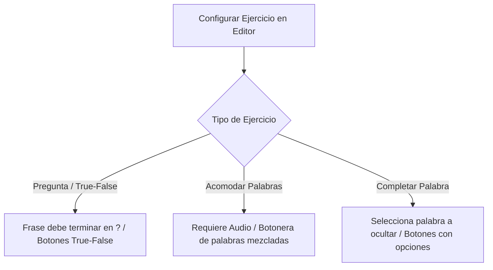

# Plan de Implementación: Ejercicios de Quiz Múltiples (Pregunta, Acomodar Palabras, Completar)

Este plan detalla la arquitectura y pasos para expandir el sistema de Auto-Quiz actual en **Lingiux**, permitiendo al creador elegir entre tres tipos de ejercicios para cada tarjeta, y presentándolos de forma interactiva en la pantalla de exploración de cartas (`WordDetailScreen`).

---

## 📸 Descripción del Comportamiento por Tipo de Ejercicio

Todos los ejercicios se configurarán en la pestaña **Quiz** del editor de tarjetas y se guardarán de forma flexible dentro del objeto JSON `canvas_design` de cada tarjeta.

### 1. Tipo: Pregunta (True / False)
*   **Editor**: 
    *   La pestaña de Quiz valida que la frase de ejemplo termine obligatoriamente en un signo de interrogación (`?`).
    *   El creador selecciona cuál es la opción correcta: **Sí** (Verdadero) o **No** (Falso).
*   **Tarjeta (Visualización)**:
    *   Se muestra la tarjeta con la frase de pregunta (ej. *Is the dog blue?*).
    *   En la base de la tarjeta se muestran los dos botones: **Sí** y **No**.
    *   Tocar la correcta emite el sonido `correct.mp3` y confeti o SnackBar de éxito; la incorrecta emite `incorrect.wav`.

### 2. Tipo: Acomodar Palabras (Duolingo Style)
*   **Editor**:
    *   Requiere que la tarjeta tenga un **audio grabado** (se valida para avanzar).
    *   Se divide automáticamente la frase de ejemplo en palabras individuales.
    *   *Opcional*: El creador puede ingresar 2 o 3 palabras extras ("distractores") para mezclarlas y dificultar el ejercicio.
*   **Tarjeta (Visualización)**:
    *   La frase de texto en el frente de la tarjeta **no se muestra** (se oculta). Únicamente se muestra el botón de audio grande para escucharla.
    *   En la base de la tarjeta (donde antes iban los botones de Sí/No) se muestra un área de renglón vacío para acomodar y, debajo de ella, un **pool de fichas de palabras (chips)** mezcladas aleatoriamente (las palabras reales de la frase + distractores).
    *   Al tocar las palabras, estas suben al renglón en orden. Cuando se completa la secuencia, se valida si es correcta o incorrecta con sonido.

### 3. Tipo: Completa la Palabra Faltante (Fill in the Blank)
*   **Editor**:
    *   Muestra una lista interactiva de las palabras de la frase de ejemplo (excluyendo la palabra clave principal de la tarjeta para evitar que sea obvio).
    *   El creador selecciona qué palabra quiere ocultar.
    *   El creador redacta 2 o 3 palabras incorrectas de opción múltiple (distractores).
*   **Tarjeta (Visualización)**:
    *   La frase de ejemplo se muestra reemplazando la palabra seleccionada por un renglón: `_____`.
    *   En la base de la tarjeta se muestran 3 o 4 botones horizontales con las opciones mezcladas (la correcta + distractores).
    *   Tocar la correcta completa el espacio en verde y reproduce sonido de éxito.

---

## ❓ Preguntas Abiertas para el Usuario

> [!IMPORTANT]
> Por favor revisa las siguientes preguntas y escribe tu respuesta para definir el comportamiento exacto de los ejercicios:
>
> 1. **Ingreso de distractores (Palabras Incorrectas)**:
>    * *(Recomendado)* ¿Deseas que en el editor, para los ejercicios de **Acomodar** y **Completar**, coloquemos un campo de texto simple para que tú escribas los distractores separados por comas? (Ej: `dog, red, run`).
> 2. **Validación interactiva en el Editor**:
>    * Para el tipo **Pregunta**, ¿bloqueamos el botón de guardar si el usuario no pone el signo de interrogación `?` al final de la frase de ejemplo?
> 3. **Número de Distractores**:
>    * Para **Completa la palabra**, ¿cuántas opciones de respuesta en total te gustaría mostrar? ¿Tres (1 correcta y 2 distractores) o cuatro?

---

## 🛠️ Propuesta de Cambios en Archivos

### 1. [card_editor_widget.dart](file:///c:/Users/sebas/OneDrive/Escritorio/Lingiux/lingiux_app/lib/features/create_card/presentation/widgets/card_editor_widget.dart)
*   Crear variables de estado locales en `_CardEditorWidgetState`:
    *   `String _quizType = 'pregunta';` // 'pregunta', 'acomodar', 'completar'
    *   `String _quizAnswer = 'Sí';` // Para True/False
    *   `String _selectedWordToHide = '';` // Para Completar
    *   `TextEditingController _distractorsController;` // Para escribir distractores
*   Modificar la pestaña de Quiz (`_buildQuizPanel`) con un selector segmented:
    *   Si es **Pregunta**: Selector de respuesta correcta (Sí/No).
    *   Si es **Acomodar**: validador de audio y campo para palabras extra.
    *   Si es **Completar**: menú desplegable de las palabras de la frase (sin la palabra clave) para elegir cuál ocultar y campo para distractores.
*   Modificar la llamada `widget.onSave` para que pase el objeto `quizConfig` al padre.

### 2. [create_card_screen.dart](file:///c:/Users/sebas/OneDrive/Escritorio/Lingiux/lingiux_app/lib/features/create_card/presentation/screens/create_card_screen.dart)
*   Cambiar la firma de `onSave` en `CardEditorWidget` para recibir el mapa de configuración de quiz.
*   En `_saveCard(Map<String, dynamic> quizConfig)`, guardar este mapa extendido dentro del campo JSON `canvas_design` de Supabase.

### 3. [word_detail_screen.dart](file:///c:/Users/sebas/OneDrive/Escritorio/Lingiux/lingiux_app/lib/features/vocabulary/presentation/screens/word_detail_screen.dart)
*   Leer `quiz_type` y la respectiva configuración desde `wordCard.canvasDesign`.
*   Diseñar dinámicamente la sección inferior e intermedia de la tarjeta según el tipo:
    *   **Caso 'pregunta'**: Muestra la frase con signo de interrogación y botones Sí/No en la base con la lógica de audio ya implementada.
    *   **Caso 'acomodar'**: Oculta el texto frontal. Muestra el audio centrado grande. Abajo renderiza un renglón interactivo y un Wrap de chips de palabras desordenadas. Al tocarlos, se van agregando y al finalizar compara contra la frase original.
    *   **Caso 'completar'**: Muestra el texto reemplazando la palabra elegida por `_____`. En la base dibuja botones horizontales con las opciones mezcladas.

---

## 🧪 Plan de Verificación

### Pruebas Manuales
1.  **Validación en Editor**:
    *   Configurar un ejercicio de tipo Pregunta sin `?` y validar que al intentar guardar lance un aviso.
    *   Configurar Acomodar palabras sin audio grabado y validar que avise que el audio es obligatorio.
2.  **Verificación de la Visualización (Card Scrolling)**:
    *   Revisar que una tarjeta con ejercicio de **Acomodar** muestre la botonera de chips y oculte el texto de la frase.
    *   Revisar que una tarjeta con ejercicio de **Completar** oculte la palabra correcta sustituyéndola por una línea.
    *   Confirmar que al presionar la respuesta correcta en todos los casos se ejecute `correct.mp3`, y con la incorrecta `incorrect.wav`.
